# Tema 1 – Introducción a la arquitectura de computadores

<p style="font-size: 1.3em;"><strong>CFGS Administración de Sistemas Informáticos y en Red (1º curso)</strong></p>

Material elaborado para el módulo **Fundamentos de Hardware**


> "Juntarse es el principio, mantenerse juntos el progreso, trabajar en equipo el éxito." — Henry Ford.

## Programación de Aula

### Resultados de Aprendizaje

Esta unidad trabaja el **Resultado de Aprendizaje 1 (RA1)** del módulo, según el **Real Decreto 1629/2009** (Anexo I, módulo *Fundamentos de Hardware*):

1. **RA1.** Configura equipos microinformáticos, componentes y periféricos, analizando sus características y relación con el conjunto.

Esta unidad se centra especialmente en los criterios:

- **CE1.a** (RA1.a): Se han identificado y caracterizado los dispositivos que constituyen los bloques funcionales de un equipo microinformático.
- **CE1.c** (RA1.c): Se ha analizado la arquitectura general de un equipo y los mecanismos de conexión entre dispositivos.
- **CE1.h** (RA1.h): Se han clasificado los dispositivos periféricos y sus mecanismos de comunicación.

---

## 1. Información y sistemas informáticos

La **informática** nace con la idea de ayudar a las personas en los trabajos rutinarios y repetitivos, generalmente de cálculo y de gestión, en los que es frecuente la repetición de tareas. La idea es que una máquina puede hacer el trabajo mejor, por su exactitud y su rapidez; ahora bien, siempre bajo el control de la persona.

El término *informática* apareció en Francia en 1962 bajo la denominación de *informatique*. Esta palabra surge de la contracción de:

> **INFOR**mation auto**MATIQUE**

Posteriormente fue aceptada por todos los países europeos; en España, en 1968, con el nombre de informática; en los países de habla inglesa se conoce como *computer science*.

El concepto de informática incluye toda una serie de tareas, como por ejemplo:

- El desarrollo y la mejora de nuevas máquinas, es decir, de nuevos ordenadores y de los elementos relacionados.
- El desarrollo y la mejora de nuevos métodos automáticos de trabajo, que en informática se basan en el llamado sistema operativo (SO).
- La construcción de aplicaciones informáticas, conocidas como programas o paquetes informáticos.

Generalmente se utiliza la expresión **sistema informático** para referirse de manera más concreta al término informática, en el sentido de conjunto de elementos necesarios para la realización y utilización de aplicaciones informáticas.

### 1.1 Información y sistemas informáticos

Un **sistema informático** es el conjunto de elementos necesarios para la realización y explotación de aplicaciones informáticas. Se incluyen los elementos de software, de hardware y los humanos.

En un sistema informático encontramos los siguientes elementos constitutivos interrelacionados:

- **Parte física (hardware)**: formada por todo aquello que se puede ver y tocar en el mundo de la informática (monitores, impresoras, ratón, soportes...).
- **Parte lógica (software)**: tiene su origen en las ideas (conceptos) y está compuesta por todo aquello que usamos en informática que no podemos ver ni tocar (juegos de ordenador, programas de contabilidad, sistemas operativos...).
- **Parte humana**: el elemento más importante de la informática. Sin las personas que están al cargo, no habría ni parte física ni parte lógica.
- **Documentación**: manuales que describen el funcionamiento y uso de los sistemas.

### 1.2 Los ordenadores

Un **ordenador** es un sistema informático digital y programable. El término "ordenador" proviene del latín *ordinator* ("que pone las cosas en su lugar"); es el vocablo usado en España, mientras que en el resto del mundo hispano se conoce como "computador" o "computadora".

Los ordenadores son sistemas informáticos electrónicos, es decir, manejan información a través de complejas combinaciones eléctricas y magnéticas.

Los ordenadores no han nacido en los últimos años: las personas siempre han buscado dispositivos que ayuden a efectuar cálculos precisos y rápidos. Desde la aparición de las calculadoras binarias hasta hoy, hay muy pocas actividades humanas que no estén ligadas de una manera u otra a las máquinas electrónicas.

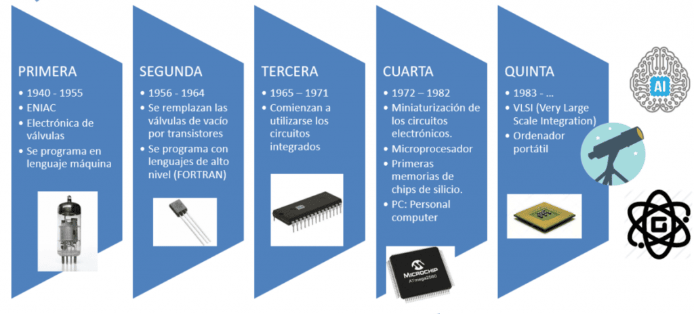

#### 1.2.1 Conceptos básicos de ordenadores

El conjunto de acciones que se ejecutan en un ordenador se conoce como **programa**: un conjunto de acciones que se realizan en un orden determinado con el objetivo de resolver un problema.

Relacionado con este concepto está el de **aplicación informática**: un conjunto de uno o más programas para hacer un trabajo determinado en un sistema informático.

En cuanto a la parte física del ordenador, para que funcione de manera eficiente necesitamos una serie de elementos funcionales, cada uno encargado de una parte:

- CPU (Unidad Central de Proceso)
- Memoria
- Almacenamiento
- Dispositivos de entrada y salida (E/S)

Estos elementos traducen las diferentes señales eléctricas en información. La información que le llega al ordenador es ausencia o presencia de señal eléctrica: **0** o **1**. Cada cifra se conoce como **bit** (*Binary Digit*) y es la unidad más pequeña de información.

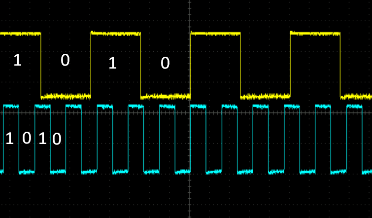

Este sistema de información, en el que solo hay 2 valores posibles, se llama **binario**. Nosotros usamos habitualmente el sistema **decimal**, que contiene dígitos del 0 al 9. Es un sistema de numeración posicional (la posición de cada cifra tiene un valor diferente). Por ejemplo, podemos representar el número **4367,85** como:

```
4000 + 300 + 60 + 7 + 0,8 + 0,05 = 4×10³ + 3×10² + 6×10¹ + 7×10⁰ + 8×10⁻¹ + 5×10⁻²
```

En cuanto al sistema decimal:

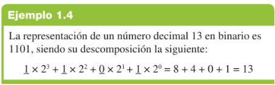

Al ser la base del sistema binario tan pequeña, el número de dígitos necesarios para representar números grandes crece con rapidez. Debido a esto, trabajar directamente en binario es una tarea muy engorrosa, por lo que se usan agrupaciones de cifras para representar números:

- **Octal**: sistema de numeración en base 8. Símbolos del 0 al 7.

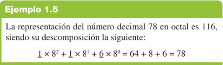

- **Hexadecimal**: sistema de numeración en base 16. Al tener más de 10 símbolos (del 0 al 15), y para evitar confusiones, se utilizan letras una vez sobrepasado el número 9:

  **A**=10, **B**=11, **C**=12, **D**=13, **E**=14, **F**=15

| Decimal | Binario | Octal | Hexadecimal |
|---|---|---|---|
| 0  | 0000 | 0  | 0 |
| 1  | 0001 | 1  | 1 |
| 2  | 0010 | 2  | 2 |
| 3  | 0011 | 3  | 3 |
| 4  | 0100 | 4  | 4 |
| 5  | 0101 | 5  | 5 |
| 6  | 0110 | 6  | 6 |
| 7  | 0111 | 7  | 7 |
| 8  | 1000 | 10 | 8 |
| 9  | 1001 | 11 | 9 |
| 10 | 1010 | 12 | A |
| 11 | 1011 | 13 | B |
| 12 | 1100 | 14 | C |
| 13 | 1101 | 15 | D |
| 14 | 1110 | 16 | E |
| 15 | 1111 | 17 | F |

#### 1.2.2 Y todo esto, ¿para qué?

Podemos realizar operaciones en binario usando circuitos lógicos. Esto nos da la posibilidad de transformar señales eléctricas en información valiosa; por ejemplo, los impulsos ópticos del movimiento de un ratón se traducen en la posición del puntero en la pantalla.

Si queremos hacer una operación matemática (sumar) en sistema binario, necesitamos un circuito lógico, ya que solo recibirá 2 posibles cifras en cada una de sus entradas.

El problema de la suma en binario es que, al sumar 1 + 1, necesitamos una serie de reglas para saber qué hacer. Esto se resuelve usando la misma técnica que en las matemáticas en decimal: nos "llevamos" una cifra y la colocamos a la izquierda. Simplemente, 1+1 sigue siendo igual a 2, salvo que en binario "2" se escribe "10". Reglas básicas:

```
0 + 0 = 0
0 + 1 = 1
1 + 1 = 10
```

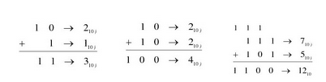

**Ejemplo: semisumador**

Un semisumador es un circuito digital sencillo que permite sumar dos bits y registrar el acarreo. Los tres resultados posibles de la suma de dos bits son: 0+0=0; 0+1=1+0=1; y 1+1=10 (en binario).

Siempre que diseñamos un circuito digital, necesitamos trasladar estos resultados o condiciones a una tabla de verdad:

| Operando A | Operando B | Suma | Carry out |
|---|---|---|---|
| 0 | 0 | 0 | 0 |
| 0 | 1 | 1 | 0 |
| 1 | 0 | 1 | 0 |
| 1 | 1 | 0 | 1 |

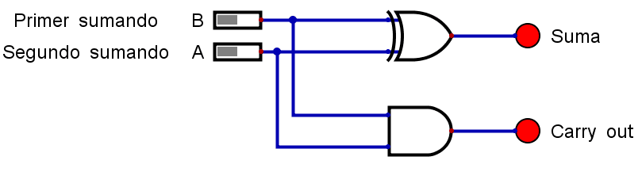

*Fuente: [angelmicelti.github.io/4ESO/EDI/semisumador.html](https://angelmicelti.github.io/4ESO/EDI/semisumador.html)*

---

## 2. Estructura funcional de un computador

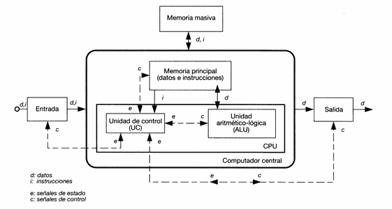

Con lo que sabemos hasta ahora, podemos ampliar nuestra definición de ordenador:

> **Definición**
>
> El ordenador es un sistema electrónico que hace operaciones aritméticas y lógicas a alta velocidad de acuerdo con instrucciones internas, ejecutadas sin intervención humana. Además, tiene la capacidad de aceptar y almacenar datos de entrada, procesarlos y producir resultados de salida automáticamente. Su función principal es el **procesamiento de datos**.

Hay varios elementos imprescindibles para un ordenador:

- Unidades de E/S para aceptar información y comunicar los resultados.
- Un procesador para procesar la información.
- Una memoria para almacenar la información y las instrucciones.
- Un medio para interconectar los componentes.

La forma de interconectar las diferentes unidades anteriores es la **arquitectura de ordenador**.

La arquitectura y la organización del computador suelen confundirse o usarse indistintamente, aunque tienen significados diferentes:

**Arquitectura** del computador: conjunto de elementos del computador visibles desde el punto de vista del programador de ensamblador:

- Juego de instrucciones y modos de direccionamiento del computador.
- Tipos y formatos de los operandos.
- Mapa de memoria y de E/S.
- Modelos de ejecución.

**Estructura u organización**: unidades funcionales del computador y modo en que están interconectadas:

- Sistemas de interconexión y de control.
- Interfaz entre el computador y los periféricos.
- Tecnologías utilizadas.

Existen dos tipos de arquitecturas principales: **Von Neumann** y **Harvard**. La diferencia se encuentra en el modo de almacenar en la memoria las instrucciones y los datos con los que trabajan. En las máquinas Von Neumann, instrucciones y datos conviven en el mismo espacio de memoria, sin separación física; en Harvard, cada uno tiene su propio espacio de memoria y, por tanto, sus propias conexiones.

### 2.1 Arquitectura Von Neumann

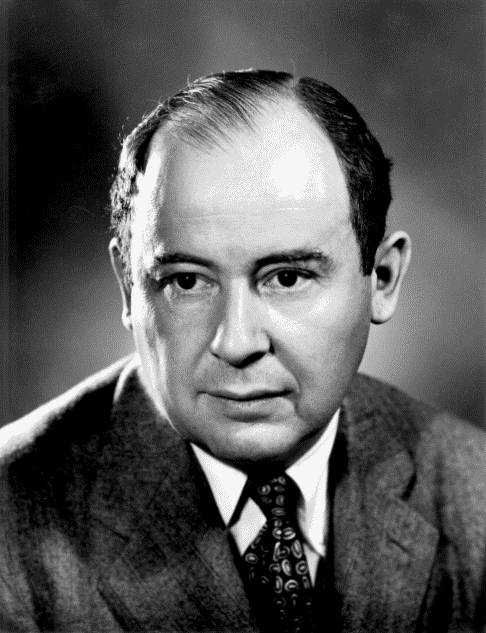

John von Neumann nació en el Imperio de Austria-Hungría, en Budapest, en el seno de una familia judía de banqueros, ennoblecida por el Imperio. Niño prodigio, estudió matemáticas y química en su ciudad natal, en Berlín y en Zúrich. Recibió su doctorado en matemáticas de la Universidad de Budapest a los 23 años.

Dio su nombre a la **Arquitectura de Von Neumann**, utilizada en casi todos los ordenadores actuales.

El concepto de programa almacenado permitió leer un programa (instrucciones) y sus datos dentro de la memoria de la computadora, y después ejecutar las instrucciones sin tener que volverlas a escribir. La idea era conectar permanentemente las unidades del ordenador y que su funcionamiento estuviera coordinado bajo un control central.

- Estableció el modelo básico de los computadores digitales (1946).
- Construyó una computadora con programas almacenados, cuando hasta entonces se trabajaba con programas cableados.

Esta tecnología sigue vigente, aunque con modificaciones.

**Principios de la arquitectura de Von Neumann:**

- En la **memoria** del ordenador se **almacenan simultáneamente datos e instrucciones** (una instrucción es una operación básica entre dos o más datos).
- Se puede **acceder a la información contenida en la memoria especificando la dirección** donde está almacenada.
- **La ejecución de un programa se realiza de forma secuencial**, pasando de una instrucción a la que sigue inmediatamente.

La arquitectura de Von Neumann se compone de 4 elementos funcionales:

- **Unidad Central de Proceso (CPU)**: ejecuta programas almacenados en la memoria principal. Se compone de la Unidad de Control, los registros y la Unidad Aritmético-Lógica.
  - **Unidad Aritmético-Lógica**: realiza operaciones elementales con datos que vienen de la memoria principal (pueden estar almacenados temporalmente en los registros).
  - **Unidad de control**: se encarga de leer las instrucciones y enviar señales de control para ejecutarlas.
  - **Registros**: almacenan temporalmente información.
- **Memoria principal (MP)**: donde se almacenan datos y programas en ejecución, identificados mediante una dirección.
- **Unidad de entrada y salida (I/O)**: periféricos de entrada, salida y entrada-salida, para introducir datos en el ordenador o mostrar los datos procedentes de él. Permiten comunicar el ordenador con el exterior.
- **Buses**: interconectan los tres elementos anteriores a través de un conjunto de líneas que llevan señales de control (bus de control), datos (bus de datos) y direcciones (bus de direcciones). Permiten a la CPU seleccionar a qué direcciones de memoria y dispositivos desea acceder.

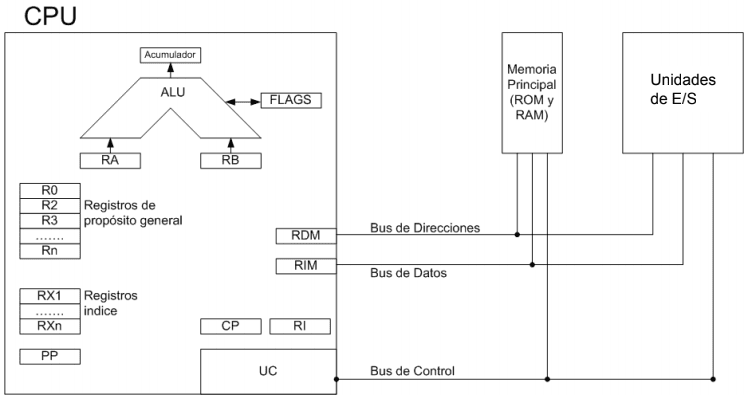

### 2.2 Arquitectura Harvard

Los ordenadores con arquitectura Harvard dividen el espacio de almacenamiento en dos bloques de memoria físicamente separados: uno almacena las instrucciones y el otro los datos. El acceso a estos espacios se realiza mediante buses diferentes, lo que permite la lectura simultánea de instrucciones y datos.

Las máquinas con arquitectura Harvard presentan un mayor rendimiento en la ejecución de instrucciones, ya que pueden leer instrucciones y datos de forma simultánea (en una memoria solo se puede obtener un dato o instrucción por acceso, salvo en memorias multipuerto).

En una arquitectura **Von Neumann**, primero se accede a la memoria para obtener la instrucción a ejecutar y se descodifica, conociendo así la operación a realizar y los operandos. Después se realizan los accesos necesarios a memoria (uno tras otro) para obtener los datos con los que operar.

En una arquitectura **Harvard**, mientras la CPU obtiene los datos requeridos por una instrucción, se puede leer simultáneamente la siguiente instrucción a ejecutar, con lo que **el rendimiento es claramente superior**.

> El PC (ordenador personal) es una máquina **Von Neumann**, y por tanto cumple con las características descritas para dicha arquitectura.

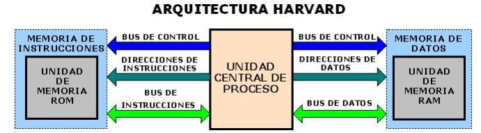

> **Actividad 1**
> Si Harvard es más eficiente que Von Neumann, ¿por qué no se usan en todos los computadores?

La solución a la pregunta anterior es que el diseño Von Neumann es más sencillo y, además, tiene un coste menor.

---

## 3. Elementos funcionales de un computador

### 3.1 CPU

La **CPU** (*Central Process Unit*) es el auténtico cerebro de todos los elementos del PC. Su función principal es ejecutar los programas almacenados en la memoria principal, leyendo las instrucciones, decodificándolas y realizando las acciones asociadas a cada una de ellas.

Físicamente está formada por circuitos electrónicos integrados en un chip llamado **procesador**.

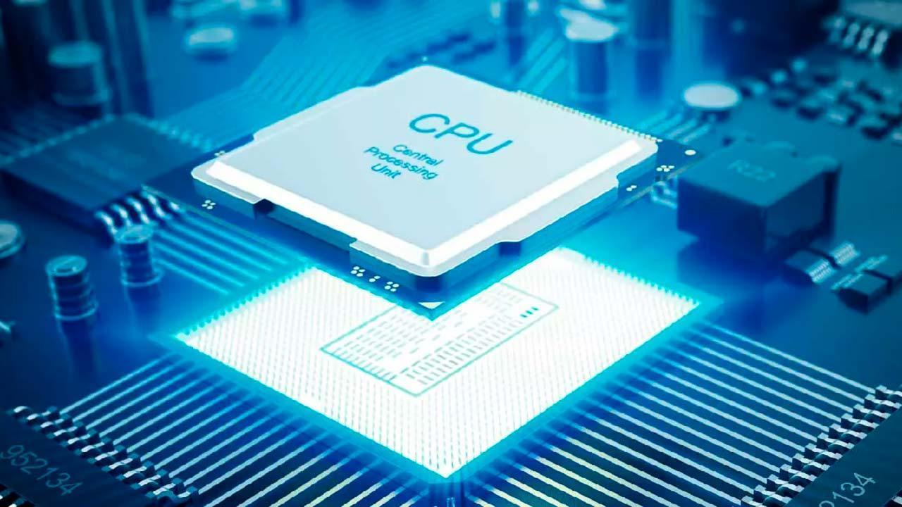

*Fuente: [hardzone.es](https://hardzone.es/reportajes/que-es/procesador-cpu-caracteristicas/)*

La información manejada es, a fin de cuentas, electricidad que viaja a través de los circuitos y que es retenida en pequeñas zonas de memoria para su posterior procesamiento.

#### 3.1.1 ¿Qué es el procesador?

A nivel físico, una CPU es una estructura muy compleja que se compone, a día de hoy, de miles de millones de transistores fabricados con silicio. Estos se combinan formando puertas lógicas, que a su vez forman las diferentes estructuras que permiten tratar las instrucciones de manera ordenada y ejecutar el código, ya sean instrucciones de lectura a memoria como operaciones matemáticas (sumas, restas, multiplicaciones, divisiones) y operaciones más complejas necesarias para ejecutar los diferentes programas.

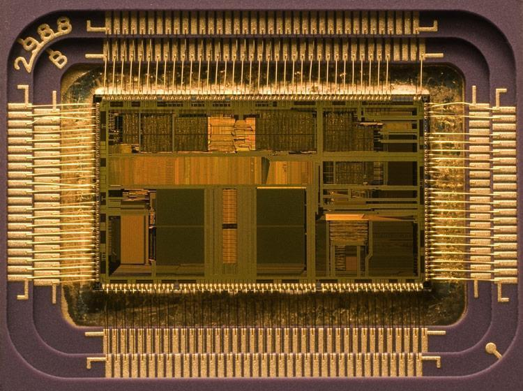

La velocidad de un procesador se expresa en Hz, que mide la cantidad de operaciones que la CPU realiza. Está gobernada por una señal a la que llamamos **reloj**, que suele consistir en una señal digital de onda cuadrada que marca el compás: la cantidad de pulsos por segundo a la que trabaja la CPU. Las primeras CPUs rondaban 1 MHz; en la actualidad tenemos procesadores con más de 3 GHz, es decir, más de 3000 veces más ciclos de reloj que los primeros.

Un procesador es comparable a un motor de 2 o 4 tiempos, en el sentido de que sigue un funcionamiento mecánico diferenciado por una serie de etapas comunes: captación, descodificación y ejecución. Cada arquitectura ejecuta estas etapas de manera diferente, pero la definición e intencionalidad general es siempre la misma.

Los componentes de la CPU son:

- Unidad de control
- Unidad Aritmético-Lógica
- Registros

#### 3.1.2 Componentes de la CPU. Unidad de control

Para ejecutar una instrucción de lenguaje máquina se requieren una serie de operaciones elementales y sucesos físicos en los diversos componentes del procesador. La **Unidad de Control** es la responsable de que todas estas operaciones se ejecuten correctamente.

**Funciones de la Unidad de control:**

- Dirigir al resto de las unidades e interpretar las instrucciones recibidas, coordinando que todos los elementos funcionen de forma armónica.
- Analizar e interpretar las instrucciones del programa que se está ejecutando.
- Atender y decidir sobre posibles interrupciones que se puedan producir en el proceso (p. ej.: teclado, impresoras...).

**Estructura de la Unidad de Control:**

- **Reloj**: sincroniza todas las operaciones elementales del computador. El período de esta señal se denomina *tiempo de ciclo*. La frecuencia del reloj (antes en MHz, hoy en GHz) determina en parte la velocidad de funcionamiento del ordenador.

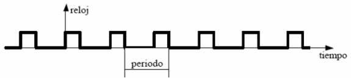

- **Contador de programa (CP)** — también llamado registro de control de secuencia (RCS): contiene en todo momento la dirección de memoria de la siguiente instrucción a ejecutar.
- **Registro de instrucción (RI)**: área de almacenamiento temporal de alta velocidad y reducido tamaño. Maneja y almacena instrucciones a una velocidad unas 10 veces mayor que la memoria caché. Contiene la instrucción que se está ejecutando en cada momento.

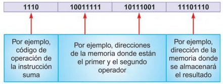

- **Decodificador**: decodifica e identifica una instrucción y genera señales de control para el resto de elementos, con el fin de ejecutar dicha operación. Extrae el código de operación de la instrucción del registro de instrucción (RI), lo analiza y lo comunica al controlador.
- **Secuenciador**: envía micro-órdenes al resto de elementos para que se sincronicen con el reloj.
- **Controlador o secuenciador**: interpreta el código de operación y lo lleva a cabo, generando microórdenes que actúan sobre el resto del sistema en sincronía con los pulsos de reloj.

*(Conceptos relacionados: bus interno, microórdenes.)*

#### 3.1.3 Componentes de la CPU. Unidad aritmético-lógica

- **Unidad Aritmético-Lógica (ALU)**: encargada de realizar las operaciones aritméticas y lógicas indicadas por la unidad de control tras descodificar la instrucción. Toma el contenido de dos registros de trabajo asociados a la UCP, realiza la operación indicada y deja el resultado en un registro de trabajo (llamado **acumulador** o Registro Acumulador).

En los procesadores actuales, la ALU no solo realiza operaciones aritméticas básicas con números enteros o fraccionarios, sino que también ejecuta operaciones como raíz cuadrada y funciones trascendentes (seno, coseno, tangente, arco tangente, logaritmos, exponenciación).

**Estructura de la Unidad Aritmético-Lógica:**

- **Circuito operacional (COP)**: contiene los circuitos digitales necesarios para hacer operaciones (suma, resta, etc.). La entrada la proporcionan los registros de entrada y el bus de control indica la operación.
- **Registros de entrada (REN1 y REN2)**: almacenan datos y operandos que intervienen en una instrucción antes de la operación del circuito operacional (COP).
- **Registro Acumulador (RA)**: almacena temporalmente resultados finales. Tiene conexión con el bus de datos para enviar el resultado a memoria o a la unidad de control.
- **Registro de estado — Flags (RES)**: recoge información sobre condiciones y estados de la última operación (positivo, negativo, arrastre, etc.), e indica si la operación fue exitosa o no. Es un conjunto de biestables que registran condiciones de la última operación realizada.

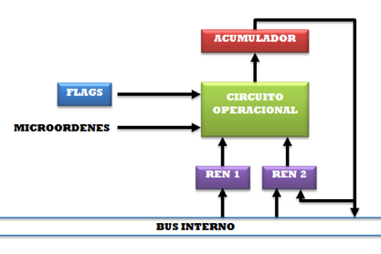

### 3.2 Memoria

Se denomina **memoria** a todo dispositivo capaz de almacenar información y de servirla cuando sea requerida. Esta información consiste en los datos e instrucciones del programa y en los resultados parciales o finales de las operaciones realizadas en la ALU. En un dispositivo de memoria se pueden realizar dos acciones: **lectura y escritura**, aunque no todas las memorias permiten hacer ambas. Toda la información que se ha de procesar debe pasar necesariamente por la memoria central.

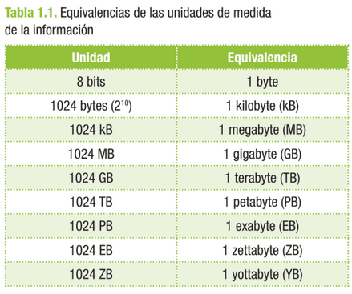

Pueden clasificarse en dos grandes grupos: internas y externas (también llamadas primarias y secundarias):

- **Memoria externa**: situada en dispositivos "externos" o "periféricos" al ordenador (disquetes, discos duros, cintas, CDs, DVDs, etc.). Algunas son intercambiables, con capacidad de almacenamiento virtualmente ilimitada, aunque con el coste de insertar manualmente el soporte.
- **Memorias internas**: normalmente nos referimos a la Memoria Principal (RAM), aunque también se incluyen los registros de la CPU y la memoria caché. Están situadas en el procesador, la placa base, o en tarjetas insertadas en sus zócalos.

Para realizar lecturas y escrituras es necesario conocer la ubicación (dirección) de la información. El elemento básico de la memoria digital es el **biestable**, capaz de almacenar la unidad mínima de información: el bit. La memoria es como una matriz de posiciones, donde en cada celda se almacena un bit:

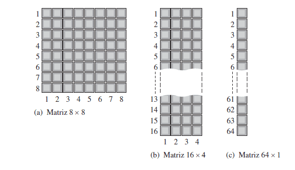

#### 3.2.1 Tipos de memoria

Hoy en día, la memoria principal está construida con semiconductores tipo CMOS. Los dos grupos de memoria de tipo semiconductor más comunes son la memoria **ROM** y la **RAM**.

**Memoria RAM** (*Random Access Memory*): sirve tanto para leer como para grabar información, y se trata generalmente de memoria volátil, es decir, que pierde su contenido al cortarse el fluido eléctrico.

Existe un tipo de RAM no volátil, conocida como **CMOS RAM** (*Complementary Metal Oxide Semiconductor*): memoria de baja potencia alimentada normalmente por una batería interna. El acceso a los datos de la RAM es aleatorio y directo: podemos acceder a las diferentes posiciones indicando su dirección.

Internamente están formadas por semiconductores de silicio y circuitos electrónicos, agrupados en circuitos integrados (chips), cuya finalidad es almacenar datos binarios durante un proceso.

Estos chips están formados por una matriz de celdas con elementos biestables (conectado/desconectado), capaces de almacenar un bit de información. Agrupando 8 de estas celdas se forma una **posición de memoria**, que corresponde a la parte más pequeña de información a la que se puede acceder (**byte**). Cada celda se identifica mediante una dirección de memoria, para poder almacenar y recuperar la información posteriormente.

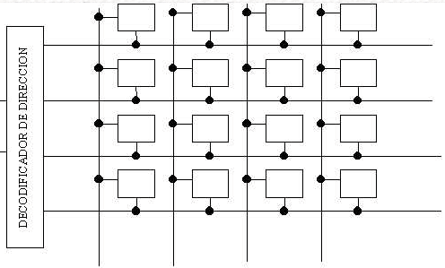

- **RAM**: memorias formadas por semiconductores. Podemos distinguir:
  - **DRAM** (*Dynamic RAM*): memoria de lectura/escritura formada por condensadores (uno por bit), que se descargan cada cierto tiempo, por lo que es necesario leer el bit antes de que se pierda y regrabarlo o "refrescarlo" (ciclo de refresco). El problema es que no se puede acceder a la información mientras se está refrescando.
  - **SRAM** (*Static RAM*): también de lectura y escritura, pero no necesitan ser refrescadas, ya que se basan en semiconductores biestables que se autoalimentan y mantienen su estado mientras no se interrumpa la alimentación.
- **ROM** (*Read Only Memory*): formada también por semiconductores, permite el acceso directo pero solo para lectura. No son volátiles como la RAM y las programan los fabricantes durante su fabricación. Tipos:
  - **PROM** (*Programable ROM*): permite programarla mediante un programador de memorias; una vez grabada, ya no puede cambiarse (pasa a ser ROM).
  - **EPROM** (*Erasable PROM*): PROM reprogramable; permite grabar y borrar su contenido tantas veces como se quiera.
  - **EEPROM** (*Electrical EPROM*): EPROM borrable eléctricamente; se pueden borrar bits individuales.
  - **Memoria flash**: memoria programable por software. En las ROM anteriores se almacena la BIOS del sistema; en la flash se puede guardar y actualizar conforme evoluciona el software.

#### 3.2.2 Estructura de la memoria principal

- **Registro de dirección de memoria (RDM)**: contiene, en cada momento, la dirección de la celda que se quiere seleccionar de la memoria, para leer o escribir.
- **Registro de intercambio de memoria (RIM)**: en él se deposita el contenido de una celda de memoria seleccionada en una operación de lectura o escritura.
- **Palabra**: también llamada *ancho de palabra*, es normalmente múltiplo de 8.
- **Selector de memoria (SM)**: conecta la celda de memoria con el registro de intercambio de memoria para realizar la transferencia.
- **Celda de memoria**: donde se guarda la información.

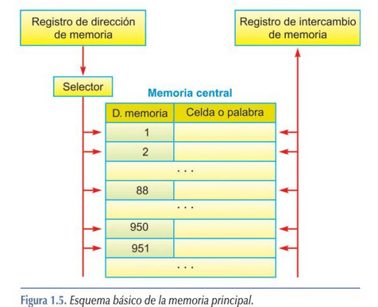

### 3.3 Unidades de E/S

El concepto de **entrada/salida** hace referencia a toda comunicación o intercambio de información entre la CPU y la memoria central con los dispositivos periféricos. Los componentes del ordenador que permiten esta comunicación son las unidades de entrada/salida.

El sistema de E/S está formado por dos partes fundamentales:

- **Interfaz**: sistema hardware/software que permite la comunicación entre el periférico y la CPU o memoria principal; conjunto de circuitos y programas usados para resolver las diferencias entre el procesador central y cada periférico. La parte software del interfaz se llama **controlador de E/S**.
- **Periféricos**: dispositivos electromecánicos, electromagnéticos o electrónicos que permiten la comunicación directa con el mundo exterior.

Los periféricos pueden clasificarse en cinco categorías:

- **Periféricos de entrada**: obtienen los datos introducidos por el usuario. Ejemplos: ratón, teclado, escáner, micrófono.
- **Periféricos de salida**: muestran o envían información hacia el exterior del ordenador. Ejemplos: monitor, impresora, altavoces.
- **Periféricos de entrada/salida**: permiten enviar y recibir información. Ejemplo: un módem.
- **Periféricos de almacenamiento**: almacenan datos. Ejemplos: disco duro, dispositivos de almacenamiento óptico, cinta magnética.
- **Periféricos de comunicación**: permiten la comunicación con otros ordenadores o dispositivos. Ejemplo: tarjeta de red.

**Mecanismos de transmisión de las E/S**

En un proceso de E/S, las solicitudes pueden realizarse de tres formas:

- **E/S programada**: el propio programa en ejecución hace la petición de un proceso de E/S, gestionado por software.
- **E/S controlada por interrupciones**: los dispositivos provocan una interrupción para realizar el proceso de E/S. Actualmente los microprocesadores disponen de un controlador para ello.

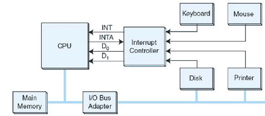

- **E/S con Acceso Directo a Memoria (DMA)**: la transferencia se realiza por acceso directo a memoria; el controlador del periférico lleva todo el peso de la transferencia, comunicándose directamente con la memoria del computador sin necesidad de intervención de la CPU.

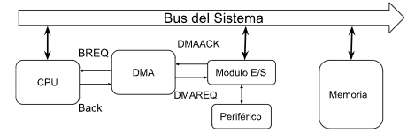

- **Procesadores de E/S**: ampliación del DMA; consisten en un controlador de E/S con capacidad de ejecutar programas de E/S por sí solo, liberando a la CPU de realizar instrucciones y reduciendo su trabajo de almacenarlas en memoria principal.

### 3.4 Buses del sistema

Un **bus**, en una primera aproximación simple, es un conjunto de conductores eléctricos por el que se intercambia información entre dos o más dispositivos electrónicos digitales mediante una vía de comunicación. La información que circula por el bus necesita la participación de todas las líneas conductoras que lo conforman, por lo que se consideran lógicamente agrupadas en un único bus.

Para intercambiar información a través de un bus, los dispositivos conectados deben adaptarse a un conjunto de especificaciones que rigen su funcionamiento: el **protocolo de bus**. Así, un bus es un conjunto de conductores eléctricos por el que se intercambia información mediante un protocolo adecuadamente especificado.

Un bus del sistema consta de una serie de líneas clasificables en tres grupos funcionales:

- **Líneas de datos**: establecen un camino para transferir datos desde los módulos del sistema. Su anchura depende de la longitud de una instrucción.
- **Líneas de dirección**: se utilizan para seleccionar la fuente o el destino de la información que hay sobre el bus de datos. Su anchura depende de la capacidad de la unidad de memoria.
- **Líneas de control**: gobiernan el acceso y uso de las líneas de datos y dirección. Las más típicas son: escritura en memoria, lectura de memoria, escritura a E/S, lectura de E/S, reconocimiento de transferencia, petición del bus, autorización del bus, petición de interrupción, reconocimiento de interrupción, reloj y reset.

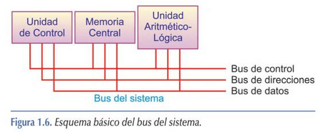

#### 3.4.1 Características del bus

- Un bus se caracteriza por la **cantidad de información que se transmite** simultáneamente.
- Se expresa en bits y corresponde al número de líneas físicas por las que se envía información simultáneamente.
- Un cable plano de **32 hilos** permite la transmisión de **32 bits** en paralelo.
- El término "ancho" designa el número de bits que un bus puede transmitir simultáneamente.

> **Actividad 2**
> El bus de datos debe ser del mismo tamaño o superior que el de la palabra de memoria, ¿por qué?

**Ejemplo de uso de los buses — Lectura de registros:**

1. Bus de control: señal de comprobación de estado del registro.
2. Bus de control: confirmación de que el registro está preparado para la operación de lectura.
3. Bus de dirección: envía la dirección de los registros implicados.
4. Bus de datos: envía los datos que intervienen en la operación.
5. Bus de control: notificación por parte de los registros de que ha finalizado.

---

## 4. Ciclo de trabajo

El ordenador es una máquina secuencial, gobernada por una señal de reloj cuyos flancos descendentes y ascendentes marcan la transición de una fase a otra. Este ciclo se llama **ciclo máquina**.

Las fases en las que se divide el ciclo de trabajo son:

1. Fase de búsqueda
2. Fase de decodificación
3. Fase de ejecución
4. Fase de almacenamiento/finalización

Las instrucciones que se ejecutan en el ciclo máquina se llaman **instrucciones máquina**. Durante los ciclos máquina se ejecutan las operaciones necesarias, y dependiendo de la complejidad de la instrucción, se necesitarán más o menos ciclos. Las fases de búsqueda y decodificación siempre ocupan los mismos ciclos; la diferencia entre instrucciones se sitúa en las fases 3 y 4.

La finalización de las instrucciones máquina se basa en completar las 4 fases descritas, lo que se conoce como **ciclo de instrucción**, que se repite consecutivamente: cuando finaliza la instrucción en curso, entra otra en el ciclo.

**1) Fase de búsqueda de la instrucción**

  a. Consiste en la lectura en memoria para extraer la nueva instrucción. La dirección de memoria se encuentra en el **PC** (*Program Counter*).
  b. El **RI** copia el contenido del **PC**.
  c. Una vez copiado, el PC se incrementa en 1 para apuntar a la siguiente instrucción.

**2) Fase de interpretación de la instrucción**

  a. Decodificación de la instrucción y cálculo de las direcciones de los operandos implicados.
  b. Se determina qué líneas de control de la UC han de activarse y en qué orden, para llevar a cabo la ejecución de las instrucciones de la fase anterior.

**3) Fase de ejecución de la instrucción**

  a. Se recuperan los operandos que requiere la instrucción.
  b. Se activan las señales de control en el orden determinado en la fase anterior.
  c. Se ejecuta la operación en la ALU.
  d. Se almacena el resultado en el registro **acumulador**.
  e. El **RE** (Registro de Estado) almacena si el resultado de la instrucción ha sido exitoso o no.

**4) Fase de almacenamiento del resultado**

  a. Se almacena en la posición indicada y se pasa a la instrucción siguiente.
  b. En el registro acumulador queda el valor por si es necesario para la siguiente instrucción.

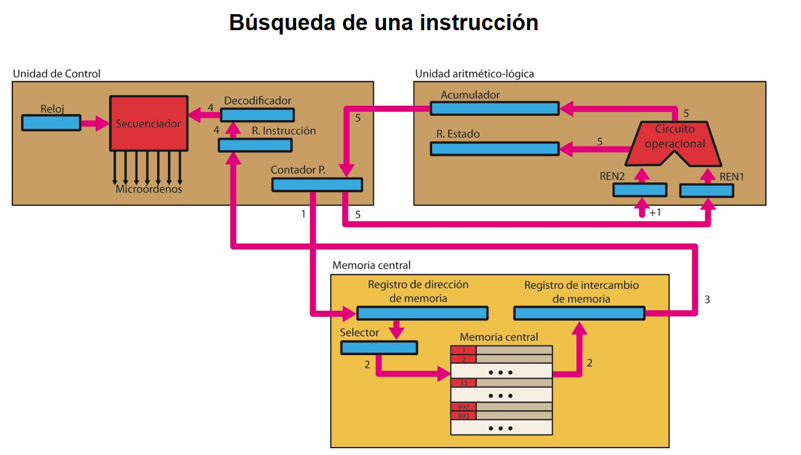

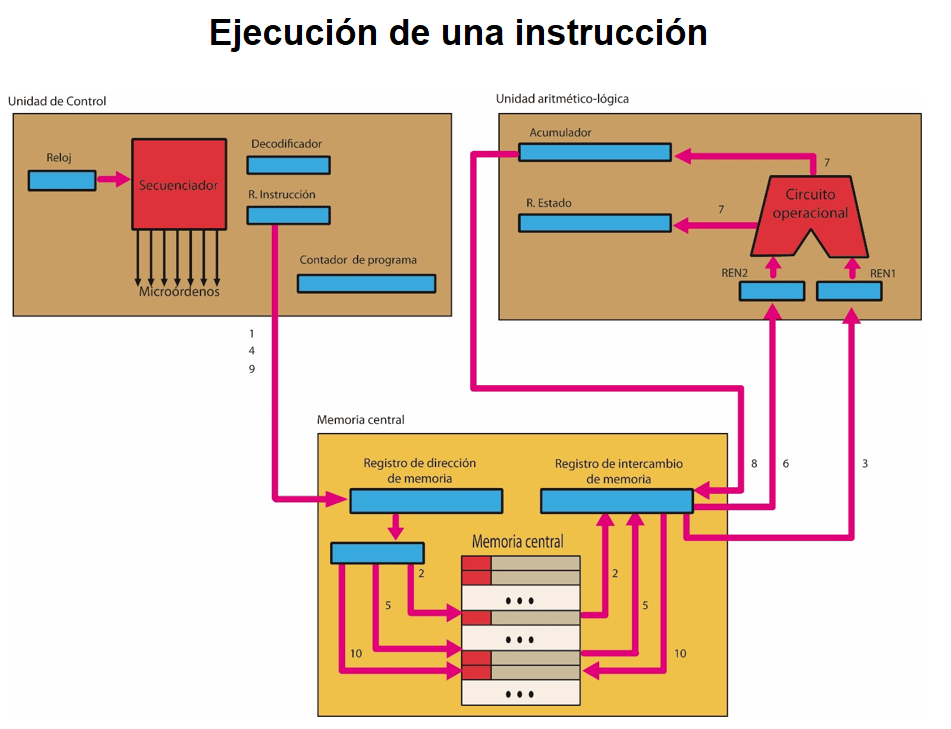

---

## 5. Bibliografía

- Imagen de portada: freepik.es
- [hardzone.es — ¿Qué es el procesador CPU? Características](https://hardzone.es/reportajes/que-es/procesador-cpu-caracteristicas/)
- *Montaje y mantenimiento de equipos*. Ed. Paraninfo, 3ª edición.
- www.wikipedia.es
- *Fundamentos de hardware*. Ed. Ra-ma.
- Daniel M. Argüello, Santiago C. Pérez e Higinio A. Facchini. *Arquitectura de computadores*. ISBN: 978-950-42-0158-8.
- Barrachina S., León G., Martí J.V. *Conceptos elementales de computadores*. Publicaciones Universitat Jaume I.
- Sergio Barrachina Mir, Maribel Castillo Catalán, Germán Fabregat Llueca, Juan Carlos Fernández Fernández, Germán León Navarro, José Vicente Martí Avilés, Rafael Mayo Gual, Raúl Montoliu Colás. *Introducción a la arquitectura de computadores con QtARMSim y Arduino*. Publicaciones Universitat Jaume I.
