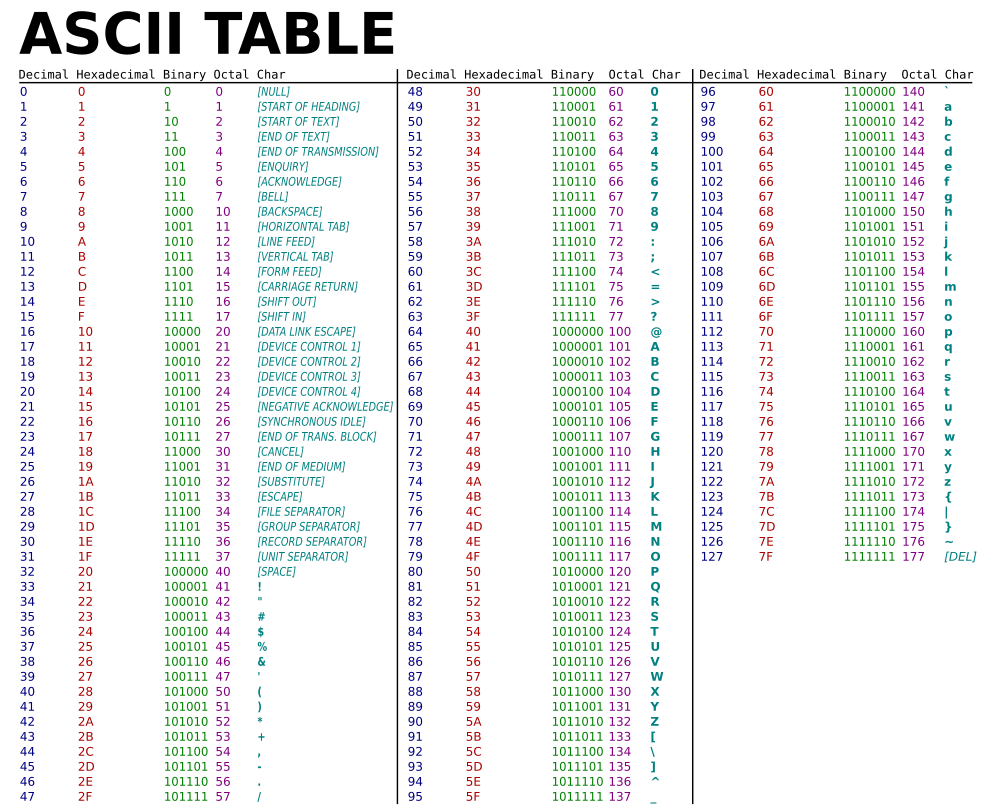
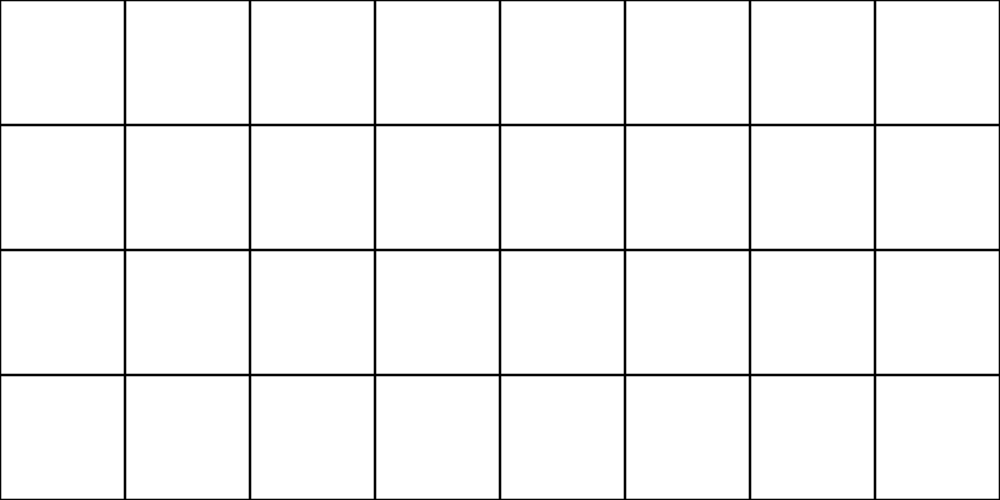
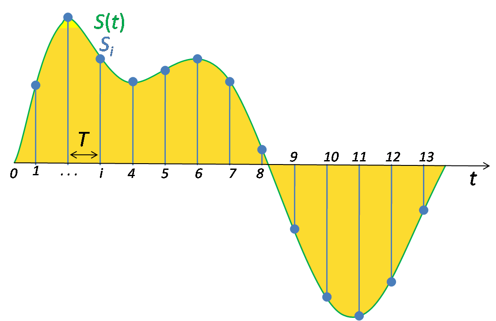
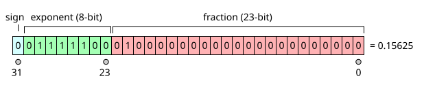

<p style="font-size: 1.3em;"><strong>CFGS Administración de Sistemas Informáticos y en Red (1º curso)</strong></p>

Material elaborado para el módulo **0371. Fonaments de Maquinari / Fundamentos de Hardware**

# Sistemas de numeración y representación de la información

## Programación de Aula

!!! info "Nota"
    Esta es una unidad de **nivelación/repaso**, previa al Tema 1, que no corresponde a un RA específico del Real Decreto de título. Se recomienda impartirla al inicio del curso como base matemática necesaria para comprender la representación binaria de la información (RA1) y sirve de apoyo transversal a todo el módulo.

### Planificación Temporal (5 sesiones / 10 horas)

| Sesión | Contenido |
| ------ | --------- |
| 1 | Sistemas de numeración: concepto de base. El sistema binario |
| 2 | Los sistemas octal y hexadecimal. Conversiones directas entre bases |
| 3 | Aritmética binaria: suma y resta. Representación de números negativos |
| 4 | Representación de texto e imágenes |
| 5 | Representación de audio y números reales. Repaso y ejercicios |

## 1. Sistemas de numeración: el concepto de base

Un **sistema de numeración** es un conjunto de símbolos y reglas que permiten representar cantidades. La característica que define un sistema de numeración es su **base**: el número de símbolos distintos que utiliza.

El sistema que usamos habitualmente es el **decimal (base 10)**, con diez símbolos (0-9). Cada posición dentro de un número representa una potencia de la base, que aumenta de derecha a izquierda:

$$
2\,451 = 2 \times 10^3 + 4 \times 10^2 + 5 \times 10^1 + 1 \times 10^0
$$

Un ordenador, al trabajar internamente solo con dos estados (encendido/apagado, 1/0), utiliza de forma nativa el **sistema binario (base 2)**. Sin embargo, escribir números binarios largos resulta poco práctico para las personas, por lo que en informática también se usan el **sistema octal (base 8)** y, sobre todo, el **sistema hexadecimal (base 16)**, que permiten representar la misma información de forma más compacta y legible.

| Sistema | Base | Símbolos utilizados |
| -------- | ---- | --------------------- |
| Binario | 2 | 0, 1 |
| Octal | 8 | 0, 1, 2, 3, 4, 5, 6, 7 |
| Decimal | 10 | 0, 1, 2, 3, 4, 5, 6, 7, 8, 9 |
| Hexadecimal | 16 | 0-9, A, B, C, D, E, F (donde A=10, B=11, C=12, D=13, E=14, F=15) |

## 2. El sistema binario

Cada dígito binario se llama **bit** (*binary digit*), y solo puede valer 0 o 1. En un número binario, cada posición representa una potencia de 2:

$$
1011_2 = 1 \times 2^3 + 0 \times 2^2 + 1 \times 2^1 + 1 \times 2^0 = 8 + 0 + 2 + 1 = 11_{10}
$$

### 2.1 Conversión de binario a decimal

Se suma el valor de la potencia de 2 correspondiente a cada posición donde haya un 1:

!!! example "Ejemplo"
    $$110101_2 = 1{\cdot}2^5 + 1{\cdot}2^4 + 0{\cdot}2^3 + 1{\cdot}2^2 + 0{\cdot}2^1 + 1{\cdot}2^0 = 32+16+0+4+0+1 = 53_{10}$$

### 2.2 Conversión de decimal a binario

El método más habitual es el de las **divisiones sucesivas entre 2**: se divide el número entre 2 repetidamente, anotando el resto (0 o 1) de cada división, hasta llegar a un cociente 0. El número binario resultante se lee de abajo hacia arriba (del último resto al primero).

!!! example "Ejemplo: convertir 53 a binario"
    | División | Cociente | Resto |
    | --------- | -------- | ----- |
    | 53 ÷ 2 | 26 | 1 |
    | 26 ÷ 2 | 13 | 0 |
    | 13 ÷ 2 | 6 | 1 |
    | 6 ÷ 2 | 3 | 0 |
    | 3 ÷ 2 | 1 | 1 |
    | 1 ÷ 2 | 0 | 1 |

    Leyendo los restos de abajo hacia arriba: **53₁₀ = 110101₂**

## 3. El sistema octal

El sistema octal (base 8) sigue el mismo principio que el binario y el decimal, pero con potencias de 8.

### 3.1 De octal a decimal

!!! example "Ejemplo"
    $$247_8 = 2{\cdot}8^2 + 4{\cdot}8^1 + 7{\cdot}8^0 = 128 + 32 + 7 = 167_{10}$$

### 3.2 De decimal a octal

Igual que con el binario, pero dividiendo sucesivamente entre 8 en lugar de entre 2.

## 4. El sistema hexadecimal

El sistema hexadecimal (base 16) es el más utilizado en informática para representar valores binarios de forma compacta (direcciones de memoria, colores en diseño web, códigos de error...).

### 4.1 De hexadecimal a decimal

!!! example "Ejemplo"
    $$2F_{16} = 2{\cdot}16^1 + F{\cdot}16^0 = 2{\cdot}16 + 15{\cdot}1 = 32+15 = 47_{10}$$

### 4.2 De decimal a hexadecimal

Igual que en los casos anteriores, dividiendo sucesivamente entre 16. Cuando el resto de una división sea mayor que 9, se sustituye por su letra equivalente (10=A, 11=B... 15=F).

## 5. Conversiones directas entre binario, octal y hexadecimal

Convertir entre binario y octal, o entre binario y hexadecimal, **no requiere pasar por el decimal**, ya que tanto el 8 como el 16 son potencias exactas de 2 (8=2³, 16=2⁴). Esto permite hacer la conversión agrupando bits directamente.

### 5.1 De binario a octal

Se agrupan los bits del número binario **de 3 en 3**, empezando por la derecha (rellenando con ceros a la izquierda si hace falta), y se convierte cada grupo a su dígito octal equivalente.

!!! example "Ejemplo: convertir 110101₂ a octal"
    Se agrupa de 3 en 3: `110` `101`
    - `110` = 6
    - `101` = 5

    **110101₂ = 65₈**

### 5.2 De binario a hexadecimal

Se agrupan los bits **de 4 en 4**, empezando por la derecha, y se convierte cada grupo a su dígito hexadecimal equivalente.

!!! example "Ejemplo: convertir 11010101₂ a hexadecimal"
    Se agrupa de 4 en 4: `1101` `0101`
    - `1101` = 13 = D
    - `0101` = 5

    **11010101₂ = D5₁₆**

### 5.3 Tabla de referencia rápida

| Decimal | Binario | Octal | Hexadecimal |
| -------- | -------- | ----- | ------------- |
| 0 | 0000 | 0 | 0 |
| 1 | 0001 | 1 | 1 |
| 2 | 0010 | 2 | 2 |
| 3 | 0011 | 3 | 3 |
| 4 | 0100 | 4 | 4 |
| 5 | 0101 | 5 | 5 |
| 6 | 0110 | 6 | 6 |
| 7 | 0111 | 7 | 7 |
| 8 | 1000 | 10 | 8 |
| 9 | 1001 | 11 | 9 |
| 10 | 1010 | 12 | A |
| 11 | 1011 | 13 | B |
| 12 | 1100 | 14 | C |
| 13 | 1101 | 15 | D |
| 14 | 1110 | 16 | E |
| 15 | 1111 | 17 | F |

!!! info "Recuerda"
    Es muy habitual identificar la base de un número mediante un subíndice (1010₂) o un prefijo (0x2F para hexadecimal, 0b1010 para binario en programación), ya que un mismo número de dígitos como "10" significa algo completamente distinto según la base en la que se interprete.

## 6. Aritmética binaria

### 6.1 Suma binaria

La suma en binario sigue las mismas reglas que en decimal, pero con solo dos símbolos. Las combinaciones posibles son:

| Operación | Resultado |
| ---------- | --------- |
| 0 + 0 | 0 |
| 0 + 1 | 1 |
| 1 + 0 | 1 |
| 1 + 1 | 0, y **me llevo 1** (acarreo) |
| 1 + 1 + 1 (con acarreo) | 1, y me llevo 1 |

!!! example "Ejemplo: 1011₂ + 0110₂"
    ```
      1011
    +  0110
    ------
      10001
    ```
    Comprobación: 1011₂ = 11₁₀, 0110₂ = 6₁₀, 11+6 = 17₁₀ = 10001₂ ✓

### 6.2 Resta binaria

Sigue una lógica similar, tomando "prestado" de la posición siguiente cuando haga falta restar 1 a 0 (igual que en decimal, cuando restamos y el minuendo es menor que el sustraendo).

!!! note "En la práctica"
    Los ordenadores, internamente, no restan de esta forma: usan una técnica llamada **complemento a 2** (que veremos en la sección 7), que permite convertir cualquier resta en una suma.

## 7. Representación de números negativos

Hasta ahora hemos trabajado con números binarios sin signo, donde cada bit representa únicamente una potencia de 2 en positivo. Para poder representar también números **negativos**, hay que reservar de alguna forma información sobre el signo, y existen varias técnicas para hacerlo, cada una con sus ventajas e inconvenientes.

!!! example "Comparativa (usando 8 bits)"
    | Decimal | Signo y magnitud | Complemento a 1 | Complemento a 2 |
    | -------- | ------------------ | ----------------- | ------------------ |
    | +5 | `00000101` | `00000101` | `00000101` |
    | −5 | `10000101` | `11111010` | `11111011` |
    | 0 (positivo) | `00000000` | `00000000` | `00000000` |
    | 0 (negativo) | `10000000` ⚠️ | `11111111` ⚠️ | *(no existe, un único cero)* |

### 7.1 Signo y magnitud

El bit más a la izquierda (el más significativo) se reserva para indicar el signo (0 = positivo, 1 = negativo), y el resto de bits representan el valor absoluto del número, exactamente igual que en binario sin signo.

!!! example "Ejemplo (8 bits)"
    +5 = `00000101` — −5 = `10000101` (el primer bit cambia de 0 a 1, el resto queda igual)

Como se ve en la tabla comparativa, el principal inconveniente de este método es que existen **dos representaciones distintas para el cero** (`00000000` y `10000000`), lo que complica el diseño de los circuitos aritméticos y "desperdicia" una combinación de bits.

### 7.2 Complemento a 1

Para obtener el complemento a 1 de un número, simplemente se invierten todos sus bits (los 0 pasan a 1 y viceversa). Es una operación muy rápida de implementar en un circuito electrónico, pero **sigue teniendo el mismo problema del doble cero** que el signo y magnitud (`00000000` y `11111111`).

!!! example "Ejemplo (8 bits)"
    +5 = `00000101` → se invierten todos los bits → Complemento a 1 de 5 (es decir, −5) = `11111010`

### 7.3 Complemento a 2

El **complemento a 2** es el método que utilizan realmente los ordenadores actuales para representar números negativos, ya que soluciona el problema del doble cero (solo existe una única representación del 0) y, además, permite que la **resta se realice internamente como una suma**, simplificando muchísimo el diseño del procesador. Se obtiene en dos pasos:

1. Se calcula el complemento a 1 (se invierten todos los bits).
2. Se suma 1 al resultado.

!!! example "Ejemplo: representar −5 en complemento a 2 (8 bits)"
    1. +5 = `00000101`
    2. Complemento a 1: `11111010`
    3. Se suma 1: `11111010 + 1 = 11111011`

    **−5 en complemento a 2 (8 bits) = 11111011**

### 7.4 Restar usando el complemento a 2 (sumando)

La gran ventaja práctica del complemento a 2 es que una resta A − B se puede calcular como una suma A + (−B), donde −B se obtiene con el complemento a 2. Así, el procesador solo necesita un circuito sumador, no uno de suma y otro de resta por separado.

!!! example "Ejemplo: calcular 9 − 5 usando complemento a 2 (8 bits)"
    1. 9 en binario: `00001001`
    2. −5 en complemento a 2 (calculado antes): `11111011`
    3. Se suman ambos: `00001001 + 11111011 = 100000100`
    4. Al tener 8 bits de capacidad, se descarta el 9º bit (el acarreo final): resultado = `00000100`

    **00000100₂ = 4₁₀**, que efectivamente es 9 − 5 ✓

!!! info "Recuerda"
    En complemento a 2, el bit más significativo también indica el signo (0 = positivo, 1 = negativo), pero el resto de bits ya no representan directamente el valor absoluto como en signo y magnitud, sino que forman parte de una única representación coherente para todo el rango de números.

## 8. Representación de texto

Cada carácter (letra, número, símbolo) debe codificarse como una secuencia de bits para poder almacenarse o transmitirse. La idea es sencilla: se elabora una tabla que asigna, de forma única, un número a cada carácter posible, y ese número se guarda en binario.

### 8.1 El código ASCII

El **código ASCII** (*American Standard Code for Information Interchange*) asigna un número, entre 0 y 127, a cada carácter del alfabeto latino básico, los dígitos, los signos de puntuación y algunos caracteres de control (como el salto de línea o el tabulador).


<p style="text-align:center; font-size:0.85em; color:#666;"><em>Fragmento de la tabla ASCII: cada carácter tiene asignado un código numérico, que se almacena en binario.</em></p>

!!! example "Ejemplo"
    La letra mayúscula "A" tiene asignado el código ASCII **65**, que en binario (usando 8 bits) es `01000001`. La letra "B" es el 66 (`01000010`), y así sucesivamente.

Al usar solo 7 bits (128 combinaciones posibles), el ASCII original resultó insuficiente para representar alfabetos con caracteres especiales (como la ñ, las vocales acentuadas, u otros idiomas con alfabetos distintos al latino), lo que dio lugar primero a extensiones de 8 bits (como ISO-8859-1, con 256 combinaciones) y, finalmente, a estándares mucho más completos.

### 8.2 Unicode

**Unicode** es el estándar actual que resuelve definitivamente la limitación de ASCII, asignando un código único (llamado *code point*) a prácticamente cualquier carácter de cualquier sistema de escritura del mundo (alfabetos latino, cirílico, árabe, chino...), además de símbolos matemáticos, emojis, etc. Unicode ya contempla más de 140 000 caracteres distintos.

Una de sus codificaciones más utilizadas en internet es **UTF-8**, que tiene una ventaja muy importante: es **compatible con ASCII**. Los primeros 128 caracteres se codifican en UTF-8 exactamente igual (con 1 solo byte) que en ASCII, y solo los caracteres menos comunes ocupan 2, 3 o hasta 4 bytes. Esto permite que un archivo de texto antiguo en ASCII se pueda interpretar sin problemas como UTF-8.

## 9. Representación de imágenes

Una imagen digital se descompone en una matriz de puntos llamados **píxeles** (del inglés *picture element*), cada uno de los cuales almacena la información de color de esa posición concreta de la imagen.


<p style="text-align:center; font-size:0.85em; color:#666;"><em>Al ampliar mucho una imagen digital, se distinguen los píxeles individuales que la componen.</em></p>

### 9.1 Profundidad de color

El número de bits dedicados a cada píxel (**profundidad de color**) determina cuántos colores distintos se pueden representar: con N bits por píxel, se pueden representar 2^N colores diferentes.

!!! example "Ejemplos de profundidad de color"
    | Bits por píxel | Colores representables | Uso habitual |
    | ---------------- | ------------------------- | ------------- |
    | 1 bit | 2 (blanco y negro puro) | Imágenes de línea, faxes antiguos |
    | 8 bits | 256 | Imágenes en escala de grises, o color indexado (GIF) |
    | 24 bits (8+8+8) | Más de 16,7 millones | Color real (JPEG, PNG), la más habitual hoy |
    | 32 bits (24 + 8 de transparencia) | Igual que 24 bits + canal alfa | PNG con transparencia |

En una imagen a color de 24 bits, se reservan típicamente **8 bits para cada componente** (rojo, verde y azul — el modelo RGB), lo que permite 256 niveles de intensidad para cada uno de esos tres colores, y su combinación produce el resto de colores visibles.

### 9.2 Resolución

La **resolución** de una imagen es el número total de píxeles que la componen (ancho × alto, por ejemplo 1920×1080). A mayor resolución y mayor profundidad de color, más nítida y realista será la imagen, pero también mayor será el tamaño del archivo que ocupe (sin tener en cuenta la compresión, que puede reducir mucho ese tamaño).

## 10. Representación de audio

El sonido es, en origen, una señal **analógica** (continua): una onda que varía de forma constante en el tiempo, como la vibración del aire que llega a nuestro oído. Para poder almacenarla en un ordenador, debe convertirse en una señal **digital**, mediante un proceso llamado **digitalización**.


<p style="text-align:center; font-size:0.85em; color:#666;"><em>La señal analógica continua se convierte en una secuencia de muestras discretas para poder almacenarla digitalmente.</em></p>

### 10.1 Muestreo y frecuencia de muestreo

La digitalización consiste en tomar "fotografías" del valor de la onda a intervalos de tiempo regulares (**muestras**). El número de muestras que se toman por segundo se denomina **frecuencia de muestreo**, medida en hercios (Hz).

!!! example "Ejemplo"
    La calidad de un CD de audio usa una frecuencia de muestreo de **44 100 Hz** (44 100 muestras por segundo). Esto no es casual: el oído humano percibe sonidos hasta unos 20 000 Hz, y según el llamado *teorema de muestreo*, hace falta muestrear a más del doble de la frecuencia máxima que se quiere reproducir con fidelidad — de ahí el valor de 44 100 Hz.

### 10.2 Resolución de bits

Además de cuántas muestras se toman por segundo, importa también con cuántos bits se codifica el valor de cada muestra (**resolución o profundidad de bits**): a más bits por muestra, mayor precisión y calidad de sonido (más "escalones" distintos de volumen se pueden distinguir), pero también mayor tamaño del archivo resultante.

!!! note "Ejemplo de cálculo"
    Un CD de audio usa 44 100 muestras/segundo, con 16 bits por muestra, en estéreo (2 canales). Eso supone: 44 100 × 16 × 2 = 1 411 200 bits por segundo de audio sin comprimir (aproximadamente 1,41 Mbps), lo que explica por qué los archivos de audio sin comprimir (como el WAV) ocupan bastante espacio.

## 11. Representación de números reales (coma flotante)

Todo lo visto hasta ahora sirve para números enteros. Pero, ¿cómo se representa un número con decimales, como 6,5 o 0,1? Los ordenadores utilizan para ello la **notación en coma flotante**, inspirada en la notación científica que usamos en matemáticas (por ejemplo, 6,022 × 10²³).

Un número en coma flotante se representa mediante tres partes:

- **Signo**: indica si el número es positivo o negativo.
- **Mantisa** (o significando): los dígitos significativos del número.
- **Exponente**: indica cuántas posiciones hay que desplazar la coma decimal, y en qué dirección.

### 11.1 El estándar IEEE 754

El formato más extendido para representar números en coma flotante es el estándar **IEEE 754**, utilizado prácticamente por todos los procesadores y lenguajes de programación actuales. Define, entre otros, dos formatos:

| Formato | Bits totales | Signo | Exponente | Mantisa |
| -------- | -------------- | ----- | ---------- | -------- |
| Precisión simple (float) | 32 bits | 1 bit | 8 bits | 23 bits |
| Precisión doble (double) | 64 bits | 1 bit | 11 bits | 52 bits |


<p style="text-align:center; font-size:0.85em; color:#666;"><em>Distribución de los 32 bits en el formato de precisión simple: 1 bit de signo, 8 bits de exponente y 23 bits de mantisa.</em></p>

### 11.2 Ejemplo completo: representar 6,5 en precisión simple (32 bits)

!!! example "Paso a paso"
    **Paso 1 — Pasar a binario.** 6,5 en binario es `110,1` (6 = `110`; 0,5 = `0,1` en binario, ya que 0,1₂ = 1×2⁻¹ = 0,5).

    **Paso 2 — Normalizar** (dejar un único 1 delante de la coma, como en notación científica): `110,1 = 1,101 × 2²`

    **Paso 3 — Signo.** El número es positivo, así que el bit de signo es `0`.

    **Paso 4 — Exponente con sesgo (*bias*).** En precisión simple, al exponente real se le suma siempre 127 antes de guardarlo (para poder representar también exponentes negativos sin necesitar un signo aparte). Como el exponente real es 2: 2 + 127 = 129, que en binario (8 bits) es `10000001`.

    **Paso 5 — Mantisa.** Se guardan los dígitos que quedan después del punto en la forma normalizada (`1,101`), es decir `101`, rellenando con ceros hasta completar los 23 bits: `10100000000000000000000`.

    **Resultado final (32 bits):**
    ```
    0 10000001 10100000000000000000000
    signo  exponente        mantisa
    ```

!!! info "Recuerda"
    El primer "1" de la mantisa normalizada (el que está justo antes de la coma en `1,101`) **no se almacena**, porque siempre vale 1 en un número normalizado: se llama *bit implícito*, y es lo que permite ganar un bit extra de precisión "gratis".

### 11.3 Precisión y limitaciones

Como la mantisa tiene un número limitado de bits, no todos los números reales se pueden representar de forma exacta (por ejemplo, 0,1 en binario es una fracción periódica infinita, igual que 1/3 lo es en decimal), lo que provoca los conocidos **errores de redondeo** en cálculos con decimales que a veces se observan en programación.

## Ejercicios prácticos

!!! task "Tarea"
    **Ejercicio 1**. Convierte los siguientes números binarios a decimal: 1101₂, 100110₂, 11111₂.

    **Ejercicio 2**. Convierte los siguientes números decimales a binario: 25, 100, 17.

    **Ejercicio 3**. Convierte 345₈ a decimal, y 200₁₀ a octal.

    **Ejercicio 4**. Convierte 1A3₁₆ a decimal, y 500₁₀ a hexadecimal.

    **Ejercicio 5**. Convierte directamente (sin pasar por decimal) el número binario 111010110₂ a octal y a hexadecimal.

    **Ejercicio 6**. Realiza las siguientes sumas en binario, y comprueba el resultado convirtiendo los números a decimal: 1101₂ + 1011₂, y 10010₂ + 00111₂.

    **Ejercicio 7**. Un color en diseño web se representa en hexadecimal como #A3C1E8. Explica cuántos bits ocupa cada componente de color (rojo, verde, azul) y por qué se usa precisamente el sistema hexadecimal para esta representación.

    **Ejercicio 8**. Completa una tabla como la del punto 5.3 para los números del 16 al 20, en las cuatro bases (decimal, binario, octal, hexadecimal).

    **Ejercicio 9**. Representa el número −18 en complemento a 2, usando 8 bits.

    **Ejercicio 10**. Explica por qué el método de signo y magnitud tiene el problema de las "dos representaciones del cero", y cómo lo soluciona el complemento a 2.

    **Ejercicio 11**. Explica la diferencia entre ASCII y Unicode, y por qué fue necesario crear este último.

    **Ejercicio 12**. Si una imagen usa 16 bits por píxel, ¿cuántos colores distintos puede representar como máximo?

    **Ejercicio 13**. Explica qué es la frecuencia de muestreo en la digitalización de audio, y por qué el CD de audio usa 44 100 Hz.

    **Ejercicio 14**. Siguiendo el mismo procedimiento paso a paso del ejemplo de la sección 11.2, representa el número **5,25** en formato IEEE 754 de precisión simple (32 bits).
