
<strong>CFGS Administración de Sistemas Informáticos y en Red (1º curso)</strong>

Material elaborado para el módulo **Fundamentos de Hardware**

# Introducción a los sistemas microinformáticos

## Programación de Aula

### Resultados de Aprendizaje

Esta unidad trabaja el **Resultado de Aprendizaje 1 (RA1)** del módulo, según el **Real Decreto 1629/2009** (Anexo I, módulo *Fundamentos de Hardware*):

1. **RA1.** Configura equipos microinformáticos, componentes y periféricos, analizando sus características y relación con el conjunto.

Esta unidad se centra especialmente en los criterios:

- **CE1.a** (RA1.a): Se han identificado y caracterizado los dispositivos que constituyen los bloques funcionales de un equipo microinformático.
- **CE1.c** (RA1.c): Se ha analizado la arquitectura general de un equipo y los mecanismos de conexión entre dispositivos.
- **CE1.h** (RA1.h): Se han clasificado los dispositivos periféricos y sus mecanismos de comunicación.

### Planificación Temporal (11 sesiones / 22 horas)

!!! info "Nota"
    Dado el volumen de contenidos de esta unidad (arquitectura, componentes físicos y lógicos, buses, nuevas arquitecturas), se ha ampliado a 22 horas. Si tu programación exige menos horas, puedes recortar las sesiones 7-8 (CISC/RISC en detalle) o la 11 (nuevas arquitecturas) y dejarlas como ampliación optativa.

| Sesión | Contenido |
| ------ | --------- |
| 1 | Sistemas microinformáticos: hardware, software, firmware y humanware |
| 2 | El ordenador y la informática: definiciones y conceptos clave |
| 3 | Historia de la informática (I): de los orígenes mecánicos a la era del transistor |
| 4 | Historia de la informática (II): de los primeros ordenadores personales a la actualidad |
| 5 | La arquitectura de Von Neumann. Estructura de un sistema informático |
| 6 | La arquitectura Harvard. El cuello de botella de Von Neumann |
| 7 | Arquitecturas CISC y RISC |
| 8 | Componentes físicos: el procesador (unidad de control y ALU), memoria y almacenamiento |
| 9 | Periféricos. Componentes lógicos: software, SO, firmware y drivers |
| 10 | Los buses del sistema |
| 11 | Nuevas arquitecturas: SoC, coprocesadores, chips neuromórficos e IA en procesadores. Repaso y ejercicios |

## 1. Sistemas microinformáticos

La **microinformática** es la rama de la informática centrada en el estudio y uso de los equipos construidos alrededor de un **microprocesador**: el circuito integrado que actúa como CPU (Unidad Central de Procesamiento) del equipo.

### 1.1 La placa base como soporte del sistema

Todos los componentes de un ordenador se conectan, física y eléctricamente, a la **placa base** (o placa madre, *motherboard*), que proporciona tanto las conexiones necesarias entre dispositivos como la alimentación eléctrica que cada uno de ellos requiere. En ella se encuentran, entre otros elementos, los **slots de expansión** y el **zócalo del procesador (CPU socket)**, donde se instala el microprocesador.

### 1.2 Del impulso eléctrico a la información

El microprocesador recibe constantemente **impulsos eléctricos**, que se interpretan como código binario (presencia o ausencia de corriente, representada como 1 o 0). Cada uno de esos impulsos, de forma aislada, constituye un **dato**. Es la unidad central de procesamiento la que ordena, interpreta y procesa esos datos hasta convertirlos en **información** con sentido, que finalmente se envía a algún periférico de salida para que el usuario pueda percibirla.

Todo este procesamiento implica una enorme cantidad de operaciones aritméticas y lógicas realizadas a gran velocidad, lo que genera una cantidad considerable de calor. Por eso los procesadores necesitan sistemas de refrigeración (**disipadores**) y, a menudo, ventiladores específicos (**coolers**).

### 1.3 Elementos de un sistema microinformático

Un sistema microinformático está formado por cuatro tipos de elementos interrelacionados:

| Elemento | Naturaleza | Descripción |
| --------- | ----------- | ------------ |
| Hardware | Tangible | Los componentes físicos: procesador, memoria, dispositivos de almacenamiento y periféricos |
| Software | Intangible | El sistema operativo, el firmware y las aplicaciones (destacando los sistemas de gestión de bases de datos) |
| Información | — | Puede obtenerse de forma externa (introducida por el usuario) o generarse mediante el propio procesamiento del sistema |
| Soporte humano | — | El personal técnico que diseña y mantiene el sistema (analistas, programadores, técnicos de mantenimiento) y los propios usuarios finales |

## 2. El ordenador y la informática

### 2.1 ¿Qué es un ordenador?

Un **ordenador** (computador o computadora) es una máquina capaz de aceptar datos de entrada, realizar con ellos operaciones lógicas y aritméticas, y proporcionar el resultado a través de un medio de salida, todo ello sin intervención humana directa y siguiendo un programa de instrucciones previamente almacenado en el propio equipo.

Lo que distingue a un ordenador de otras máquinas (como una calculadora) es precisamente esto: es una máquina **programable y de propósito general**, capaz de procesar datos de naturaleza muy distinta según las instrucciones que reciba, en lugar de estar limitado a una única función fija.

Los **datos** son conjuntos de símbolos que representan un valor, un hecho, un objeto o una idea, en una forma adecuada para su tratamiento. Pueden ser captados directamente por el propio ordenador (mediante sensores u otros dispositivos) o introducidos por una persona en forma de letras y números.

### 2.2 ¿Qué es la informática?

La palabra **informática** proviene del francés, como contracción de *información* y *automática*. La Real Academia de la Lengua Española la define como el conjunto de conocimientos científicos y técnicas que permiten el tratamiento automático de la información mediante ordenadores.

Como disciplina, la informática (o ciencia e ingeniería de los computadores) combina métodos teóricos, experimentales y de diseño, por lo que se considera tanto una ciencia como una ingeniería, abarcando el diseño, análisis, implementación y aplicación de los procesos que transforman la información.

### 2.3 Software, hardware y firmware

- **Programa**: conjunto de instrucciones que se introducen en un ordenador para que realice una tarea concreta.
- **Aplicación informática**: conjunto de varios programas relacionados entre sí.
- **Software**: término que engloba a los programas, las aplicaciones y los datos que estos manejan.
- **Hardware**: el conjunto de componentes físicos que forman el sistema informático, necesarios para que el software pueda funcionar y generar la información que el usuario necesita.
- **Firmware**: un tipo especial de software, grabado directamente en un componente físico, del que resulta casi inseparable. Es el caso, por ejemplo, del programa grabado en una memoria ROM, o del software que configura dispositivos de red como routers o switches.

## 3. Historia de la informática (I): de los orígenes mecánicos a la era del transistor

Antes de que existieran las máquinas electrónicas, la humanidad ya buscaba formas de automatizar el cálculo:

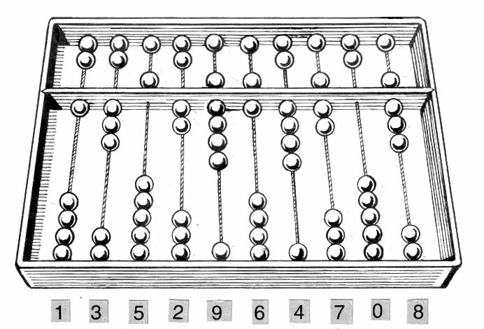

<em>El ábaco, inventado hace miles de años, es la herramienta de cálculo más antigua que se conoce.</em>

- **Hacia el 3500 a.C.**, en Babilonia, se inventa el **ábaco**, la primera herramienta conocida para realizar cálculos.
- En el **siglo IX**, el matemático Al-Juarismi desarrolla el concepto de **algoritmo**, término que deriva precisamente de su nombre.
- En **1642**, Blaise Pascal construye la **Pascalina**, una de las primeras calculadoras mecánicas capaces de sumar mediante ruedas dentadas.

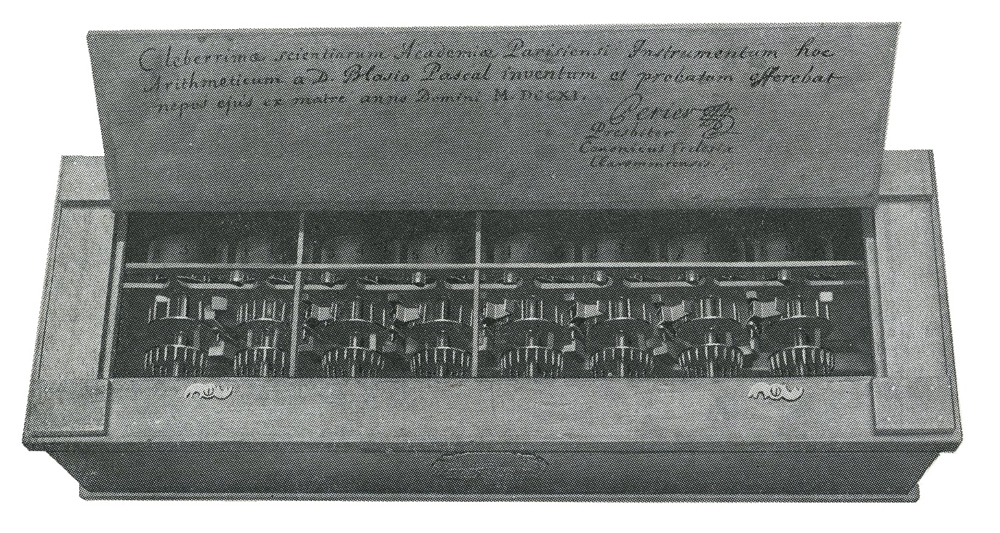

<em>La Pascalina sumaba automáticamente mediante un sistema de ruedas dentadas con acarreo.</em>

- En **1673**, Gottfried Leibniz diseña la primera calculadora de propósito general capaz de multiplicar y dividir, aunque con problemas de fiabilidad.
- En **1801**, Joseph Marie Jacquard aplica **tarjetas perforadas** para controlar el patrón de tejido de una máquina textil — una idea que más adelante sentaría las bases de la programación por tarjetas.
- Entre **1822 y 1837**, Charles Babbage diseña el **Motor Analítico**, considerado el primer proyecto de una máquina de cálculo de propósito general programable, aunque nunca llegó a construirlo en vida (se construyó finalmente en 1989). Por ello se le conoce como el "padre de las computadoras modernas".
- En **1843**, Ada Lovelace propone que las tarjetas perforadas puedan hacer repetir ciertas operaciones al motor de Babbage, por lo que se la considera la primera programadora de la historia.
- En **1854**, George Boole publica su **álgebra de Boole**, que reduce la lógica a tres operadores básicos (Y, O, NO), sentando las bases matemáticas de toda la informática posterior.
- En **1936**, Alan Turing formaliza el concepto de **algoritmo** mediante su descripción teórica de la "máquina de Turing".
- En **1941**, Konrad Zuse construye el **Z3**, la primera máquina programable y totalmente automática.
- En **1944**, se pone en marcha el **Harvard Mark I**, un ordenador electromecánico financiado por IBM, con centenares de miles de piezas mecánicas.
- En **1946**, se construye en la Universidad de Pensilvania el **ENIAC**, considerado el primer ordenador electrónico de propósito general, con más de 18.000 tubos de vacío.

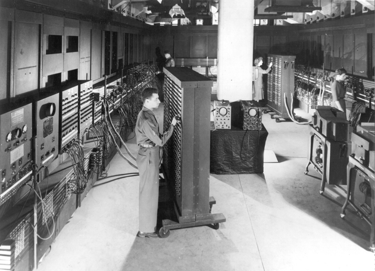

<em>El ENIAC (1946) ocupaba una sala entera y pesaba unas 27 toneladas.</em>

- En **1947**, John Bardeen, Walter Brattain y William Shockley inventan el **transistor** en los Laboratorios Bell, un avance que revolucionaría por completo la electrónica.

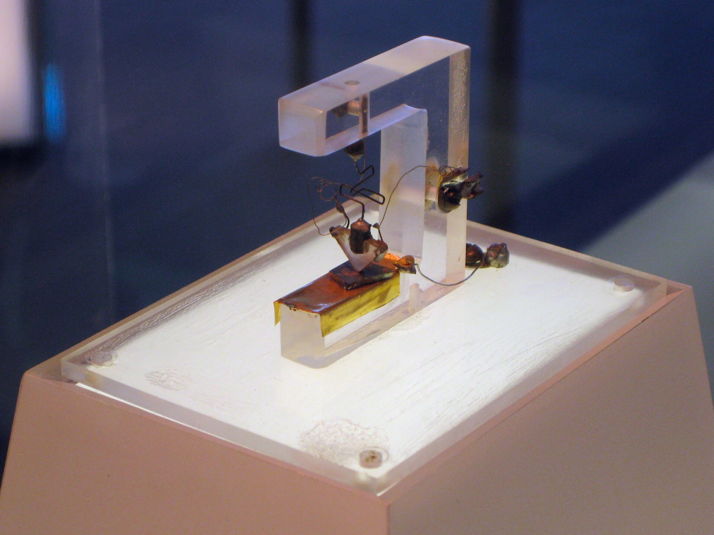

<em>El primer transistor de la historia, construido en los Laboratorios Bell en 1947.</em>

- En **1958**, Jack Kilby construye el primer **circuito integrado**, permitiendo agrupar múltiples componentes electrónicos en un solo chip.

## 4. Historia de la informática (II): de los primeros ordenadores personales a la actualidad

- En **1968**, Robert Noyce y Gordon Moore fundan **Intel**.
- En **1969-1970**, nace en los Laboratorios Bell el sistema **UNIX**, germen de gran parte de los sistemas operativos actuales.
- En **1971**, Intel desarrolla y comercializa uno de los primeros microprocesadores de la historia.
- En **1975 y 1976**, se fundan respectivamente **Microsoft** y **Apple**, dos de las compañías que definirían la informática personal de las décadas siguientes.
- En **1983**, ARPANET se desliga definitivamente de su origen militar, marcándose a menudo esta fecha como el nacimiento simbólico de **Internet**.
- En **1990**, Tim Berners-Lee concibe el **World Wide Web**, junto con las bases del protocolo HTTP, el lenguaje HTML y el concepto de URL.
- En **1991**, Linus Torvalds comienza a desarrollar **Linux**, un sistema operativo compatible con Unix y de código abierto.
- Durante los **años 90 y 2000**, se sucede el lanzamiento de las distintas versiones de Windows (3.1, 95, XP...) y la popularización de Internet entre el público general.
- En **2007-2010**, la llegada del **smartphone** (con el iPhone como principal impulsor) y, poco después, de la **tablet**, transforma de nuevo la manera en que las personas usan la informática en su día a día.
- En **2018**, se hacen públicas las vulnerabilidades **Meltdown y Spectre**, que afectan a la práctica totalidad de los procesadores modernos, poniendo de relieve la importancia de la seguridad a nivel de hardware.
- En los **años más recientes**, la **inteligencia artificial y el aprendizaje automático**, la generalización de los **procesadores multinúcleo** en todo tipo de dispositivos (desde smartphones hasta automóviles), y el auge del **teletrabajo** y la **ciberseguridad**, marcan las tendencias tecnológicas más destacadas.

!!! note "La Ley de Moore"
    A lo largo de toda esta historia reciente, se ha cumplido con notable precisión la **Ley de Moore**: la observación de que la cantidad de transistores que se pueden integrar en un chip (y, con ello, la potencia de cálculo disponible) se duplica aproximadamente cada uno o dos años.

## 5. La arquitectura de Von Neumann

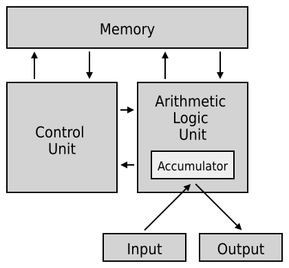

<em>CPU, memoria y periféricos conectados mediante un bus común: el esquema clásico de Von Neumann.</em>

La **arquitectura de Von Neumann**, publicada a principios de los años 40, sigue siendo, con matices y evoluciones, el modelo fundamental sobre el que se construyen prácticamente todos los ordenadores digitales actuales, a pesar de la enorme evolución tecnológica sufrida desde entonces.

Según este modelo, los distintos bloques funcionales de un ordenador deben estar siempre conectados entre sí, de forma que no sea necesario modificar el hardware para ejecutar un programa distinto. Sus bloques funcionales son:

- **Unidad Central de Proceso (CPU)**: el núcleo del ordenador, encargado de realizar las operaciones básicas y de gestionar el funcionamiento del resto de componentes.
- **Memoria principal**: donde se almacenan tanto los datos como las instrucciones de los programas.
- **Buses**: el conexionado que permite la comunicación entre los distintos bloques funcionales.
- **Periféricos**: los elementos que capturan datos (como un teclado), muestran resultados (como un monitor) o comunican el sistema con otros equipos.

### 5.1 Estructura de un sistema informático

De forma más amplia, un sistema informático completo se puede describir en cuatro niveles:

| Nivel | Descripción |
| ------ | ----------- |
| Hardware | Los recursos de cómputo básicos: CPU, memoria y dispositivos de entrada/salida |
| Sistema operativo | Controla y coordina el uso de los recursos hardware, repartiéndolos entre los distintos programas |
| Programas de aplicación | Utilizan los recursos del hardware y los servicios del sistema operativo para resolver tareas concretas: procesadores de texto, navegadores, compiladores, juegos... |
| Usuarios | Las personas (u otras máquinas y sistemas) que hacen uso de todo lo anterior |

Cada nivel se apoya en el anterior: los programas de aplicación no podrían funcionar sin el sistema operativo, y este, a su vez, no tendría ningún sentido sin el hardware físico sobre el que ejecutarse.

### 5.2 El ciclo de ejecución de instrucciones

Un programa es un conjunto de instrucciones y datos que se ejecutan de forma secuencial, y que a partir de unos datos de entrada producen una salida. Para ello, el ordenador repite constantemente esta secuencia:

1. Busca cuál es la siguiente instrucción a ejecutar.
2. Decodifica la instrucción.
3. Busca los operandos necesarios.
4. Realiza la operación.
5. Almacena el resultado.

Las instrucciones que el procesador ejecuta directamente están escritas en **lenguaje máquina** (binario). Como este lenguaje resulta muy difícil de manejar para una persona, los programas se escriben habitualmente en **lenguajes de más alto nivel**, mucho más cercanos al lenguaje humano, que después un programa **compilador** se encarga de traducir a lenguaje máquina.

## 6. La arquitectura Harvard

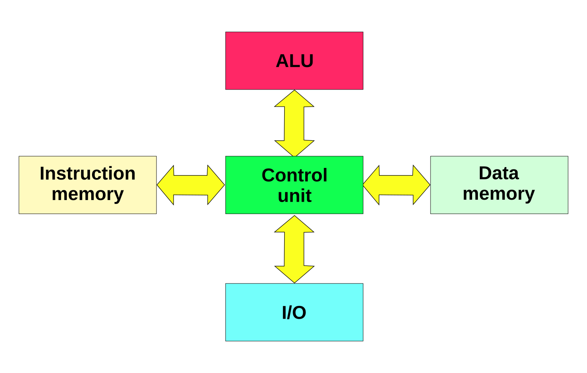

<em>En la arquitectura Harvard, la memoria de datos y la de instrucciones están físicamente separadas, cada una con su propio bus.</em>

Al principio de la computación electrónica convivieron dos filosofías de diseño enfrentadas: la arquitectura de **Von Neumann** y la arquitectura **Harvard**.

La diferencia fundamental es esta: en la arquitectura de **Von Neumann**, instrucciones y datos comparten el mismo espacio de memoria y el mismo bus de acceso. En la arquitectura **Harvard**, en cambio, la memoria de datos y la memoria de instrucciones están **físicamente separadas**, cada una con su propio bus.

| Aspecto | Von Neumann | Harvard |
| -------- | ------------ | -------- |
| Memoria de datos e instrucciones | Compartida | Separada |
| Prioridad de diseño | Flexibilidad y libertad para el programador | Rendimiento |
| Acceso simultáneo a datos e instrucciones | No (mismo bus) | Sí (buses independientes) |

En la práctica, los ordenadores actuales son **híbridos**: el procesador dispone de cachés separadas para datos e instrucciones (más cercanas al enfoque Harvard, por rendimiento), mientras que la memoria RAM principal sigue funcionando de forma puramente Von Neumann.

### 6.1 El cuello de botella de Von Neumann

La principal limitación de la arquitectura de Von Neumann es precisamente compartir un único bloque de memoria y un único bus para datos e instrucciones: como ambos deben transferirse de forma secuencial por el mismo canal, se genera un **cuello de botella** que limita la velocidad máxima de trabajo del sistema, por rápido que sea el procesador. Es, en parte, para paliar este problema por lo que los microprocesadores actuales incorporan cachés separadas para datos y para instrucciones, como se ha comentado.

## 7. Arquitecturas CISC y RISC

Una de las primeras decisiones a la hora de diseñar un microprocesador es definir su **juego de instrucciones**, lo cual condiciona tanto el diseño físico del procesador como la forma en que se deben programar todas las operaciones que este pueda ejecutar. Frente a esta decisión, existen dos filosofías de diseño enfrentadas.

### 7.1 Arquitectura CISC

**CISC** (*Complex Instruction Set Computer*, ordenador con juego de instrucciones complejo) se caracteriza por un conjunto de instrucciones muy amplio, capaz de realizar operaciones complejas directamente sobre datos situados en memoria o en registros internos. Esta complejidad dificulta el paralelismo entre instrucciones; por ello, los procesadores CISC de alto rendimiento actuales suelen traducir internamente esas instrucciones complejas en varias **microinstrucciones** más simples, de tipo RISC, antes de ejecutarlas. El procesador **x86**, el más habitual en equipos de escritorio, es de tipo CISC.

### 7.2 Arquitectura RISC

**RISC** (*Reduced Instruction Set Computer*, ordenador con juego de instrucciones reducido) se basa en instrucciones de tamaño fijo, presentadas en pocos formatos distintos, donde únicamente las instrucciones de carga y almacenamiento acceden a la memoria de datos. El objetivo de este diseño es facilitar la segmentación y el paralelismo en la ejecución de instrucciones, reduciendo al mínimo los accesos a memoria. Arquitecturas como **ARM**, **MIPS**, **SPARC** o **PowerPC** siguen esta filosofía, y son las que protagonizan la tendencia actual de diseño de microprocesadores, especialmente en dispositivos móviles y servidores.

!!! note "Relación con Von Neumann y Harvard"
    De forma orientativa, la arquitectura RISC se apoya conceptualmente más en los principios de Von Neumann, mientras que CISC tiene más en común históricamente con el enfoque Harvard, aunque en la práctica ambas familias han ido convergiendo con soluciones híbridas.

## 8. Componentes físicos: procesador, memoria y almacenamiento

### 8.1 El procesador

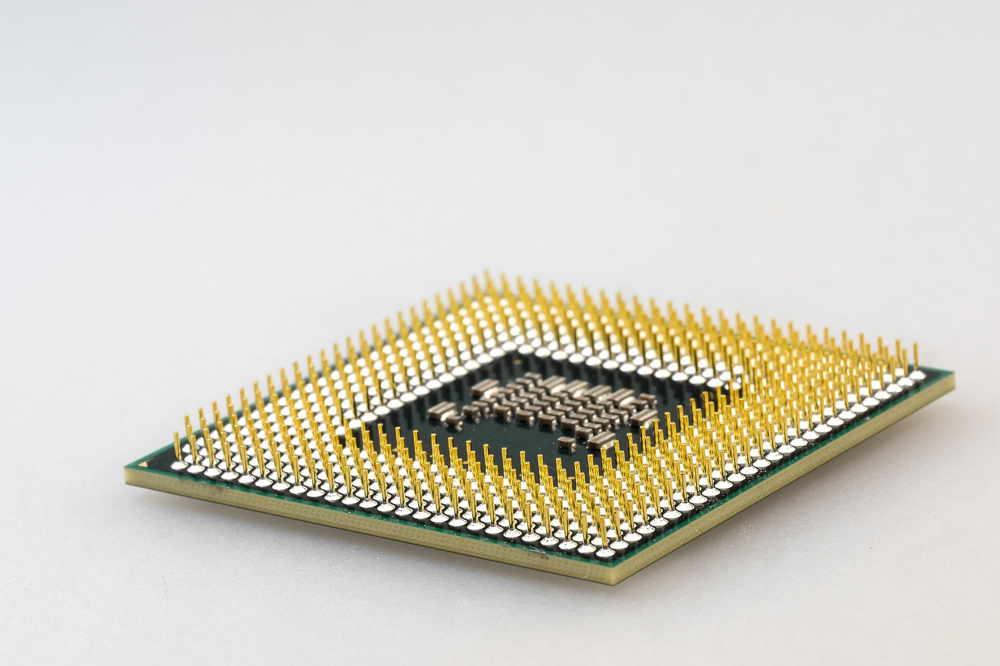

<em>Un microprocesador real, integrado en un único chip.</em>

El procesador es el "cerebro" del ordenador, encargado de controlar y gobernar todo el sistema, comunicándose con la memoria y los periféricos a través de los buses. Sus tareas principales son leer datos de memoria, procesarlos, y volver a escribir el resultado en memoria.

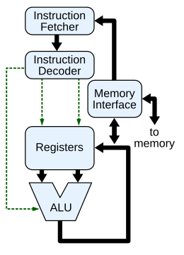

<em>Esquema simplificado de un procesador: la unidad de control coordina la ALU y los registros a través de los buses internos.</em>

El procesador está formado por los siguientes componentes:

#### 8.1.1 La unidad de control (UC)

La **unidad de control** es el componente que gobierna y coordina el funcionamiento de todo el procesador (y, en cierta medida, de todo el sistema), interpretando y ejecutando las instrucciones en la secuencia correcta.

- **Entradas de la unidad de control**: las señales que le llegan desde el resto de dispositivos, informándole del resultado de la actividad que ha sucedido (por ejemplo, si una operación de la ALU ha dado como resultado cero, o si un dispositivo de E/S ha terminado una transferencia).
- **Salidas de la unidad de control**: las órdenes que genera para controlar la actividad del resto de componentes (a la ALU, a la memoria, a los dispositivos de E/S).

Para llevar a cabo su trabajo, la unidad de control repite constantemente el **ciclo de instrucción** que ya vimos en la sección de Von Neumann: busca la instrucción en memoria, la decodifica (averigua qué operación representa), genera las señales necesarias para ejecutarla, y pasa a la siguiente instrucción.

!!! note "El decodificador de instrucciones"
    Dentro de la unidad de control, un circuito llamado **decodificador de instrucciones** es el encargado de "traducir" el código de operación de cada instrucción (un número binario) en la combinación exacta de señales eléctricas que hay que activar para realizar esa operación concreta.

#### 8.1.2 La unidad aritmético-lógica (ALU)

La **ALU** (*Arithmetic Logic Unit*) es el circuito encargado de realizar todas las operaciones elementales del procesador, tanto **aritméticas** (suma, resta, multiplicación...) como **lógicas** (comparaciones del tipo igual, mayor o menor, y operaciones booleanas como AND, OR, NOT o XOR).

- La ALU recibe como entrada uno o dos **operandos** (los datos sobre los que va a operar) y una señal que indica qué operación concreta debe realizar (enviada por la unidad de control).
- El resultado de la operación se deposita en un registro especial llamado **acumulador (ACC)**.
- Además del resultado en sí, la ALU suele generar un conjunto de **indicadores o flags** (por ejemplo, si el resultado fue cero, si fue negativo, o si se produjo un desbordamiento), que la unidad de control puede consultar después para decidir el siguiente paso del programa (por ejemplo, en una instrucción de salto condicional).

!!! example "Ejemplo de funcionamiento conjunto"
    Al ejecutar una instrucción de suma: la **unidad de control** decodifica la instrucción y ordena a la **ALU** que sume los valores de dos registros; la ALU realiza la suma y deposita el resultado en el **acumulador**; si el resultado ha sido cero, se activa el indicador correspondiente, que la unidad de control podrá consultar en instrucciones posteriores.

#### 8.1.3 Registros y reloj

- **Registros**: una memoria de altísima velocidad y muy poca capacidad, integrada en el propio microprocesador, que permite guardar y acceder de forma casi instantánea a los valores que se usan con más frecuencia, especialmente en operaciones matemáticas.
- **Reloj**: genera una sucesión de impulsos eléctricos a intervalos constantes, marcando así el ritmo de trabajo de la CPU. El ordenador realiza, típicamente, una operación simple por cada ciclo de reloj: cuanto más corto es ese ciclo, más operaciones puede realizar por segundo. Esta frecuencia se mide en **hercios (Hz)**, y habitualmente en sus múltiplos: **megahercios (MHz)**, un millón de ciclos por segundo, y **gigahercios (GHz)**, mil millones de ciclos por segundo.

### 8.2 La memoria

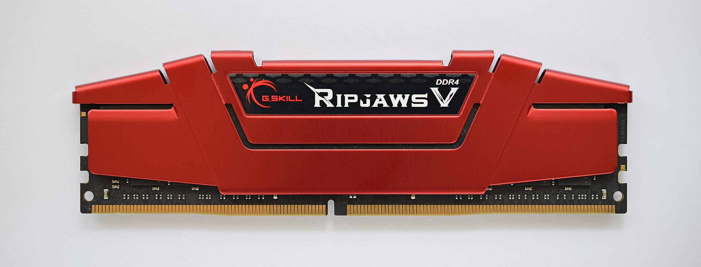

<em>Un módulo de memoria RAM DDR4.</em>

La memoria permite almacenar la información que el sistema necesita, y existen distintos tipos según su función:

| Tipo | Características |
| ----- | ----------------- |
| RAM | Memoria principal del sistema. Es **volátil**: su contenido se pierde al apagar el equipo o ante un corte de corriente. Cualquier dato o programa debe estar en RAM para poder usarse; más RAM permite trabajar con más programas abiertos a la vez y con mayor fluidez |
| ROM | Memoria de solo lectura, que contiene la información necesaria para el arranque del equipo |
| Caché | Memoria mucho más rápida que la RAM, que guarda de forma temporal la información leída o escrita más recientemente, para acelerar los accesos posteriores |

Estos tres tipos forman lo que se conoce como **jerarquía de memoria**: de menor a mayor velocidad (y, a la vez, de mayor a menor capacidad), los registros del procesador, la memoria caché, y finalmente la memoria RAM.

### 8.3 Dispositivos de almacenamiento

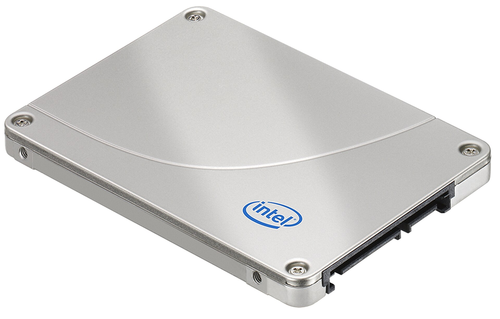

<em>Un SSD no tiene partes mecánicas, lo que lo hace mucho más rápido que un disco duro tradicional.</em>

A diferencia de la RAM, los dispositivos de almacenamiento guardan la información de forma **permanente**:

| Dispositivo | Características |
| ------------ | ----------------- |
| Disco duro clásico (HDD) | Contiene piezas mecánicas: una cabeza de lectura/escritura que se desplaza sobre discos magnéticos giratorios |
| Disco de estado sólido (SSD) | Sin partes mecánicas, lee y escribe los datos mucho más rápido que un HDD |
| Disco duro externo | Permite hacer copias de seguridad independientes del disco interno del equipo |
| Disco óptico (CD-ROM, CD-RW, DVD) | Usa un rayo láser para leer y grabar la información; gran capacidad y buena seguridad frente a pérdida de datos, aunque en desuso frente a otros soportes |

La capacidad de los discos duros se mide habitualmente en gigabytes (GB) o terabytes (TB).

## 9. Periféricos y componentes lógicos

### 9.1 Clasificación de los periféricos

Se consideran **periféricos** todos los dispositivos hardware a través de los cuales el ordenador se comunica con el exterior, así como los sistemas que sirven de memoria auxiliar a la memoria principal:

| Categoría | Función |
| ---------- | ------- |
| Periféricos de entrada | Captan y, si es necesario, digitalizan datos introducidos por el usuario o por otro dispositivo, enviándolos al ordenador para su procesamiento |
| Periféricos de salida | Muestran o proyectan información hacia el exterior, convirtiendo los impulsos eléctricos en información legible para el usuario (por ejemplo, una impresora) |
| Periféricos de entrada/salida (E/S) | Permiten la comunicación bidireccional del ordenador con el medio externo |
| Periféricos de almacenamiento | Almacenan datos e información de forma persistente (disco duro, memoria flash, cinta magnética...); la RAM, al ser volátil, no se considera un periférico de almacenamiento |
| Periféricos de comunicación | Permiten la interacción entre dos o más dispositivos |

### 9.2 El software: programas y aplicaciones

Un **programa informático** es un conjunto de instrucciones que, al ejecutarse, realizan una o varias tareas en el ordenador; sin programas, el hardware no puede funcionar por sí solo. Al conjunto general de programas se le denomina **software**, o equipamiento/soporte lógico del sistema.

### 9.3 El sistema operativo

Un **sistema operativo (SO)** es el programa (o conjunto de programas) que gestiona los recursos hardware de un sistema informático y ofrece servicios a los programas de aplicación, ejecutándose con un nivel de privilegio superior al resto del software.

!!! note "Un matiz habitual"
    Es un error común llamar "sistema operativo" al conjunto completo de herramientas que lo acompañan (el explorador de archivos, el navegador web...). En sentido estricto, el sistema operativo es el **núcleo (kernel)**, y esas otras herramientas son programas que se ejecutan sobre él.

Ejemplos de sistemas operativos para PC: Microsoft Windows, macOS, GNU/Linux, Solaris, FreeBSD, Chrome OS o Android, entre otros.

### 9.4 El firmware

El **firmware** es un bloque de instrucciones grabado en una memoria (normalmente ROM, EEPROM o flash) que establece la lógica de más bajo nivel para controlar los circuitos electrónicos de un dispositivo. Está estrechamente integrado con la electrónica del equipo, siendo el software que interactúa de forma más directa con el hardware. La **BIOS** de un ordenador es un ejemplo de firmware: su función es poner en marcha el equipo al encenderlo y preparar el entorno para cargar el sistema operativo en la RAM.

### 9.5 Los drivers o controladores de dispositivos

Un **driver** (controlador de dispositivo) es la parte del sistema operativo encargada de activar, configurar y gestionar la interacción con un dispositivo hardware concreto. Funciona de forma similar a un proceso normal, pero con la única función de controlar el dispositivo para el que fue diseñado.

Un driver, típicamente:

- **Descubre** el estado del dispositivo e informa de ello al sistema operativo.
- **Atiende** al dispositivo cuando este genera un aviso (por ejemplo, al pulsar un botón).
- **Transmite** datos hacia el dispositivo (comandos o información a enviar).
- **Lee** los datos que el dispositivo capta, para que puedan tratarse en el ordenador.

Pueden existir varios controladores distintos para un mismo dispositivo (el oficial del fabricante, uno genérico del sistema operativo, o versiones no oficiales de terceros), y es importante evitar instalar drivers de fuentes no confiables, por el riesgo de malware o de mal funcionamiento del dispositivo.

## 10. Los buses del sistema

Un **bus** es un conjunto de conductores eléctricos a los que se conectan los distintos componentes del sistema. El bus no discrimina: la señal llega a todos los dispositivos conectados, y son estos los que ignoran las señales que no van dirigidas a ellos. La operación básica de transferencia en un bus se denomina **ciclo de bus**.

### 10.1 Tipos de estructura de bus

| Tipo | Funcionamiento |
| ----- | --------------- |
| Bus único | Trata la memoria y los periféricos como si fueran posiciones de memoria, asimilando las operaciones de E/S a operaciones de lectura/escritura; no permite el uso de controladores DMA |
| Bus dedicado | Distingue claramente la memoria de los periféricos, permitiendo el uso de controladores DMA; se subdivide a su vez en tres tipos de bus |

### 10.2 Los tres buses dedicados

| Bus | Función |
| ---- | ------- |
| Bus de datos | Transfiere los datos entre la CPU, la memoria y las unidades de E/S. Interesa especialmente su **ancho de banda** (información transmitida por segundo) |
| Bus de direcciones | Transfiere la dirección de memoria (o de un registro de E/S) a la que se quiere acceder. Interesa su **capacidad de direccionamiento**: con N líneas, puede direccionar 2^N posiciones distintas |
| Bus de control | Transmite señales de sincronismo, indicadores de lectura/escritura, peticiones de DMA, interrupciones (IRQ), etc. |

La **anchura** de un bus (cantidad de líneas que lo componen) determina cuánta información puede transmitir en cada ciclo, y suele coincidir con el ancho de palabra de la memoria del sistema.

### 10.3 Buses transparentes y buses gestionados por software

Algunos buses son **transparentes** para el sistema operativo (como el que conecta directamente la CPU con la memoria): ni el sistema operativo ni los drivers son conscientes de su existencia. Otros buses, en cambio, están **gestionados por software**, disponen de su propio driver y son vistos por el sistema operativo como un dispositivo más (por ejemplo, PCI Express, SATA o USB).

De hecho, el sistema operativo identifica muchos periféricos, en primera instancia, por el bus y el número de conexión al que están enganchados, más que por su tipo real de dispositivo.

### 10.4 El bus PCI Express (PCIe)

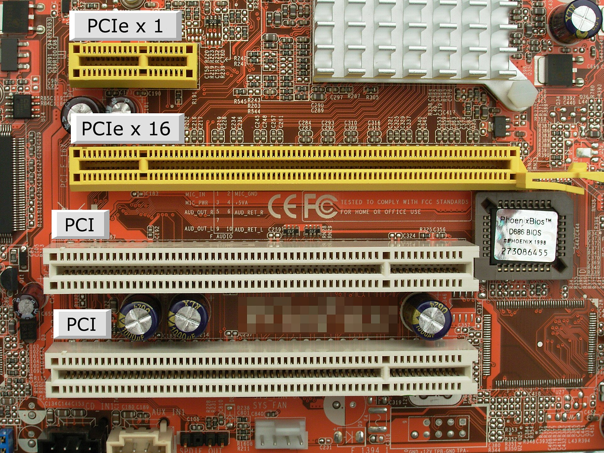

<em>Comparación de slots PCI (arriba) y PCIe (abajo) en una placa base.</em>

El **PCIe** es un bus de comunicación interno (integrado en la placa base o accesible mediante sus slots) que conecta distintos componentes con el procesador, a menudo a través del chipset. Existen distintas variantes comerciales según su número de líneas: **x1, x4, x8 y x16**; cuantas más líneas, mayor es la velocidad de transferencia posible. Es habitual encontrar dispositivos con conector físico x16 que, sin embargo, solo aprovechan 8 líneas o menos, según su diseño concreto.

## 11. Nuevas arquitecturas de procesadores

Todo lo visto hasta ahora describe la arquitectura "clásica" de un procesador. Sin embargo, la informática actual (especialmente la móvil) ha desarrollado nuevas variantes y componentes adicionales que conviene conocer.

### 11.1 El SoC (System on a Chip)

Un **SoC** (*System on a Chip*, sistema en un chip) es un microprocesador que integra, en un único circuito, no solo la CPU, sino también otras funciones que en un ordenador de sobremesa clásico estarían repartidas en componentes separados: conectividad inalámbrica (Bluetooth, Wi-Fi), procesamiento gráfico, memoria RAM, gestión de entrada/salida, etc. Los SoC son la base de la **informática móvil** (smartphones, tablets), donde el espacio, el consumo energético y la integración son prioritarios frente a la máxima potencia de cálculo bruta.

### 11.2 Coprocesadores de los SoC

Un **coprocesador** es una unidad especializada que ayuda al procesador principal en tareas concretas, para las que resulta más eficiente que una CPU de propósito general. Los SoC de los smartphones actuales incorporan, junto a la CPU principal, varios coprocesadores dedicados:

| Coprocesador | Función |
| ------------- | ------- |
| GPU (Graphics Processing Unit) | Procesamiento gráfico y operaciones matemáticas de coma flotante en paralelo |
| ISP (Image Signal Processor) | Procesa la señal de la cámara en tiempo real (fotografía y vídeo en alta resolución) |
| DSP (Digital Signal Processor) | Procesamiento de señales de audio y de sensores de movimiento (brújula, giroscopio, acelerómetro) |
| NPU (Neural Processing Unit) | Ejecuta de forma eficiente los cálculos típicos de la inteligencia artificial (ver sección 11.4) |

Al descargar estas tareas específicas a coprocesadores dedicados, la CPU principal queda libre para otras tareas, y el consumo de batería se reduce notablemente frente a realizar esas mismas operaciones en la CPU de propósito general.

### 11.3 Chips neuromórficos

Los procesadores actuales, aunque capaces de realizar billones de operaciones por segundo, siguen siendo mucho menos eficientes energéticamente que el cerebro humano a la hora de realizar tareas como reconocer patrones, caras o sonidos.

Los **chips neuromórficos** son una nueva arquitectura de procesador diseñada imitando la organización del cerebro (formado por neuronas que se activan mediante sinapsis), en lugar de la arquitectura clásica basada en CPU y memoria separadas. En vez de procesar valores numéricos continuos como una CPU tradicional, suelen implementar **redes neuronales de impulsos (*spiking neural networks*)**, donde la información se transmite mediante pulsos discretos en el tiempo, de forma similar a como se comunican realmente las neuronas biológicas.

!!! example "Ejemplos reales"
    El chip **Loihi**, de Intel, o el proyecto **TrueNorth**, de IBM, son ejemplos de chips neuromórficos experimentales, diseñados específicamente para tareas de reconocimiento de patrones con un consumo energético muchísimo menor que el de una CPU o GPU convencional realizando la misma tarea.

Este enfoque abre aplicaciones potenciales en dispositivos de bajísimo consumo capaces de "escuchar" o "ver" de forma continua sin agotar rápidamente su batería, o en la asistencia a personas con discapacidad sensorial mediante la replicación artificial de sensores.

### 11.4 Inteligencia artificial en los procesadores

Los procesadores actuales incorporan cada vez más técnicas relacionadas con la **inteligencia artificial (IA)** para mejorar su eficiencia y capacidad:

| Concepto | Relación |
| --------- | -------- |
| Inteligencia Artificial (IA) | Disciplina general |
| Aprendizaje automático / Machine Learning (ML) | Una rama de la IA |
| Aprendizaje profundo / Deep Learning (DL) | Una parte, más específica, del aprendizaje automático, basada en **redes neuronales** |

El **aprendizaje automático** consiste en que un sistema aprenda a partir de un conjunto de datos de referencia ya clasificados, de forma que después sea capaz de clasificar correctamente nuevos datos que se le presenten (por ejemplo, reconocer si una fotografía contiene una cara humana, entrenando el sistema con muchas fotos ya etiquetadas).

#### Entrenamiento frente a inferencia

- **Entrenamiento**: el proceso, muy exigente computacionalmente, en el que el modelo "aprende" a partir de un gran volumen de datos de ejemplo. Se realiza habitualmente en servidores potentes con varias GPU.
- **Inferencia**: el proceso de utilizar un modelo ya entrenado para obtener un resultado sobre un dato nuevo. Es mucho menos exigente, y puede ejecutarse en dispositivos con mucha menos potencia, como un smartphone (a menudo aprovechando la NPU vista en la sección 11.2).

#### El papel de la GPU y la NPU

Las **GPU**, al estar diseñadas para trabajar de forma masivamente paralela, resultan especialmente adecuadas para entrenar y ejecutar algoritmos de aprendizaje profundo, mucho más eficientes en esta tarea que una CPU de propósito general. La **NPU**, por su parte, está específicamente diseñada para la fase de inferencia en dispositivos móviles, permitiendo ejecutar tareas de IA directamente en el propio dispositivo (lo que se conoce como ***edge AI***), sin necesidad de enviar los datos a un servidor en la nube: reconocimiento facial, mejora automática de fotografías, o asistentes de voz capaces de reconocer al usuario incluso en condiciones cambiantes.

## Ejercicios prácticos

!!! task "Tarea"
    **Ejercicio 1**. Explica con tus propias palabras qué es un sistema microinformático y enumera sus cuatro elementos principales.

    **Ejercicio 2**. ¿Qué diferencia a un ordenador de una calculadora, según la definición vista en esta unidad?

    **Ejercicio 3**. Explica la diferencia entre software, hardware y firmware, poniendo un ejemplo de cada uno distinto a los mencionados en el tema.

    **Ejercicio 4**. Elabora una línea temporal con al menos 8 hitos de la historia de la informática vistos en esta unidad, ordenados cronológicamente, indicando en una frase la importancia de cada uno.

    **Ejercicio 5**. ¿Por qué se considera a Charles Babbage el "padre de las computadoras modernas" si nunca llegó a construir su Motor Analítico?

    **Ejercicio 6**. Describe, según la arquitectura de Von Neumann, los bloques funcionales mínimos que necesita un ordenador digital para funcionar, y las cinco fases del ciclo de ejecución de una instrucción.

    **Ejercicio 7**. Explica la diferencia fundamental entre la arquitectura de Von Neumann y la arquitectura Harvard. ¿Por qué se dice que los procesadores actuales son "híbridos"?

    **Ejercicio 8**. ¿Qué es el "cuello de botella de Von Neumann" y qué solución parcial incorporan los procesadores modernos para paliarlo?

    **Ejercicio 9**. Compara las arquitecturas CISC y RISC: cita una ventaja de cada una y un ejemplo real de procesador para cada filosofía.

    **Ejercicio 10**. Explica la diferencia entre las entradas y las salidas de la unidad de control. ¿Qué es el decodificador de instrucciones y qué función cumple?

    **Ejercicio 11**. Describe cómo colaboran la unidad de control y la ALU al ejecutar una instrucción de suma, siguiendo el ejemplo de la sección 8.1.2. ¿Para qué sirven los indicadores (flags) que genera la ALU?

    **Ejercicio 12**. Si un procesador tiene una frecuencia de 3,5 GHz, ¿cuántos ciclos de reloj realiza por segundo, aproximadamente?

    **Ejercicio 13**. Ordena de más rápida/menos capacidad a más lenta/más capacidad estos tres elementos: memoria RAM, registros del procesador, memoria caché. Explica por qué existe esta jerarquía en lugar de usar un único tipo de memoria.

    **Ejercicio 14**. Clasifica estos periféricos según su categoría (entrada, salida, E/S, almacenamiento, comunicación): escáner, altavoces, disco SSD externo, tarjeta de red, pantalla táctil.

    **Ejercicio 15**. Explica la diferencia entre el sistema operativo, el firmware y un driver, usando como ejemplo el proceso completo desde que enciendes el ordenador hasta que puedes mover el ratón con normalidad.

    **Ejercicio 16**. Explica la diferencia entre un bus único y un bus dedicado, y describe la función de cada uno de los tres buses (datos, direcciones, control) de un bus dedicado.

    **Ejercicio 17**. Si un bus de direcciones tiene 24 líneas, ¿cuántas posiciones de memoria distintas puede direccionar como máximo?

    **Ejercicio 18 (investigación)**. Busca las especificaciones de una placa base actual e identifica cuántas líneas PCIe ofrece cada uno de sus slots de expansión (x1, x4, x8, x16).

    **Ejercicio 19**. Explica qué es un SoC y por qué es la base de la informática móvil, en lugar de usarse una arquitectura clásica de sobremesa.

    **Ejercicio 20**. Enumera al menos tres coprocesadores que puede incluir el SoC de un smartphone y explica la función de cada uno.

    **Ejercicio 21**. Explica con tus propias palabras qué es un chip neuromórfico y en qué se diferencian sus redes neuronales de impulsos de las redes neuronales "clásicas" del aprendizaje profundo.

    **Ejercicio 22**. Explica la diferencia entre entrenamiento e inferencia en inteligencia artificial, y qué papel juegan respectivamente la GPU y la NPU en cada una de esas fases.
