
<strong>CFGS Administración de Sistemas Informáticos y en Red (1º curso)</strong>

Material elaborado para el módulo **Fundamentos de Hardware**

# UT2.1. Cajas, fuente de alimentación y placa base

## Programación de Aula

### Resultados de Aprendizaje

Esta unidad forma parte de la UT2 "Elementos internos de un sistema informático" y trabaja el **Resultado de Aprendizaje 1 (RA1)** del módulo, según el **Real Decreto 1629/2009** (Anexo I, módulo *Fundamentos de Hardware*):

1. **RA1.** Configura equipos microinformáticos, componentes y periféricos, analizando sus características y relación con el conjunto.

Según la programación de aula, la UT2 se evalúa sobre los criterios **CE11, CE13, CE14, CE18, CE47 y CE49**:

- **CE11** (RA1.a): Se han identificado y caracterizado los dispositivos que constituyen los bloques funcionales de un equipo microinformático.
- **CE13** (RA1.c): Se ha analizado la arquitectura general de un equipo y los mecanismos de conexión entre dispositivos.
- **CE14** (RA1.d): Se han establecido los parámetros de configuración (hardware y software) de un equipo microinformático con las utilidades específicas.
- **CE18** (RA1.h): Se han clasificado los dispositivos periféricos y sus mecanismos de comunicación.
- **CE47** (RA5.d): Se han descrito los elementos de seguridad de las máquinas y los equipos de protección individual que se deben emplear.
- **CE49** (RA5.f): Se han identificado las posibles fuentes de contaminación del entorno ambiental.

### Planificación Temporal (2 sesiones / 4 horas)

| Sesión | Contenido |
| ------ | --------- |
| 1 | Elementos físicos de un sistema informático. Las cajas. La fuente de alimentación |
| 2 | La placa base: factor de forma, componentes, chipset, BIOS/UEFI |

!!! info "Fuentes y licencia"
    Este tema adapta el documento *UT2.1 Cajas, fuente de alimentación y placa base* del módulo de Fundamentos de Hardware (ASIX), publicado bajo licencia **Creative Commons Reconocimiento-NoComercial-CompartirIgual 4.0 (CC BY-NC-SA 4.0)**. Por respeto a dicha licencia, este material se comparte con las mismas condiciones. Las imágenes proceden del documento original; consulta su bibliografía (Wikipedia, HardZone, Profesional Review, Freelancermap y Geeknetic) para su origen.

## 1. Elementos físicos de un sistema informático

El **hardware** en informática se refiere a las partes físicas, tangibles, de un sistema informático: sus componentes eléctricos, electrónicos y electromecánicos. Los cables, las cajas, los periféricos de todo tipo y cualquier otro elemento físico involucrado componen el hardware o soporte físico; contrariamente, el soporte lógico e intangible es el **software**.

El término es propio del inglés y su traducción al español no tiene un significado acorde, por lo que se ha adoptado tal cual. La Real Academia Española lo define como «conjunto de los componentes que integran la parte material de una computadora». Aunque lo más común es aplicarlo a los ordenadores, se usa también en robots, teléfonos móviles, cámaras fotográficas, reproductores digitales o cualquier otro dispositivo electrónico. Cuando dichos dispositivos también procesan datos, poseen firmware y/o software además de hardware.

Así, podemos mostrar los elementos hardware que forman parte de un computador o sistema informático:

| Grupo | Elementos | Ejemplos |
| ----- | --------- | -------- |
| **Internos** | Placa base | CPU, RAM, chipset, buses, slots, etc. |
| | Almacenamiento | HDD, SSD, lector, USB, etc. |
| | Tarjetas controladoras | Gráfica, sonido, RAID, etc. |
| | Componentes auxiliares | Chasis, fuente de alimentación, sistemas de refrigeración |
| **Externos** | Periféricos de entrada | Teclado, ratón, joystick, escáner, micrófono, escáner 3D, sistemas de captura de movimiento |
| | Periféricos de salida | Pantalla, impresora, reproductor de voz, altavoces |
| | Periféricos de entrada/salida | Dispositivos de red, multifunción, pantallas táctiles |
| | Almacenamiento | USB, SSD, tarjetas SD |

## 2. Cajas

La **caja** es el elemento encargado de **cohesionar** los componentes internos del ordenador. Su estructura rígida permite proteger los elementos alojados en su interior, además de facilitar su transporte. Los componentes electrónicos son extremadamente delicados frente a la electricidad estática, por lo que los materiales utilizados en la construcción de las cajas son normalmente acero o aluminio.

!!! warning "Seguridad antes de manipular el interior"
    Antes de añadir una tarjeta o instalar un componente, toca previamente un elemento metálico de la carcasa del equipo (o usa una pulsera antiestática) para eliminar tu electricidad estática y minimizar el riesgo de avería. Hazlo siempre con el equipo apagado y desenchufado.

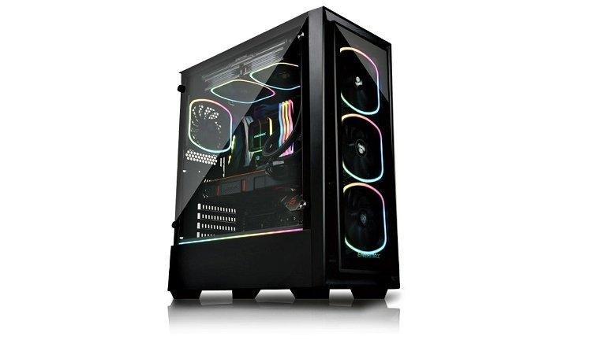

<em>Caja de torre con panel lateral</em>

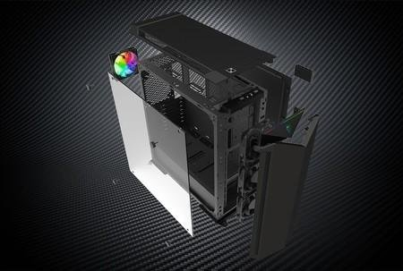

<em>Caja gaming con panel de cristal templado</em>

### 2.1 Características

El material utilizado es plástico, metal, acero o aluminio. La elección entre acero y aluminio influye en el peso, la resistencia, la maleabilidad o la capacidad de conducir el calor. El acero se ha utilizado generalmente para soportar mejor los golpes; el aluminio es más ligero y manejable, da un aspecto más atractivo y, además, permite mejor refrigeración, ya que transporta mejor el calor.

Los elementos del ordenador (microprocesadores, tarjetas, discos duros) generan gran cantidad de calor, por lo que es importante que la caja disponga de **ranuras de ventilación**. El aire caliente del interior debe ser expulsado al exterior para dejar espacio libre que ocupe el aire frío procedente del exterior. Se consideran imprescindibles las ventilaciones posteriores de la caja y recomendables las superiores o frontales, ya que así se genera un circuito de aire que disipa el calor.

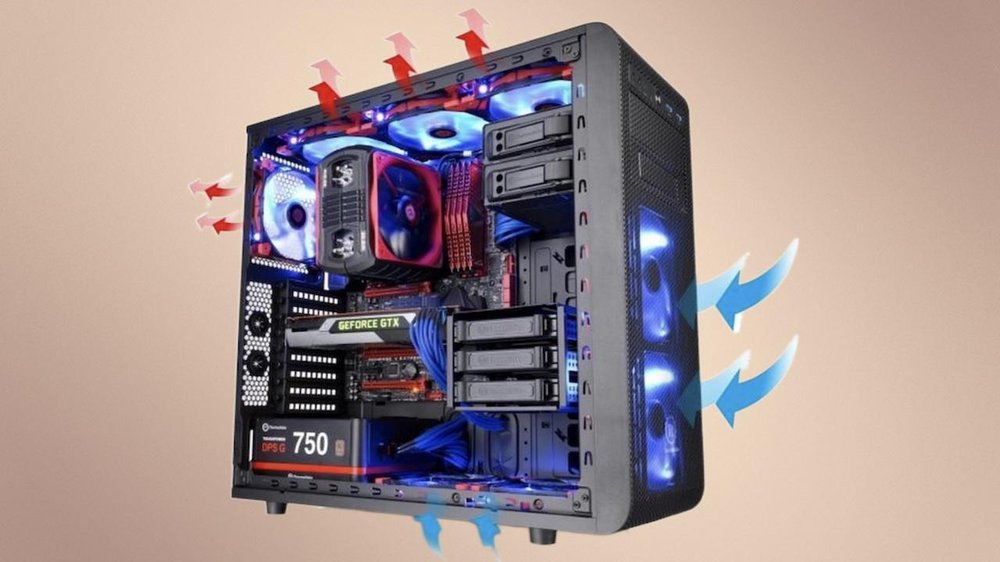

<em>Caja con ventiladores y flujo de aire</em>

Por las ranuras de ventilación entra también el polvo, que provoca averías. Es necesario limpiar de vez en cuando el interior y el exterior, comprobando el buen funcionamiento de los ventiladores para que el equipo se refrigere adecuadamente. Para limpiar el interior se recomienda un aspirador sin demasiada potencia, y para el exterior un paño húmedo, como con cualquier otro aparato eléctrico.

#### Cómo diseñar el mejor flujo de aire para tu PC

A la hora de diseñar el flujo interno de la caja hay que tener en cuenta varios factores:

- El aire caliente **tiende a subir**: los ventiladores que extraen el aire caliente deben estar en posiciones elevadas, mientras que los que introducen aire fresco deben estar en posiciones más bajas.
- Hay que **montar y canalizar bien los cables** de la caja para que ni ellos ni otros componentes bloqueen el paso del aire.
- Para diseñar un flujo de aire adecuado, los ventiladores con **más caudal de aire** (y, a ser posible, dirigido) funcionan mejor que los que tienen más presión estática.

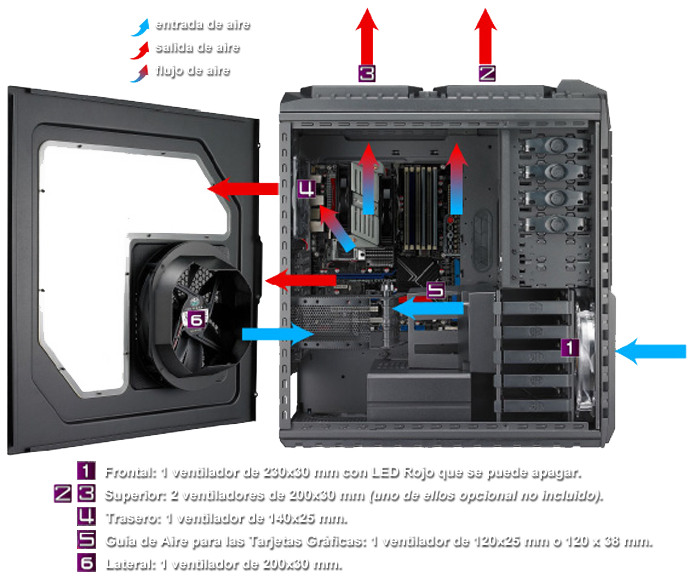

<em>Flujo de aire ideal en una caja: entrada por delante y abajo, salida por detrás y arriba</em>

Lo ideal es que los ventiladores frontales (e incluso los inferiores, si los hay) introduzcan aire fresco en la caja, mientras que los instalados en la parte trasera y en el techo lo saquen fuera.

Hay un detalle más fino para maximizar el rendimiento: en muchas cajas de gama alta se puede modificar la altura a la que se atornilla el ventilador trasero. Aunque la mayoría de usuarios lo alinea con el ventilador del disipador de la CPU (si es de aire), lo ideal es que quede **un poco por encima** (entre 1 y 2 cm), porque el aire caliente que expulsa el disipador tiende a subir y encaja mejor con el marco del ventilador trasero.

#### Componentes y facilidad de montaje

Es bastante común que los propios usuarios instalen componentes internos (tarjetas, unidades de CD/DVD...), por lo que tienen mucho éxito las cajas que facilitan su inserción y extracción. Algunos fabricantes utilizan fijación por tornillos, raíles en el chasis y sistemas de fijación por presión, es decir, cualquier método que reduzca el tiempo de instalación. Los sistemas de apertura han evolucionado mucho: en cajas verticales se recomienda un sistema de paneles laterales sin tornillos, y en las horizontales una carcasa superior única de fácil anclaje.

El acabado debe ser robusto y sin cantos afilados, ya que es habitual sufrir accidentes por los bordes mal pulidos de las láminas metálicas. Como característica práctica, muchos fabricantes incorporan conectores USB en la parte frontal. Y, por supuesto, cuenta también el atractivo de la caja: diseño, color y tamaño.

### 2.2 Tipos

El estándar **ATX** no es más que un conjunto de convenciones y características definidas para servir como patrón que facilite la integración de componentes desarrollados por distintos fabricantes. Es posible instalar una placa base de un fabricante en una caja de otra compañía sin problema alguno, siempre que ambas satisfagan lo estipulado en la misma especificación.

Fue **Intel** quien describió el estándar ATX, aunque es una especificación abierta que puede usar cualquier fabricante sin pagar royalties. Cada cierto tiempo se introducen mejoras en la especificación para adaptarla a las necesidades cambiantes y al desarrollo tecnológico.

Las dimensiones de la caja determinan el tipo, ya que la mayoría pueden incorporar **placas compatibles ATX**. De menor a mayor, las más normales son: **mini-torre**, **sobremesa**, **midi-torre** (o semitorre) y **gran torre**, así como modelos para algunos servidores que requieren montaje en **rack**. Según el tamaño disponemos de más ranuras (slots) externas y más espacio para unidades de almacenamiento.

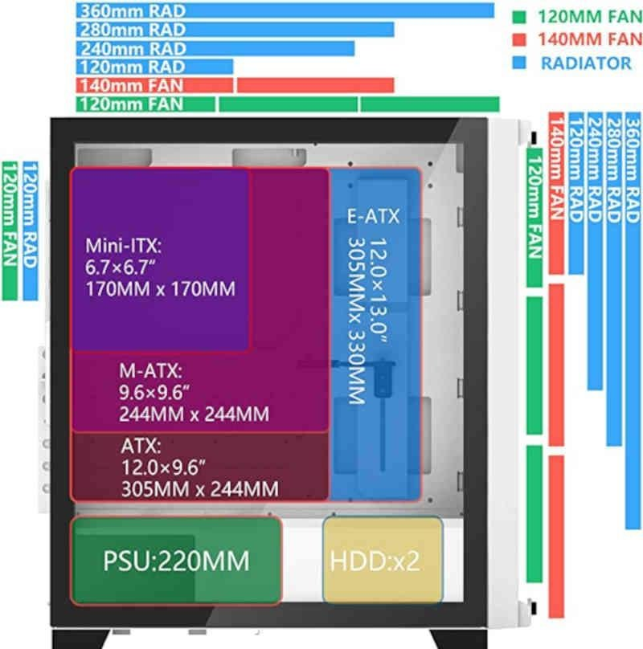

<em>Tamaños de caja y factores de forma de placa compatibles</em>

!!! task "Actividad 1"
    Busca diferentes imágenes de todos los tamaños de las cajas de PC. ¿Qué elementos caracterizan una caja *gaming*?

#### ¿Qué es un servidor blade?

Un servidor blade es básicamente la compactación de un servidor tradicional ajustado al tamaño de una tarjeta. Esta reducción se realiza normalmente en tres tamaños; por ejemplo, en los servidores blade de Dell hay blades de altura completa, media altura y cuarto de altura. Un servidor blade contiene procesadores, memoria, controladores de red integrados, FiberChannel y múltiples adaptadores de entrada/salida. Todo lo relacionado con conexiones, alimentación y refrigeración se traslada, de forma compartida, al chasis que los alberga.

Los servidores blade están diseñados para aprovechar el espacio, reducir el consumo y simplificar el mantenimiento. Su uso principal es funcionar en chasis blade en forma de granja de servidores y en centros de proceso de datos.

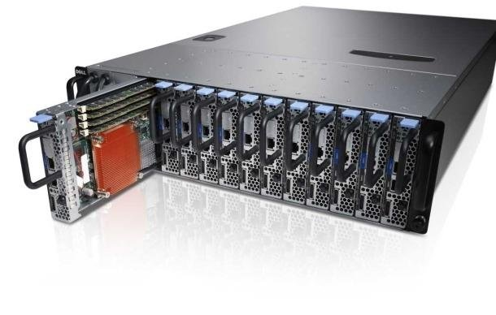

<em>Chasis con servidores blade</em>

#### Superordenadores

Un supercomputador o superordenador es un dispositivo informático con capacidades de cálculo superiores a las de los ordenadores comunes de escritorio, y se usa con fines específicos. Hoy se prefiere hablar de *computadoras de alto rendimiento* o *ambientes de cómputo de alto rendimiento*, ya que las supercomputadoras son un conjunto de potentes ordenadores unidos entre sí para aumentar su potencia de trabajo. Al año 2019, los superordenadores más rápidos superaban los 148 petaflops (un petaflop equivale a más de 1000 billones de operaciones por segundo). La lista de los más potentes es el ranking **TOP500**.

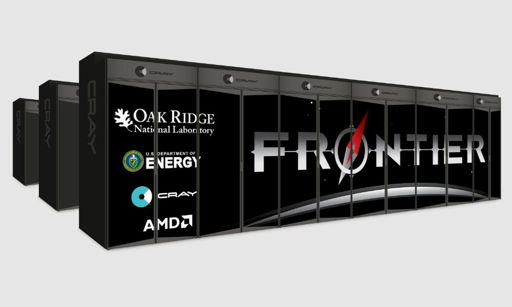

<em>El superordenador Frontier (Oak Ridge National Laboratory)</em>

### 2.3 ¿Qué debe conocer un Administrador de Sistemas?

Un administrador de sistemas es responsable de **mantener la red de PCs bajo control**. No se espera que arregle los equipos de todos los usuarios, pero será la persona que por regla general se asegure de que todo funcione. Además, es responsable de la seguridad de la red y de la gestión del tráfico, asegurándose de que existan copias de seguridad por si algo llegara a suceder.

El administrador interactúa con los usuarios finales, por lo que también debe tener habilidades sociales: es la persona que configura el «sistema» (incluyendo las cuentas personales y los derechos sobre ellas) y se asegura de que nadie pueda desconfigurar demasiado sin una cuenta de administrador.

Responsabilidades y tareas del administrador de sistemas:

- Instalar y configurar software y hardware.
- Administrar los servidores de red y las herramientas tecnológicas.
- Configurar las cuentas y los equipos de trabajo.
- Supervisar el rendimiento y mantener los sistemas.
- Solucionar problemas y apagones.
- Garantizar la seguridad mediante controles de acceso, copias de seguridad y cortafuegos.
- Actualizar los sistemas con nuevos lanzamientos y modelos.
- Desarrollar conocimientos especializados para capacitar al personal en nuevas tecnologías.
- Construir una base de datos interna con documentación técnica, manuales y políticas de TI.

## 3. Fuentes de alimentación

Los componentes del ordenador necesitan energía eléctrica, que es suministrada por la **fuente de alimentación**. Cuantos más elementos tenga el ordenador, mayor será la potencia necesaria.

La fuente de alimentación es un **transformador** diseñado para adecuar la corriente alterna de **220 V** de la red a la que necesitan los componentes del ordenador. Básicamente, transforma los 220 V de la línea eléctrica alterna en las tensiones continuas (**−12 V, −5 V, 0 V, 3,3 V, 5 V y 12 V**) que precisan los elementos; después **rectifica** la corriente alterna para conseguir que sea continua, y a continuación la **filtra** y la **estabiliza**.

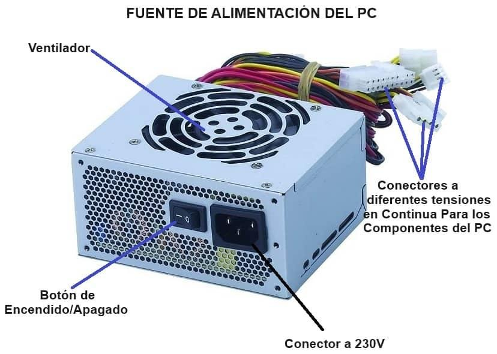

<em>Partes de una fuente de alimentación de PC</em>

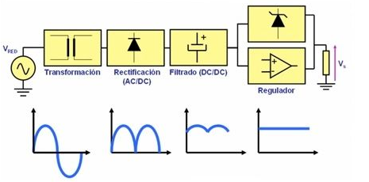

<em>Fases de la fuente: transformación, rectificación, filtrado y regulación</em>

Además, la fuente sirve como elemento de protección del ordenador: incluye un interruptor que permite encender y apagar el equipo, y un **fusible** que se funde, protegiendo el ordenador, en caso de consumo excesivo y cortocircuito. Las salidas de **5 V** son para los circuitos electrónicos y las de **12 V**, para los motores (ventilador, disco duro, etc.).

!!! info "Definición"
    Una fuente de alimentación de buena calidad debe ser capaz de generar una señal continua **estable y totalmente plana**, de forma que las variaciones de entrada no afecten al nivel de tensión de salida. Los conectores que vienen en la fuente de alimentación están normalizados.

Múltiples averías de los ordenadores se producen por pérdidas de información que tienen su origen en un mal funcionamiento o una sobrecarga del sistema de alimentación. Cuando se actualiza un equipo añadiendo o sustituyendo componentes, hay que comprobar que la fuente tiene suficiente potencia para todos ellos. Algunos componentes no incorporan protección frente a sobrecargas y pueden resultar dañados de forma irreparable; lo que es aún más perjudicial, pueden extender la avería a otros componentes del equipo. Teniendo en cuenta el consumo de los componentes actuales, un equipo moderno no debería utilizar una fuente de menos de **500 W**.

Factores como el ruido del ventilador de la fuente o el número de conectores incorporados deben tenerse en cuenta a la hora de adquirirla.

### 3.1 Características

- **Proporciona estabilidad**: una buena elección garantiza que todos los componentes tendrán la energía suficiente en cualquier momento.
- **Determina posibilidades de expansión**: la potencia, expresada en vatios (W), debe ser suficiente para los componentes actuales con alto rendimiento y para futuras ampliaciones.
- **Ventilación**: influyen el tamaño y la refrigeración.
- **Consumo energético**: coste = potencia (kW) × número de horas × precio del kWh.

### 3.2 Tipos de fuentes de alimentación

#### Según su factor de forma

**AT.** Anterior a este estaba el PC/XT de IBM; a partir de 1984 pasó a llamarse AT. La única diferencia entre ambos formatos era el tamaño, siendo la AT bastante más reducida gracias a su mayor integración, aunque seguían siendo plenamente compatibles. Alimenta la placa mediante dos conectores independientes, marcados normalmente como **P8 y P9**. Estos dos conectores no se pueden intercambiar, debiendo quedar siempre los cables negros juntos y en el centro. Son del tipo Molex 90331-0001 o equivalente.

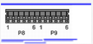

<em>Conectores P8 y P9 de una fuente AT</em>

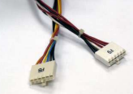

<em>Fotografía de los conectores de una fuente AT</em>

**ATX.** El formato más común en las fuentes actuales tiene un tamaño de 140 × 150 × 85 mm. Existen otros tamaños para equipos compactos, como los **SFX** (125 × 100 × 63,5 mm), y otros según el tipo de caja. El conector utilizado es el ATX/2 (20 y 24 contactos), que permite la plena compatibilidad entre ellas.

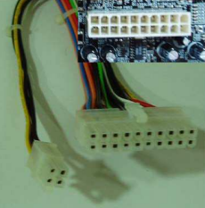

<em>Conector ATX de 20+4 pines</em>

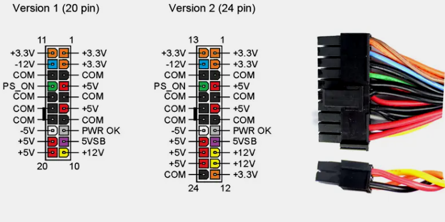

<em>Numeración de los conectores ATX de 20 y de 24 pines</em>

**Conectores especiales:**

- **PS_ON**: enciende la fuente de alimentación. Está cortocircuitado con tierra.
- **PWR_OK**: señal de validación de la fuente hacia la placa. Cuando los valores son estables, enciende.
- **+5VSB**: tensión en *stand by*, utilizada para los elementos que necesitan alimentación mientras el ordenador está apagado.

**Conectores de la fuente de alimentación ATX2 para PC:**

1. Mini Molex para FDD.
2. Molex universal: dispositivos IDE, HDD y unidad de disco óptico.
3. Para dispositivos SATA.
4. Para tarjetas gráficas de 8 pines, separable para 6 pines.
5. Para tarjeta gráfica de 6 pines.
6. Para placa base de 8 pines.
7. Para CPU P4, combinado con el conector de la placa base de 8 pines a 12 V.
8. Alimentación de la placa base ATX2 de 24 pines.

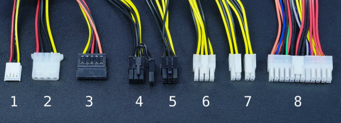

<em>Conectores de una fuente ATX numerados del 1 al 8</em>

#### Fuentes modulares, semimodulares y no modulares

- **No modulares** (cableado fijo): sus cables se fijan al circuito interno de la fuente y salen por un pequeño agujero de la parte trasera.
- **Semimodulares**: poseen un conjunto de cables fijos, pero además cuentan con conectores hembra para conectar más cables según se necesiten.
- **Modulares**: se reemplaza la maraña de cables de la parte trasera por conectores hembra.

#### Otras fuentes de alimentación

- **SFX**: como las ATX, solo varían en sus dimensiones (125 × 100 × 76,5 mm).
- **EPS**: estándar para SSI (*Server System Infrastructure*). No cumple con el estándar ATX. Tiene dos conectores, de 24 y 8 pines (150 × 97,5 × 90 mm), y son fuentes preparadas para recibir dos líneas de alimentación. Suele usarse en sistemas críticos, como servidores de tipo rack.

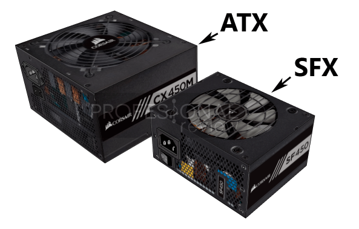

<em>Comparación de fuentes ATX y SFX</em>

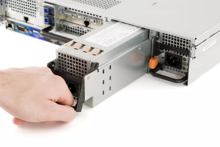

<em>Fuente redundante extraíble de un servidor rack</em>

### 3.3 Características de las fuentes de alimentación

Para saber la intensidad máxima que puede suministrar la fuente con cada una de las tensiones hay que fijarse en su placa de características:

- La entrada en corriente alterna (**AC INPUT**) admite un rango de tensiones entre 100 V y 240 V, aunque normalmente es de 230 V, la tensión de los enchufes de las casas.
- En la salida a corriente continua (**DC OUTPUT**) hay diferentes tensiones, intensidades y potencias. Por ejemplo, para +3,3 V la intensidad máxima puede ser de 15 A (igual que para +5 V), mientras que para +12 V la fuente puede suministrar 62,5 A.
- Lo mismo ocurre con la potencia: a 3,3 V solo puede llegar a 100 W, pero para +12 V puede alimentar aparatos hasta 750 W.

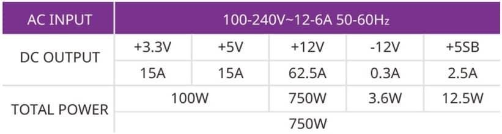

<em>Tabla de tensiones e intensidades de una fuente de 750 W</em>

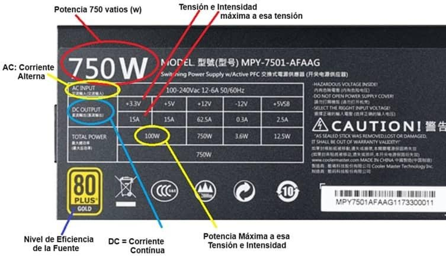

<em>Etiqueta de características de una fuente de 750 W</em>

- **Active PFC** (corrector de factor de potencia activo): permite que la distribución de energía opere a su máxima eficiencia y disminuye marcadamente los armónicos totales mezclados en la corriente AC. Una fuente con este complemento tendrá más vida útil.
- **Certificación 80 PLUS**: iniciativa para promover una mayor eficiencia energética de las fuentes de alimentación. La **eficiencia** es la energía suministrada por la fuente dividida por la energía que recibe, es decir, cuánta energía se desperdicia mientras el ordenador trabaja. Por ejemplo, una fuente de 100 W puede ser un 80 % eficiente al 100 % de carga, pero bajar al 50 % de eficiencia cuando está al 50 % de carga.

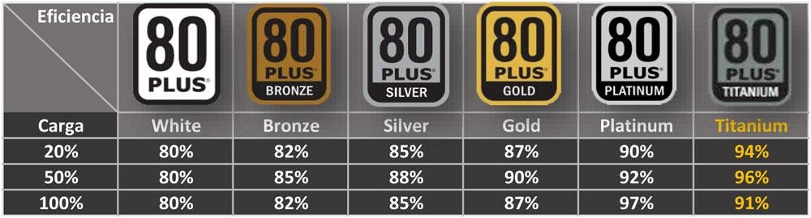

<em>Niveles de la certificación 80 PLUS y su eficiencia según la carga</em>

!!! task "Actividad 2"
    Determina la potencia que debería tener una fuente de alimentación con certificación **80 PLUS Silver** para un equipo cuyo consumo máximo puntual es de **598 W** y cuya actividad normal (la mayor parte del tiempo, o el 50 %) tiene un consumo de **400 W**, de modo que se consiga la mejor eficiencia energética posible.

    | Carga | 80 Plus Silver | Consumo | Potencia real | F.A. mínima |
    | ----- | -------------- | ------- | ------------- | ----------- |
    | 20 % | 85 % | 400 W | 400 W ÷ 0,85 = 470,5 W | 500 W |
    | 50 % | 88 % | 400 W | 400 W ÷ 0,88 = 454,5 W | 500 W |
    | 100 % | 85 % | 598 W | 598 W ÷ 0,85 = 703,5 W | 750 W |

    **Solución razonada:** la mejor eficiencia de una fuente Silver se da al 50 % de carga (88 %). Como el consumo habitual es de 400 W, lo ideal es una fuente en torno a 800 W (400 W ÷ 0,5). Con una de 750 W el pico de 598 W supone un ~80 % de carga, aún dentro de rango, y el uso normal queda cerca de su punto óptimo.

### 3.4 Conectores de la fuente

#### Procesador

- **Conector P4**: alimenta el procesador.
- De 4 u 8 pines (los de 8 pines suelen emplearse en servidores y para *overclock*).
- Es exclusivo de ATX.

#### Conector de la gráfica

- Cuando una gráfica consume menos de **75 W**, se alimenta a través del propio slot PCIe.
- Si consume más, se usa un conector de **6 pines**.
- Un segundo conector de **8 pines** se usa para el *overclock* de la gráfica.

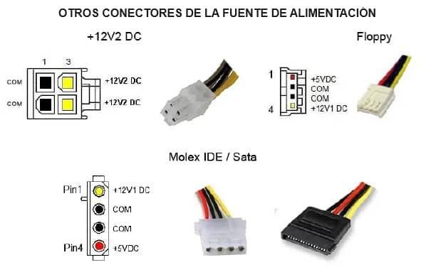

<em>Otros conectores de la fuente de alimentación (+12 V, disquetera, Molex IDE/SATA)</em>

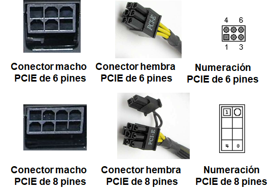

<em>Conectores PCIe de 6 y 8 pines: macho, hembra y numeración</em>

#### Almacenamiento

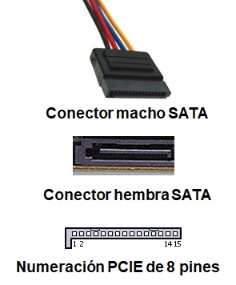

<em>Conector SATA de alimentación: macho y hembra</em>

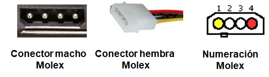

<em>Conector Molex: macho, hembra y numeración</em>

### 3.5 Fases de la fuente de alimentación

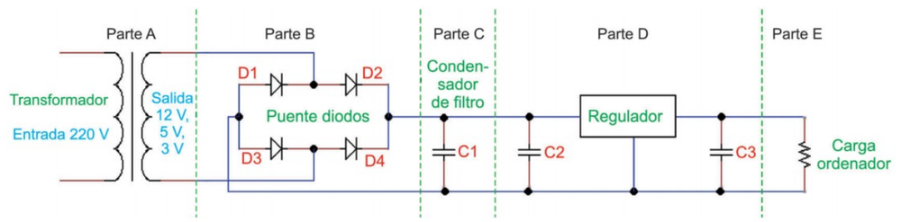

<em>Esquema por bloques de las fases de una fuente de alimentación</em>

## 4. Placa base

La **placa base**, placa madre o tarjeta madre es una placa formada por un circuito impreso a la cual van conectados todos los componentes que conforman una computadora.

Las placas base varían mucho respecto a los tipos de componentes que soportan. Por ejemplo, cada placa soporta un solo tipo de CPU y una lista corta de tipos de memoria. Además, algunas tarjetas gráficas, memorias RAM, discos duros y otros periféricos pueden no ser compatibles. El fabricante de la placa base debe proporcionar una orientación clara sobre la compatibilidad de los componentes.

En portátiles y tabletas, y cada vez más incluso en ordenadores de sobremesa, la placa base suele incorporar las funciones de la tarjeta de vídeo y de la tarjeta de sonido. Esto ayuda a mantener el tamaño reducido, pero impide actualizar esos componentes integrados.

Por otra parte, unos mecanismos de refrigeración deficientes pueden dañar el hardware conectado a la placa. Por eso los dispositivos de alto rendimiento (la CPU y las tarjetas de vídeo de gama alta) suelen refrigerarse con disipadores, y a menudo se utilizan sensores integrados para detectar la temperatura y comunicarse con la BIOS o el sistema operativo para regular la velocidad del ventilador. Los dispositivos conectados a una placa base a menudo necesitan que los controladores se instalen manualmente para funcionar con el sistema operativo.

El **chipset** determinará qué tipo de componentes se pueden conectar a la placa y nos dará las limitaciones de la misma, tanto para la memoria como para el microprocesador y otros.

!!! example "Ejemplo"
    Si elegimos un equipo con una placa base **H370** y un procesador Core i9 9900K, funcionará sin problemas, pero estará limitado: no podremos aprovechar el multiplicador desbloqueado del procesador para hacer *overclock*. Para ello necesitaríamos una placa con chipset **Z370**, de precio superior.

### 4.1 Factores de forma

Las placas base de PC, las fuentes de alimentación y las cajas salen de fábrica en distintos tamaños, conocidos como «factores de forma». Estos tres componentes tienen que ser compatibles en tamaño para un funcionamiento correcto.

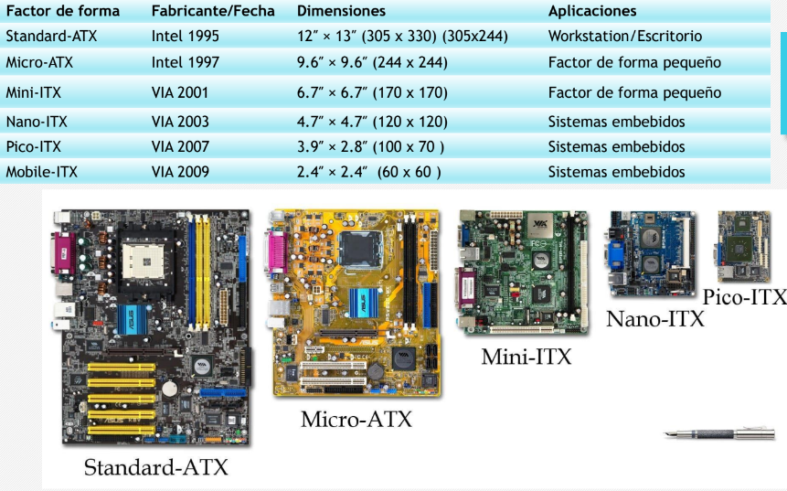

<em>Factores de forma de placas base: ATX, Micro-ATX, Mini-ITX, Nano-ITX y Pico-ITX</em>

### 4.2 Componentes de la placa base

Las placas base de los portátiles hacen el mismo trabajo que las de PC, pero están hechas a medida y varían mucho en diseño y disposición. Además, mientras la placa de un PC está diseñada con espacio para añadir componentes, en la de un portátil lo único que normalmente se puede actualizar es la RAM.

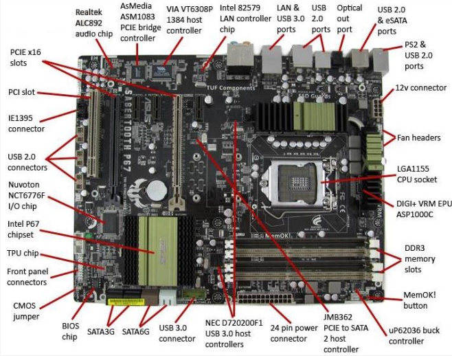

<em>Componentes de una placa base</em>

#### Zócalo de la CPU (procesador)

Aquí es donde se conecta la CPU. Todos los ordenadores modernos tienen grandes dispositivos de refrigeración sobre el procesador, que normalmente consisten en un bloque de metal con aletas y un ventilador. El zócalo está cuidadosamente diseñado para que el procesador solo quepa en el lugar adecuado.

Si el procesador no está en la placa base, puedes identificar el zócalo como socket 1 al socket 8, LGA 775 y otros, lo que ayuda a identificar el procesador que cabe. Por ejemplo, un 486DX encaja en el socket 3; un Intel Core i7 8700K, en el socket LGA 1151; un i9-7900X, en el LGA 2011; y los AMD Ryzen de primera y segunda generación, en el AM4.

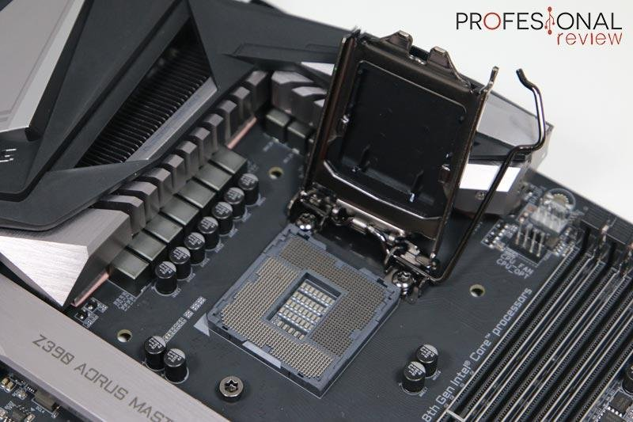

<em>Zócalo (socket) de la CPU</em>

Los tipos de sockets son:

- **PGA** (*Pin Grid Array*): la conexión se realiza mediante una matriz de pines instalados en la CPU, que encajan en los agujeros del zócalo de la placa.
- **LGA** (*Land Grid Array*): la matriz de pines está en el socket, y hacen contacto con las superficies conductoras del procesador.
- **BGA** (*Ball Grid Array*): en lugar de patitas hay pequeñas bolas que se sueldan directamente a la placa. No hace falta socket, lo que reduce tamaño y costes, pero elimina cualquier posibilidad de ampliación. Se utiliza mucho en chips de la placa y, últimamente, en portátiles.

#### Ranuras de memoria RAM (memoria DDR)

La mayoría de los equipos de escritorio tienen dos, cuatro u ocho ranuras. En los portátiles, las ranuras de RAM suelen ser la única parte de la placa que el usuario puede reemplazar.

Los módulos son largos y delgados. Las ranuras tienen un mecanismo a lo largo que corresponde a un hueco en el módulo, por lo que este solo se ajustará de la manera correcta. Este hueco también asegura que no se pueda instalar RAM incompatible, como un módulo DDR2 antiguo en una placa DDR4 moderna.

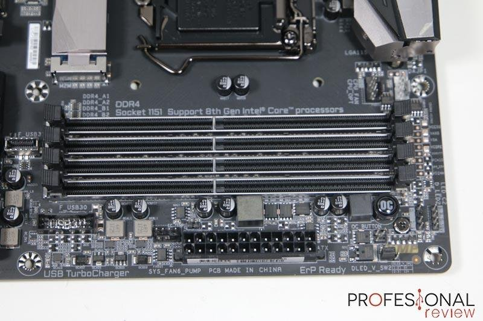

<em>Ranuras de memoria RAM</em>

#### Ranuras de expansión: PCI Express y PCI

Sirven para añadir componentes adicionales, como tarjetas gráficas o de sonido. Hay dos tipos principales: **PCI Express** y la ya obsoleta **PCI**. Las ranuras PCI Express vienen en varios tamaños y clasificaciones de velocidad (x1, x4 y x16) para adaptarse a distintos tipos de tarjetas.

En muchos PCs estas ranuras nunca llegan a utilizarse: todas las placas tienen sonido integrado y muchas CPU incluyen componentes gráficos. Sin embargo, los ordenadores para juegos suelen llevar potentes tarjetas gráficas dedicadas en una ranura PCI Express x16.

La ranura PCI es para tarjetas de expansión más antiguas (sonido, red, conexión), y cada vez es menos habitual en placas de gama media y alta, donde predominan los slots PCI Express.

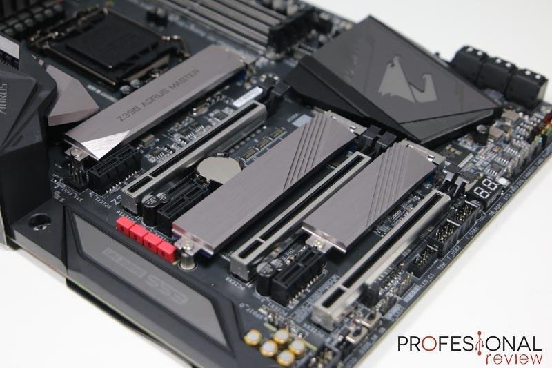

<em>Ranuras PCI Express y M.2 en una placa base</em>

Resumen de los principales slots de expansión:

- **ISA y/o VESA**: obsoletas; se empezaron a utilizar en los primeros 386.
- **PCI**: aún se ve; en la época del Pentium I fue un estándar con la llegada de tarjetas gráficas 3D.
- **PCI Express**: existe en x1, x4 y x16; son los slots de expansión habituales de las placas actuales.

#### Conectores de almacenamiento

Estos conectores son para discos duros mecánicos, dispositivos de estado sólido (SSD) y unidades ópticas, como las grabadoras de DVD.

Hay dos tipos de conectores: **SATA 2** y el más rápido **SATA 3**. SATA 2 es suficientemente rápido para los discos duros mecánicos tradicionales y las unidades ópticas, mientras que los SSD necesitan SATA 3 para funcionar a toda velocidad. Los dispositivos SATA 2 funcionan bien en conectores SATA 3, pero los SATA 3 conectados a conectores SATA 2 funcionan a velocidad reducida.

#### Puertos USB y conectores traseros

Casi todo lo que se conecta al ordenador desde el exterior, desde teclados hasta ratones e impresoras, se conecta a un puerto USB. Hay dos tipos de USB de tamaño completo: USB 2 y USB 3. El USB 3 es mucho más rápido y se adapta mejor a dispositivos como los discos duros externos, donde la velocidad extra marca la diferencia.

La mayoría de las placas tienen conectores USB 2 y USB 3, y todos los dispositivos USB 2, USB 3 y USB 3.1 funcionan en cualquiera de los puertos, aunque quizá algo más despacio en el USB 2. Las placas modernas incorporan también **USB-C** de segunda generación.

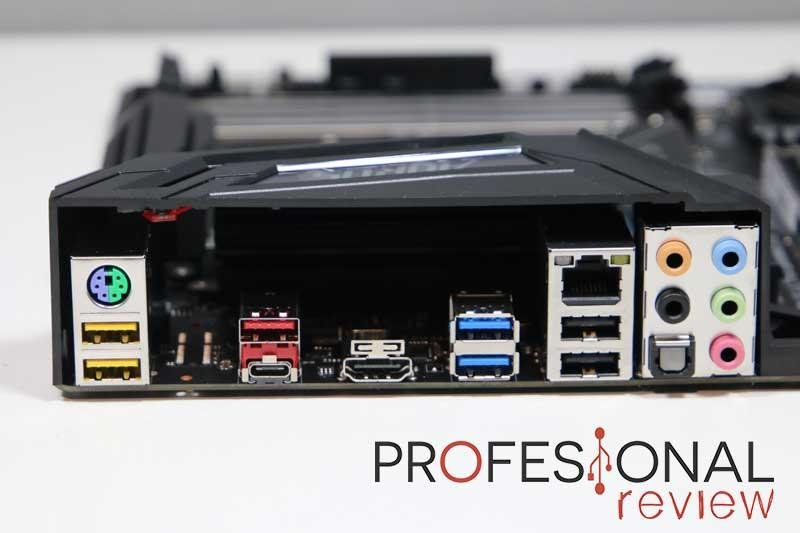

<em>Panel trasero de conectores de una placa base</em>

#### Puerto de red

No todos los portátiles tienen puerto de red con cable (algunos traen un USB con conexión Gigabit), pero se encuentran en prácticamente todos los equipos de escritorio. Aquí se conecta el cable Ethernet para crear una conexión alámbrica con un router doméstico o con la red de la oficina.

Todas las placas modernas tienen puertos Gigabit Ethernet (10/100/1000), que transfieren datos a 1000 megabits por segundo (Mbit/s), es decir, un máximo teórico de 125 megabytes por segundo (MB/s). En un futuro próximo, las conexiones de 10 Gigabit estarán en todas las placas.

#### Chipsets

Es un conjunto de chips situados en la placa base. Su función es controlar el flujo de datos entre el procesador, la memoria y los diferentes periféricos del ordenador. Estaba formado por dos chips diferenciados, conocidos como **northbridge** y **southbridge**.

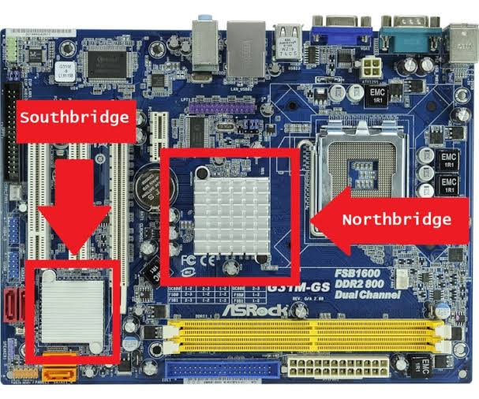

<em>Puente norte y puente sur en una placa base</em>

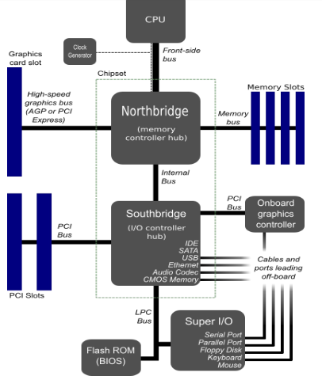

<em>Esquema de interconexión de un chipset con puente norte y puente sur</em>

- **Northbridge** (o *Memory Controller Hub*, MCH): permite a la CPU comunicarse con la RAM y la tarjeta gráfica. Controla los componentes de alta velocidad: E/S al microprocesador, RAM, AGP, PCI-E y gráfica. Se encarga de las transferencias entre el procesador y la RAM, por lo que se encuentra físicamente cerca del procesador. A veces se le llama GMCH (*Graphic and Memory Controller Hub*). A partir de Intel Sandy Bridge (2011), este componente ya no está presente como chip separado, porque se ha integrado en el propio microprocesador, mejorando claramente la rapidez de todo el hardware.
- **Southbridge** (o *I/O Controller Hub*, ICH): permite a la CPU comunicarse con las ranuras PCI, las ranuras PCI-Express x1 (tarjetas de expansión), los conectores SATA (discos duros, unidades ópticas), los puertos USB, los puertos Ethernet y el audio integrado. En definitiva, maneja los dispositivos más lentos.

Cada nueva arquitectura, tanto de AMD como de Intel, modifica las funciones que antes cumplía el southbridge: aumenta el número de conexiones directas con puertos USB y SATA e incorpora nuevas funcionalidades para comunicar los chiplets entre sí (en el caso de AMD). Su funcionamiento base sigue siendo el mismo, pero es ahora más eficiente y menos propenso a fallos.

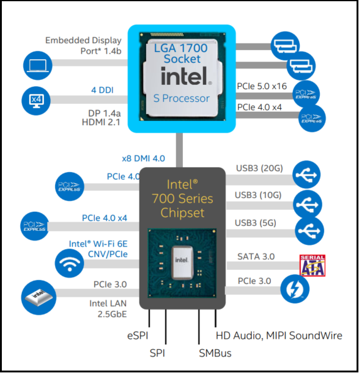

<em>Diagrama de un chipset Intel actual</em>

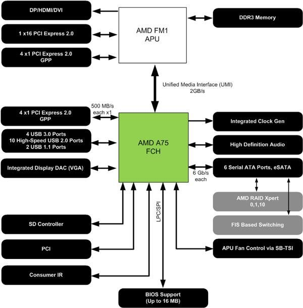

<em>Diagrama de bloques del conjunto procesador-chipset</em>

El **DMI** (*Direct Media Interface*) es un bus de alta velocidad que une el procesador con el chipset, que actúa como *hub* (concentrador) para controlar y comunicar todas las interfaces. En AMD se conoce como **UMI** (*Unified Media Interface*).

Cada procesador ha de utilizarse junto con un chipset que complementa sus funciones y añade muchas otras. Cada procesador se instala en un socket de la placa y, para obtener el mejor rendimiento, debe ir con un chipset acorde.

#### Batería CMOS (RAM CMOS)

La batería CMOS que se encuentra en la mayoría de las placas base es la pila de litio **CR2032**. Suministra energía para almacenar la configuración de la BIOS y mantener en funcionamiento el reloj en tiempo real.

Las placas base incluyen también un pequeño bloque separado de memoria hecho de chips RAM CMOS que se mantiene vivo gracias a esta batería, incluso cuando el PC está apagado, lo que evita la reconfiguración cada vez que se enciende. Los dispositivos CMOS requieren muy poca energía. La RAM CMOS almacena información básica sobre la configuración del PC, además de la hora y la fecha, que se actualizan mediante un reloj de tiempo real (RTC).

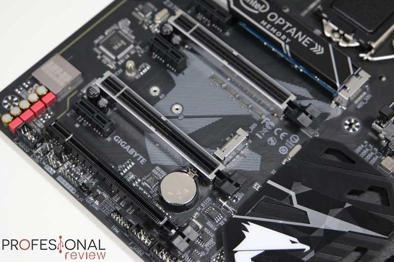

<em>Pila CR2032 de una placa base</em>

#### Conector de alimentación ATX

Se conecta al cable de alimentación ATX de 24 clavijas de la fuente, que suministra energía a la placa. Como conexión auxiliar podemos encontrar conectores de 4 u 8 pines; en placas de gama alta lo normal es ver 24 pines de alimentación y dos conexiones EPS de 8 pines (plataformas Intel LGA 2066 y AMD TR4/Threadripper).

#### Conectores de refrigeración

- **CPU_FAN**: ventilador del procesador (con control de temperatura).
- **CPU_SYS, CPU_OPT o CHA_FAN**: conectores adicionales o secundarios destinados al sistema en general, ya sea para ventiladores superiores, traseros o frontales. Hoy la mayoría pueden regularse por BIOS, pero no suelen llevar el control de temperatura del CPU_FAN.
- **AIO_PUMP**: conector destinado a la bomba del bloque de agua de una AIO (todo en uno); también puede usarse para un ventilador común.
- **W_PUMP** (*Water Pump*): enfocado a bombas de alto rendimiento para refrigeración líquida; suele disponer de mayor energía.
- **H_AMP**: diseñado para ventiladores de alto consumo, ya que puede llegar a triplicar la energía de un conector normal.

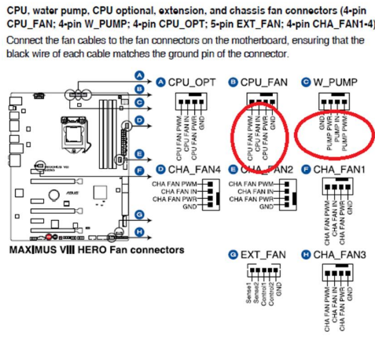

<em>Ubicación de los conectores de ventilador en una placa</em>

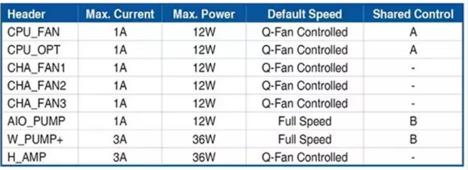

<em>Corriente, potencia y control de cada conector de ventilador</em>

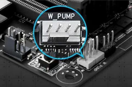

<em>Conector W_PUMP para bombas de refrigeración líquida</em>

#### Conector mSATA y/o M.2 NVMe

Se conecta a una unidad de estado sólido mSATA o M.2 NVMe. En la mayoría de los casos esta unidad SSD se utiliza como caché para acelerar los discos duros, pero es posible utilizarla como unidad de disco normal. Actualmente es difícil encontrarlo en portátiles domésticos, pero en portátiles de empresa todavía puede encontrarse.

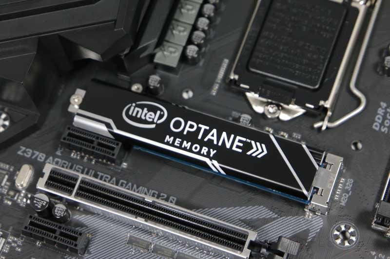

<em>Ranura M.2 con una unidad Intel Optane</em>

#### Botón de encendido y reseteo

Botón incorporado para encender, apagar y reiniciar el ordenador. Este componente es más común en las placas de gama alta.

#### Basic Input/Output System (BIOS) vs UEFI

Los ordenadores necesitan un sistema interno cuyo código contenga las instrucciones necesarias para realizar un arranque seguro y poner a punto el equipo. Para ello se creó la **BIOS**, que desde 1975 se encargó de iniciar el hardware y el software de los ordenadores.

**BIOS** significa *Basic Input/Output System* (sistema básico de entrada/salida). Es una memoria de solo lectura que consiste en software de bajo nivel que controla el hardware del sistema y actúa como interfaz entre el sistema operativo y el hardware. Se almacena en un chip ROM de la placa base porque la ROM retiene la información incluso cuando no se suministra energía al ordenador, y se utiliza durante la rutina de arranque para comprobar el sistema y prepararse para ejecutar el hardware.

Debido a las demandas de los nuevos diseños de PC nació **UEFI**, el sucesor de la BIOS. Es el primer programa que se ejecuta al iniciar el PC y tiene tres fines: verificar el hardware conectado a la placa, activar los componentes y vincularlos al sistema operativo. Sus siglas corresponden a *Unified Extensible Firmware Interface*. UEFI establece qué reloj o frecuencia debe adoptar la CPU, la GPU y la RAM, así como la energía que se debe extraer de la fuente de alimentación para los componentes.

La BIOS tenía muchas limitaciones que la UEFI corrige:

- **MBR frente a GPT**. La BIOS usaba **MBR**, que estaba limitado a entradas de 32 bits y a 4 particiones primarias en total, con un máximo de 2 TB por disco. UEFI usa **GPT**, con entradas de 64 bits, que permite muchas más particiones y discos de tamaño prácticamente ilimitado. (UEFI también soporta 32 bits, pero este sistema ya ha dejado de usarse en la mayoría de ordenadores modernos).
- **Limitación de capacidad**: UEFI puede direccionar discos duros de hasta 9,4 ZB (zettabytes).
- **Velocidad de arranque acelerada**: en UEFI los módulos y controladores se cargan en paralelo, mientras que en BIOS se cargan secuencialmente.
- **Más seguridad**: UEFI permite que los controladores y servicios genuinos se ejecuten en el arranque, lo que se conoce como *arranque seguro* (**Secure Boot**).

#### Memoria caché

La memoria caché es un pequeño bloque de memoria de alta velocidad (RAM) que mejora el rendimiento del PC precargando información de la memoria principal (relativamente lenta) y pasándola al procesador bajo demanda.

La mayoría de las CPU tienen una memoria caché interna (integrada en el procesador) que se conoce como Nivel 1 (L1) o caché primaria. Esta puede complementarse con caché externa instalada en la placa base: el Nivel 2 (L2) o caché secundaria. Hoy toda la caché se ha integrado en el propio procesador (se estudia con detalle en la UT2.2).

!!! task "Actividad 3"
    En grupos de 3, buscad las siguientes placas base y determinad sus componentes: Raspberry Pi 5, iPhone 13, Arduino, Meta Quest 2 RV, Nintendo Switch, PS4 y Xbox Serie S.

### 4.3 Componentes modernos

Las placas base modernas incorporan además elementos de seguridad como el módulo **TPM** (*Trusted Platform Module*), un chip que almacena de forma segura claves criptográficas y que se conecta a la placa mediante un conector específico. Existen distintos formatos de conector TPM (por ejemplo, 12-1, 14-1 y 20-1 pines), según la placa.

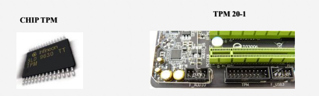

<em>Chip TPM y módulo TPM 2.0 (TPM 20-1)</em>

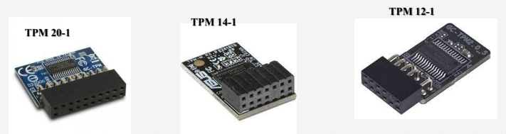

<em>Distintos tipos de conector TPM: 20-1, 14-1 y 12-1</em>

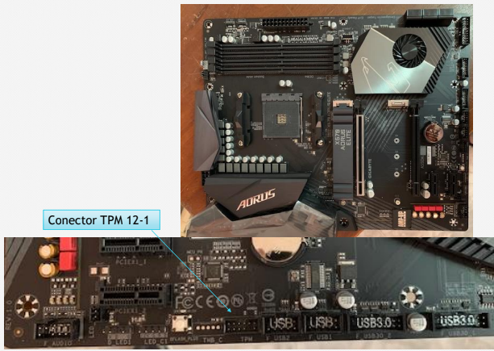

<em>Conector TPM 12-1 en una placa base</em>

## Ejercicios prácticos

!!! task "Tarea"
    **Ejercicio 1**. Clasifica estos elementos en internos o externos y, dentro de cada grupo, indica su categoría: SSD, teclado, tarjeta gráfica, impresora, fuente de alimentación, tarjeta SD, chipset, altavoces.

    **Ejercicio 2**. Explica por qué los ventiladores que extraen aire caliente de una caja deben situarse en posiciones altas y los que introducen aire fresco en posiciones bajas. ¿Por qué es importante canalizar bien los cables?

    **Ejercicio 3**. ¿Qué es un servidor *blade* y qué ventajas tiene frente a un servidor tradicional?

    **Ejercicio 4**. Explica qué hace una fuente de alimentación (transformar, rectificar, filtrar y estabilizar) y para qué se usan las salidas de 5 V y de 12 V.

    **Ejercicio 5**. ¿Cuál es la diferencia entre una fuente modular, una semimodular y una no modular? ¿Qué ventaja aporta la modular?

    **Ejercicio 6**. Un equipo tiene un consumo habitual de 300 W y un pico de 450 W. Con una fuente 80 PLUS Gold que rinde un 90 % al 50 % de carga, ¿qué potencia de fuente elegirías para trabajar en su punto de mayor eficiencia y cuánta energía consumiría de la red en uso normal?

    **Ejercicio 7**. Si una gráfica consume 120 W, ¿basta con la alimentación que proporciona la ranura PCIe? ¿Qué conector adicional necesitaría?

    **Ejercicio 8**. Explica la diferencia entre los sockets PGA, LGA y BGA. ¿Cuál de ellos no permite ampliar el procesador y por qué?

    **Ejercicio 9**. Explica qué es el chipset y describe la función del puente norte y del puente sur. ¿Por qué ha desaparecido el puente norte en los procesadores actuales?

    **Ejercicio 10**. ¿Para qué sirve la pila CR2032 de la placa base? ¿Qué pasaría con la fecha y la hora si se agotara?

    **Ejercicio 11**. Compara BIOS y UEFI: cita al menos tres diferencias (particiones, arranque, seguridad...).

    **Ejercicio 12 (práctica en el aula)**. Abre un equipo del aula (apagado, desenchufado y con las precauciones antiestáticas) e identifica: la caja y su flujo de ventilación, la fuente de alimentación y sus conectores, el socket, las ranuras de RAM y de expansión, los conectores SATA/M.2, la pila CMOS y el chipset. Haz un esquema o fotografías anotadas.

---

**Bibliografía del documento original:** Wikipedia (*Hardware*), HardZone (*flujo de aire perfecto del PC*), Freelancermap (*qué hace un administrador de sistemas*), Profesional Review (*componentes de una placa base*) y Geeknetic (*chipsets de Intel por socket*).
