
<strong>CFGS Administración de Sistemas Informáticos y en Red (1º curso)</strong>

Material elaborado para el módulo **Fundamentos de Hardware**

# UT2.2. Procesadores y memoria

## Programación de Aula

### Resultados de Aprendizaje

Esta unidad forma parte de la UT2 "Elementos internos de un sistema informático" y trabaja el **Resultado de Aprendizaje 1 (RA1)** del módulo, según el **Real Decreto 1629/2009** (Anexo I, módulo *Fundamentos de Hardware*):

1. **RA1.** Configura equipos microinformáticos, componentes y periféricos, analizando sus características y relación con el conjunto.

Criterios de evaluación que trabaja esta unidad (junto con UT2.1 y UT2.3):

- **CE11** (RA1.a): Se han identificado y caracterizado los dispositivos que constituyen los bloques funcionales de un equipo microinformático.
- **CE13** (RA1.c): Se ha analizado la arquitectura general de un equipo y los mecanismos de conexión entre dispositivos.
- **CE14** (RA1.d): Se han establecido los parámetros de configuración (hardware y software) de un equipo microinformático con las utilidades específicas.
- **CE18** (RA1.h): Se han clasificado los dispositivos periféricos y sus mecanismos de comunicación.

### Planificación Temporal (2 sesiones / 4 horas)

| Sesión | Contenido |
| ------ | --------- |
| 1 | Arquitectura de procesadores: fabricación, instrucciones, partes, núcleos e hilos, caché, consumo y overclocking |
| 2 | Memoria: caché y RAM, tipos, parámetros, cálculos y dual channel |

!!! info "Fuentes y licencia"
    Este tema adapta el documento *UT2.2 Procesadores y memoria* de **Daniel López Escuder** (Fundamentos de Hardware – ASIX), publicado bajo licencia **Creative Commons Reconocimiento-NoComercial-CompartirIgual 4.0 (CC BY-NC-SA 4.0)**. Por respeto a dicha licencia, este material se comparte con las mismas condiciones. Las imágenes proceden del documento original. Bibliografía del original: Profesional Review, HardZone, apuntes de Fundamentos de Hardware de Francisco de Asís González Cavero, *Montaje y mantenimiento de equipos* (Paraninfo, 3ª ed.) y apuntes de la Universitat Jaume I.

## 1. Introducción

El **microprocesador** es el auténtico cerebro de todos los elementos del PC. La función principal de la CPU es ejecutar los programas almacenados en la memoria principal del PC, leyendo las instrucciones, decodificándolas y realizando las acciones asociadas a cada una de ellas.

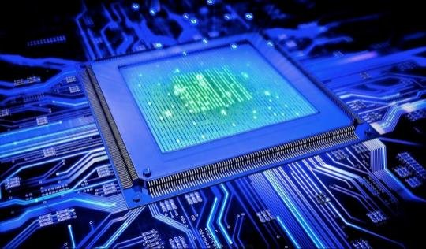

<em>El microprocesador: un chip con miles o millones de transistores</em>

El microprocesador es un chip, un componente electrónico cuyo interior está compuesto por miles o millones de **transistores**, cuya combinación permite realizar los trabajos que se le encomienden. Suelen tener forma de rectángulo y van sobre un elemento llamado **zócalo** (*socket*, en inglés), específico de cada modelo, que permite conectarlos a la placa mediante pines. Además, es necesario situarlo junto con un sistema de refrigeración que ayude a disipar el calor; para una mejor transmisión entre el procesador y el disipador se inserta **pasta térmica**.

Hemos de tener en cuenta que la información manejada es, a fin de cuentas, electricidad que viaja a través de los circuitos y que es retenida en pequeñas zonas de memoria para su posterior procesamiento en la memoria principal.

## 2. Arquitectura de procesadores

A medida que avanzan las tecnologías, la CPU que estudiamos en la arquitectura de Von Neumann ha ido evolucionando hasta el esquema siguiente. Hoy en día, los procesadores tienen varios **núcleos**, los cuales pueden acceder a la memoria caché integrada dentro del microprocesador.

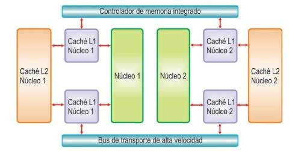

<em>Esquema de un procesador con dos núcleos, cachés L1 y L2 y controlador de memoria integrado</em>

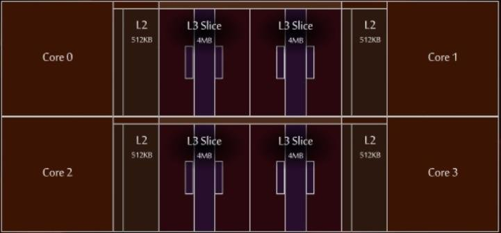

<em>Ejemplo: distribución interna de un procesador Zen 3 (cuatro núcleos, caché L2 y L3)</em>

### 2.1 Proceso de fabricación

El proceso de fabricación es básicamente el **tamaño de los transistores** que forman el procesador. Desde las válvulas de vacío de las primeras computadoras hasta los transistores **FinFET** actuales, fabricados por empresas como TSMC y Global Foundries, de solo unos nanómetros, la evolución ha sido enorme.

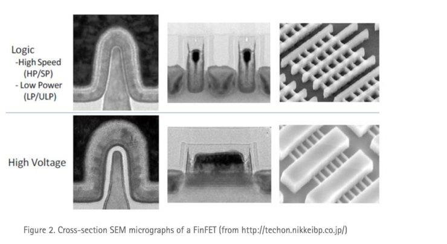

<em>Sección transversal de un transistor FinFET (micrografía electrónica)</em>

Un procesador está formado por transistores, las unidades más pequeñas que encontramos en su interior. Un transistor es un elemento que permite o no pasar corriente: 0 (no corriente), 1 (corriente). Actualmente miden 14 nm o 7 nm o menos (1 nm = 0,000000001 m). Con los transistores se crean **puertas lógicas**, y con las puertas lógicas se crean los **circuitos integrados** capaces de realizar distintas funciones.

### 2.2 Juego de instrucciones

Una parte importante de diseñar un procesador es elegir cuál será su **juego de instrucciones**, que junto con los registros utilizados forma su arquitectura. Esta decisión es importante porque determina el comportamiento funcional del sistema por dos motivos:

- El juego de instrucciones decide el diseño físico del conjunto.
- Cualquier operación a ejecutar debe ser escrita en términos de un lenguaje de estas instrucciones.

Existen varias filosofías de arquitectura de procesadores:

- **CISC**: ofrece un conjunto de instrucciones completas y lentas de ejecutar, que agrupan varias operaciones de bajo nivel en la misma instrucción. Esto da lugar a programas pequeños y sencillos de desarrollar que realizan pocos accesos a memoria. En la actualidad, CISC tiene a **x86** como su mayor exponente, con AMD y sobre todo Intel a la cabeza. Hay muchos ejemplos históricos, como los PDP, Motorola 68000, Intel 4004 o Intel 8086.
- **RISC**: ofrece un conjunto de instrucciones muy simples que se ejecutan más rápidamente. El catálogo es de pocas instrucciones muy sencillas, lo que implica que hacen falta más de ellas: el programa final es más largo y accede más veces a los datos almacenados en memoria. En la actualidad, el mayor ejemplo de procesador RISC son los productos **ARM**, muy utilizados en dispositivos móviles.
- **Híbrido CISC/RISC**: recoge lo mejor de ambas. Internamente, el procesador lleva a cabo solo instrucciones simples. Sobre estas instrucciones internas hay un circuito decodificador que convierte las instrucciones complejas utilizadas por los programas en varias instrucciones simples que el procesador puede entender.

La gran batalla actual es la de sus dos grandes exponentes, **ARM** y **x86**, que han actualizado sus objetivos a lo que importa a los usuarios del siglo XXI. El punto fuerte de ARM es la **eficiencia energética**: un chip ARM consume mucha menos energía que un procesador x86, que tiene en su alto rendimiento su gran virtud a costa de consumir bastante más energía.

### 2.3 Partes del microprocesador

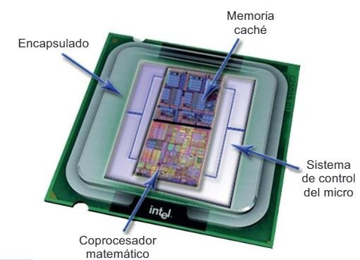

<em>Partes de un microprocesador: encapsulado, memoria caché, sistema de control y coprocesador matemático</em>

- **Encapsulado**: parte física que rodea el procesador para impedir su deterioro y permitir el enlace de los conectores con el zócalo. Otorga protección de plástico o cerámica, con una serie de conexiones eléctricas que sirven para recibir energía, realizar la transmisión de datos y evacuar el calor generado.
- **Memoria caché**: memoria ultrarrápida que el procesador emplea para tener almacenados los datos que previsiblemente se usarán con más frecuencia, sin acceder a la RAM. Hay diferentes niveles según su ubicación, velocidad y tamaño:
  - **Caché L1**: se encuentra en el núcleo del microprocesador. Es la más rápida.
  - **Caché L2**: más lenta que la L1, pero de mayor capacidad. Se encuentra en el procesador, pero no en su núcleo. Genera copia de L1.
  - **Caché L3**: agiliza el acceso a datos e instrucciones que no se localizaron en L1 o L2. Genera copia a la L2.
  - **Caché L4**: poco habitual; se utiliza como apoyo para mejorar el rendimiento de las GPU integradas.
- **Coprocesador matemático o FPU** (*Floating Point Unit*): unidad especializada en el cálculo de operaciones en coma flotante.
- **Unidad de control**: se encarga de buscar las instrucciones y los datos de la memoria principal, ejecutarlos y atender las interrupciones.
- **ALU**: se encarga de realizar las operaciones aritméticas y lógicas sencillas.
- **Registros**: pequeñas memorias de acceso rápido donde guardar datos de operaciones en curso. Pueden ser de uso general o específico.
- **iGP** (*Integrated Graphics Processor*): procesadores que dependen de la memoria primaria del sistema. Los chips integrados actuales se incrustan directamente en la CPU, lo que determina cuánta RAM se utilizará para procesar gráficos.

### 2.4 Características de la CPU

Las CPU tienen una serie de características que usamos para clasificarlas y compararlas.

!!! warning "Importante"
    La velocidad de un procesador no es el único indicativo para medir la rapidez, el número de instrucciones que procesa por unidad de tiempo, sino que intervienen otros parámetros como el número de núcleos, la arquitectura, la caché y, por supuesto, la frecuencia.

#### 2.4.1 Número de núcleos

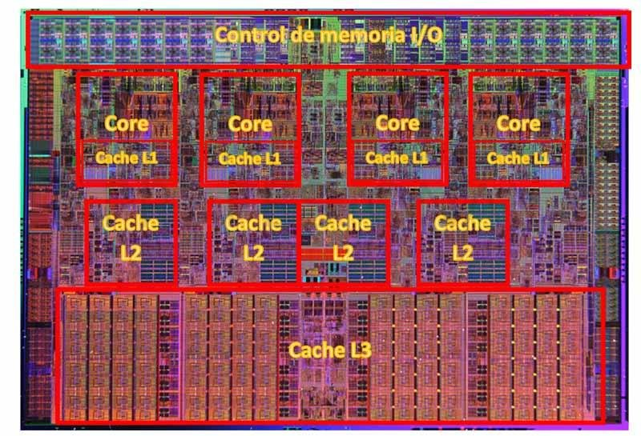

<em>Fotografía de la pastilla de silicio de un procesador con varios núcleos y caché L3</em>

Los **núcleos** son las entidades de procesamiento de información: los elementos formados por los componentes básicos de la arquitectura x86, es decir, la unidad de control (UC), el decodificador de instrucciones (DI), la unidad aritmético-lógica (ALU), la unidad de coma flotante (FPU) y la pila de instrucciones (PI).

Cada uno de estos núcleos está formado por los mismos componentes internos, y cada uno es capaz de llevar a cabo una operación en cada ciclo de instrucción. Este ciclo se mide en frecuencia o hercios (Hz): mientras más Hz, más instrucciones por segundo; y mientras más núcleos, más operaciones al mismo tiempo.

En la actualidad, fabricantes como AMD implementan estos núcleos en bloques de silicio, **chiplets** o CCX, de forma modular. Con este sistema se consigue una mejor escalabilidad: se trata de colocar chiplets hasta conseguir el número deseado de núcleos (8 por cada elemento), y además es posible activar o desactivar cada núcleo para conseguir el recuento deseado. Intel, por su parte, aún mete todos los núcleos en un solo silicio.

#### 2.4.2 Control de voltaje

**Turbo Boost** y **Precision Boost Overdrive** son los sistemas que utilizan Intel y AMD, respectivamente, para controlar el voltaje de sus procesadores de forma activa e inteligente. Esto les permite aumentar la frecuencia de trabajo como si de un *overclocking* automático se tratase, para que la CPU rinda más ante una gran carga de tareas. Ayuda además a mejorar la eficiencia térmica y el consumo, al poder variar la frecuencia cuando sea necesario.

#### 2.4.3 Hilos de procesamiento o *threads*

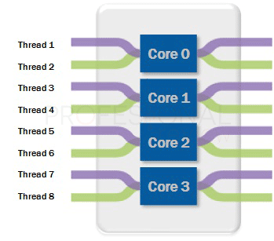

<em>Ocho hilos repartidos entre cuatro núcleos</em>

En un procesador no solo tenemos núcleos: también existen los **hilos de procesamiento**. Normalmente los veremos representados en las especificaciones como *X Cores / X Threads* (X C / X T). Por ejemplo, un Intel Core i9-9900K tiene 8C/16T, mientras que un i5-9400 tiene 6C/6T.

El término *thread* viene de «subproceso», y no forma parte físicamente del procesador: su funcionalidad es puramente lógica y se realiza mediante el conjunto de instrucciones del procesador. Se puede definir como el flujo de control de datos de un programa (un programa está formado por instrucciones o procesos), que permite administrar las tareas de un procesador dividiéndolas en trozos más pequeños llamados subprocesos. Así se pretende optimizar los tiempos de espera de cada instrucción en la cola de proceso.

Hay tareas más difíciles que otras, por lo que un núcleo tardará más o menos tiempo en terminarlas. Con los hilos, esa tarea se divide en algo más simple para que cada trozo sea procesado por el primer núcleo libre que se encuentre. El resultado es mantener continuamente los núcleos ocupados, sin tiempos muertos.

#### 2.4.4 Tecnologías multithreading

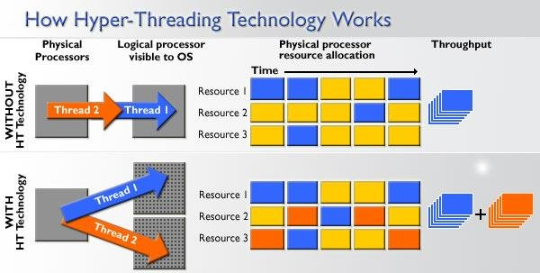

<em>Funcionamiento de la tecnología Hyper-Threading</em>

¿Por qué vemos en unos casos el mismo número de núcleos que de hilos y en otros no? Se debe a las tecnologías *multithreading* que los fabricantes tienen implementadas en sus procesadores. Cuando una CPU cuenta con el doble de hilos que de núcleos, significa que tiene implementada esta tecnología: divide un núcleo en dos hilos o «núcleos lógicos» para dividir tareas. La división se realiza siempre en dos hilos por núcleo y no más.

La tecnología de Intel se denomina **Hyper-Threading**, y la de AMD, **SMT** (*Simultaneous Multithreading*). A efectos prácticos ambas funcionan igual y, en nuestro equipo, los veremos como núcleos reales (por ejemplo, al renderizar una foto). Un procesador con idéntica velocidad es más rápido si tiene 8 núcleos físicos que si tuviera 8 lógicos.

#### 2.4.5 Memoria caché

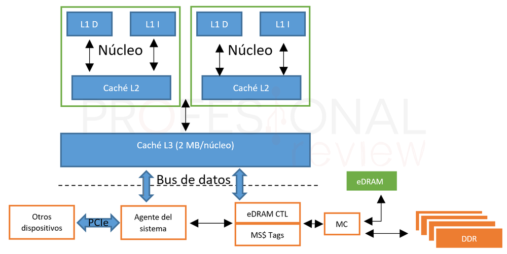

<em>Esquema de la memoria caché dentro del procesador y su conexión con la RAM</em>

Es, de hecho, el segundo elemento más importante de un procesador. La memoria caché es mucho más rápida que la memoria RAM y está directamente integrada en el procesador. Mientras que una RAM DDR4 a 3600 MHz puede alcanzar los 50 000 MB/s en lectura, una caché L3 puede llegar a los 570 GB/s, una L2 a los 790 GB/s y una L1 a los 1600 GB/s (cifras registradas en los Ryzen 3000).

Esta memoria es de tipo **SRAM** (*Static RAM*), rápida y cara, mientras que la RAM usa **DRAM** (*Dynamic RAM*), lenta y barata por necesitar continuamente una señal de refresco. En la caché se almacenan los datos que van a ser usados inmediatamente por el procesador, eliminando la espera de cogerlos de la RAM y optimizando el tiempo de proceso. En los procesadores de AMD e Intel existen tres niveles de caché:

- **L1**: la más cercana a los núcleos, la más pequeña y la más rápida (latencias inferiores a 1 ns). Está dividida en dos: **L1I** (instrucciones) y **L1D** (datos). En los Intel Core de 9ª generación y los Ryzen 3000 es de 32 KB en cada caso, y cada núcleo tiene la suya propia.
- **L2**: la siguiente, con latencias en torno a los 3 ns; también asignada de forma independiente a cada núcleo. Las CPU Intel la tienen de 256 KB, y los Ryzen, de 512 KB.
- **L3**: la memoria más grande de las tres, asignada de forma compartida entre los núcleos, normalmente en grupos de 4.

Se produce un **acierto de caché** (*hit*) cuando los datos solicitados se encuentran en ella, y un **error o fallo de caché** (*miss*) cuando no. Los datos se alojan en distintos niveles según su frecuencia de uso.

#### 2.4.6 Buses

El **puente norte** de un procesador o de una placa base tiene la función de conectar la memoria RAM con la CPU. En la actualidad, ambos fabricantes implementan este controlador de memoria (o PCH, *Platform Controller Hub*) dentro de la propia CPU, por ejemplo en un silicio independiente en las CPU basadas en chiplets.

Es una forma de aumentar significativamente la velocidad de las transacciones de información y de simplificar los buses de las placas base, quedándose solo con el puente sur, que llamamos **chipset**. Este conjunto de chips se dedica a direccionar los datos de los discos duros, periféricos y algunas ranuras PCIe. Los procesadores de última generación de escritorio y portátiles son capaces de direccionar hasta 128 GB de RAM en *dual channel* a 3200 MHz nativos (4800 MHz con perfiles JEDEC y XMP activado).

Los buses se dividen en:

- **Bus de datos**: transporta los datos e instrucciones de los programas.
- **Bus de direcciones**: por él circulan las direcciones de las celdas donde se guardan los datos.
- **BSB** (*Back-Side Bus*): bus de conexión entre los núcleos del procesador y la memoria. El que utiliza AMD en Zen 2 se denomina **Infinity Fabric** (capaz de trabajar a 5100 MHz), y el de Intel, **Intel Ring Bus**.
- **Bus frontal o FSB**: bus para comunicar el procesador con el chipset. En Intel es **QuickPath Interconnect** y en AMD, **HyperTransport**.

#### 2.4.7 iGPU: procesador gráfico integrado

La mayoría de procesadores actuales cuentan con núcleos destinados a trabajar exclusivamente con gráficos y texturas. Ya sea Intel, AMD o fabricantes como Qualcomm (con sus Adreno para smartphone) o Realtek (para Smart TV y NAS), todos tienen núcleos de este tipo. A este tipo de procesadores se les llama **APU** (*Accelerated Processor Unit*).

La razón es simple: separar este duro trabajo del resto de tareas típicas de un programa, ya que son mucho más pesadas y lentas si no se usa un bus de mayor capacidad (por ejemplo, de 128 bits en las APU). Al igual que los núcleos normales, estos se pueden medir en cantidad y en la frecuencia a la que trabajan, pero además tienen otros componentes: las **unidades de sombreado**, las **TMU** (unidades de texturizado) y las **ROP** (unidades de renderizado). Todas ellas ayudan a identificar la potencia gráfica del conjunto.

### 2.5 Socket

Fuera de los componentes de una CPU, tenemos dónde conectarla: el **zócalo o socket**, un gran conector ubicado en la placa base y provisto de cientos de pines que hacen contacto con la CPU para trasladarle la energía y los datos a procesar. Cada fabricante tiene sus propios sockets, y pueden ser de varios tipos:

- **LGA** (*Land Grid Array*): los pines están instalados directamente en el socket de la placa y la CPU solo cuenta con contactos planos. Permite mayor densidad de conexiones y lo usa Intel (por ejemplo LGA 1151 en escritorio y LGA 2066 en estaciones de trabajo). También lo usa AMD en sus Threadripper (TR4).
- **PGA** (*Pin Grid Array*): justo lo contrario, los pines están en la propia CPU y el socket tiene huecos. Lo usa AMD todavía en sus Ryzen de escritorio (AM4).
- **BGA** (*Ball Grid Array*): un «socket» en el que se suelda directamente el procesador. Se usa en los portátiles de nueva generación, tanto de AMD como de Intel.

### 2.6 Consumo

El **consumo** es la energía que gasta el procesador. Para hallarlo: **tensión (V) × intensidad (A)**.

- **Voltaje**: tensión de alimentación.
- **Corriente**: cantidad de electricidad que circula por un conductor.
- **Consumo**: se expresa en vatios (W).

Hay tecnologías que hacen que el procesador no consuma cuando no tiene nada que procesar (por ejemplo, **Cool'n'Quiet** de AMD).

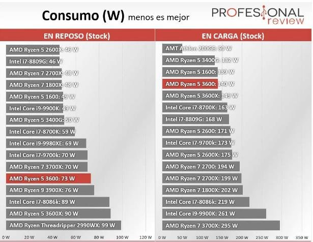

<em>Comparativa de consumo de procesadores en reposo y en carga</em>

!!! example "Ejemplos"
    - i7 → 1,25 V; 90 A → consumo: 1,25 V × 90 A = **112,5 W**.
    - Ryzen 5 → 1,15 V; 70 A → consumo: 1,15 V × 70 A = **80,5 W**.
    - ¿Voltaje de un procesador que consume 95 W y 80 A? Voltaje = consumo ÷ intensidad = 95 ÷ 80 = **1,19 V**.

#### 2.6.1 Control de temperatura

El *thermal throttling* es un sistema de protección automático que tienen las CPU para disminuir el voltaje y la potencia suministrada cuando las temperaturas llegan al máximo admisible. De esta forma se baja la frecuencia de trabajo y también la temperatura, estabilizando el chip para que no se queme. Los propios fabricantes ofrecen datos de las temperaturas de sus procesadores:

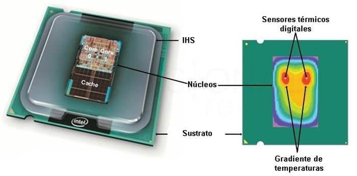

<em>Sensores térmicos digitales, IHS, núcleos y gradiente de temperaturas en un procesador</em>

- **TjMax**: temperatura máxima que un procesador es capaz de aguantar en su matriz, es decir, dentro de sus núcleos. Cuando la CPU se acerca a ella salta la protección que baja el voltaje y la potencia.
- **Tdie, Tjunction o temperatura de unión**: se mide en tiempo real por sensores colocados en el interior de los núcleos. Nunca superará TjMax, ya que el sistema de protección actúa antes.
- **TCase**: temperatura medida en el **IHS** (difusor térmico integrado) del procesador, es decir, en su encapsulado; siempre es distinta a la que se marca dentro de un núcleo.
- **CPU Package**: promedio de la temperatura de unión de todos los núcleos de la CPU.

### 2.7 Resumen de tecnologías asociadas

**Intel**

- **Hyper-Threading**: divide el núcleo en dos, creando un microprocesador virtual.
- **QuickPath Interconnect**: conexión punto a punto con el procesador (4,8 a 6,4 GT/s).
- **Turbo Boost**: incrementa la velocidad de los núcleos cuando el usuario lo demanda.
- **SpeedStep**: cambia la frecuencia del microprocesador ajustándose a la carga; disminuye el consumo y el calor.
- **Quick Sync**: permite codificar y decodificar un vídeo por hardware.
- **HD Graphics**: procesador gráfico dentro de la CPU.

**AMD**

- **CMT** (*Cluster-based Multithreading*): divide el procesador en dos, similar a Hyper-Threading.
- **HyperTransport**: comunicaciones de alta velocidad punto a punto, similar a QuickPath.
- **Turbo Core**: modifica la frecuencia en función de la demanda del procesador.
- **Cool'n'Quiet**: permite reducir la frecuencia de operación del procesador.

### 2.8 Overclocking

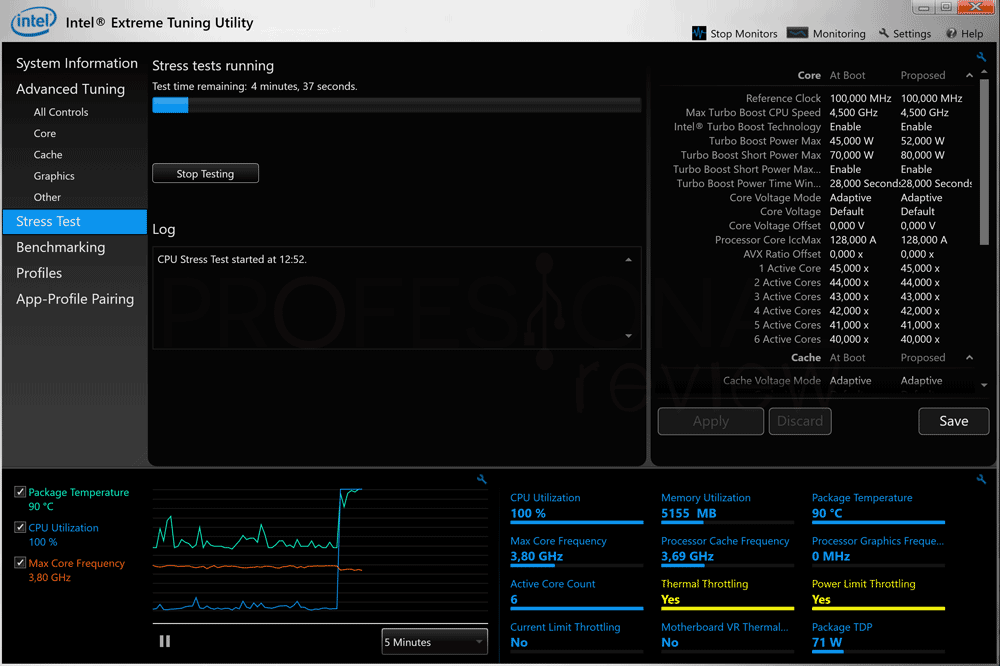

<em>Herramienta Intel Extreme Tuning Utility (XTU) para ajustar frecuencia y voltaje</em>

El **overclocking** es una técnica en la que se aumenta el voltaje de la CPU y se modifica el multiplicador para aumentar así su frecuencia de operación. No se trata de las frecuencias de las especificaciones (como el modo turbo), sino de valores que superan los establecidos por el fabricante. Es un riesgo para la estabilidad e integridad del procesador.

!!! warning "Importante"
    Cuando hagamos *overclocking*, no es aconsejable sobrepasar la velocidad marcada en más de un 15 %.

Para realizar un overclock hace falta una CPU con el **multiplicador desbloqueado** y una placa base con un chipset que permita este tipo de acción. Todos los AMD Ryzen son susceptibles de ser overclockeados, al igual que los procesadores Intel con denominación **K**. Los chipsets AMD B450, X470 y X570 admiten esta práctica, al igual que los de la serie X y Z de Intel.

El overclocking también se puede realizar aumentando la frecuencia del reloj base o **BCLK**, el reloj principal de la placa base, que controla prácticamente todos los componentes (CPU, RAM, PCIe y chipset). Si se aumenta este reloj se aumenta la frecuencia de otros componentes que incluso tienen el multiplicador bloqueado, aunque conlleva aún más riesgos y es un método muy inestable.

El **undervolting**, por su parte, es justo lo contrario: disminuir el voltaje para evitar que un procesador haga *thermal throttling*. Se usa en portátiles o tarjetas gráficas con sistemas de refrigeración ineficaces.

| Consecuencias negativas | Consecuencias positivas |
| ----------------------- | ----------------------- |
| Que no funcione a más velocidad de la marcada | Tener un procesador más rápido «gratis» |
| Que se estropee (rara vez pasa si se sube de manera escalonada) | |
| Que funcione, pero se caliente más rápido | |

Consejos:

- Utilizar un buen ventilador y disipador.
- Subir gradualmente la velocidad.
- En ocasiones hay que subir el voltaje al que trabaja el microprocesador.
- Estar atentos a cualquier fallo de ejecución.
- No pedir imposibles: subir un i7 a 420 MHz es demasiado.
- Contar con el resto de componentes de calidad.

Últimamente los fabricantes están limitando esta práctica, por lo que tienen un multiplicador del bus fijo.

### 2.9 Tipos de microprocesadores

- **Superescalares**: capaces de ejecutar más de una instrucción por ciclo de reloj.
- **Coprocesadores**: procesador que ayuda al procesador principal a procesar tareas complejas, aumentando su rendimiento.
- **DSP** (procesadores de señales digitales): ayudan a codificar/decodificar vídeos en tiempo real y a convertir señales digitales en analógicas y viceversa.
- **IOP** (procesador de E/S): controla y administra las tareas de entrada/salida.
- **GPU**: diseñado específicamente para acelerar el proceso de creación de imágenes; ejecuta las instrucciones en paralelo, razón por la cual es más rápido que la CPU para esta tarea.
- **SoC** (*System on Chip*): procesadores soldados a la placa base, habituales en portátiles y consolas.

### 2.10 Procesadores recientes

<em>Cómo leer el nombre de un procesador Intel: marca, modificador, indicador de generación y sufijo</em>

**Intel** se mantiene fiel a la microarquitectura de **núcleo monolítico**, lo que significa que todos los núcleos del procesador se integran en una única pastilla de silicio. Últimas arquitecturas (según el documento):

- **Rocket Lake-S**: basada en el proceso de 14 nm++, en las gamas Core i5, i7 e i9 de 11ª generación (serie 11xxx). Hasta 8 núcleos y 16 hilos.
- **Cascade Lake-X**: basada en 14 nm++, en los Core i7 e i9 serie 10000X y Xeon, con hasta 18 núcleos y 34 hilos.

**AMD** utiliza una microarquitectura **MCM** (módulo multichip), lo que significa que los núcleos pueden quedar repartidos en una, dos o hasta ocho pastillas de silicio, conocidas como **chiplets**, que se intercomunican mediante **Infinity Fabric**.

- **Zen 3**: basada en el proceso de fabricación de 7 nm. Se utiliza en los Ryzen 5, 7 y 9 serie 5000 y en los Ryzen Pro Mobile, con hasta 16 núcleos y 32 hilos.
- **AMD EPYC**: plataforma de AMD para profesionales basada en Zen 3.

La **arquitectura ARM** es una arquitectura de procesadores que ha evolucionado desde los principios de diseño RISC y es muy utilizada en sistemas embebidos. ARM no fabrica ningún procesador: proporciona los diseños fundamentales que otros utilizan en los chipsets que a menudo denominan «propios».

- **Qualcomm (Snapdragon)**: gama baja 2xx (205, 212), gama media 4xx, 6xx y 7xx, y gama alta 8xx.
- **Apple**: el procesador ARM de Apple citado en el documento es el M1, con un rendimiento similar al de un i7 o un Ryzen 7.

## 3. Memoria

La memoria proporciona almacenamiento temporal para tareas computacionales, lo que la hace fundamental para el funcionamiento de una computadora. Los datos se almacenan en la memoria para que se puedan enviar a la CPU para los cálculos, y para que una aplicación pueda recuperar datos cuando sea necesario.

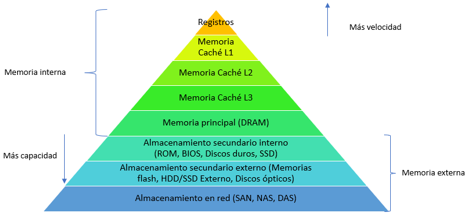

<em>Jerarquía de memoria: registros, caché L1, L2, L3, RAM y almacenamiento</em>

En un sistema informático tenemos diferentes tipos de memoria:

- **Registros**: las memorias más rápidas del ordenador; se encuentran en el procesador.
- **Memoria RAM**: la memoria principal del ordenador. Es volátil y se mide en B/GB.
- **Caché**: memoria que sirve de puente entre la memoria principal y el procesador, aumentando la velocidad del sistema. También es volátil.
- **RAM-CMOS**: memoria de bajo consumo y volátil.
- **ROM** (*Read Only Memory*): memoria no volátil pero más lenta. No es cierto que no se pueda escribir, pero está pensada para ser leída.

### 3.1 Memoria caché

Consiste en una memoria auxiliar empleada para **acelerar los accesos a la memoria principal** y así intentar compensar la diferencia de velocidad entre ella y el procesador.

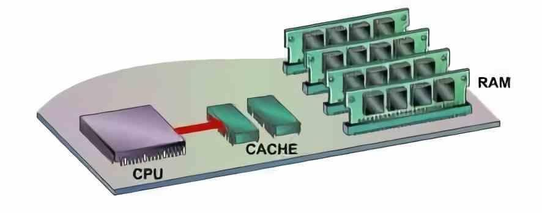

<em>La memoria caché entre la CPU y la memoria RAM</em>

Por limitaciones físicas, la mayoría de los datos que debe procesar la CPU no se encuentran dentro de ella, sino en otro conjunto de chips, la memoria RAM. Esto conlleva un cierto retardo en la comunicación entre ambos, y la memoria caché es la solución más utilizada para paliar este problema.

A un nivel básico, la caché es muy rápida y contiene un pequeño conjunto de instrucciones que el equipo usa con asiduidad para realizar sus tareas cotidianas. El equipo carga esas instrucciones en la caché mediante algoritmos complejos para acceder a ellas de manera inmediata, de modo que ese pequeño retraso entre la CPU y la RAM desaparece o se camufla.

Cuando el procesador intenta leer una palabra de memoria, comprueba si está en la caché. Si está (**acierto**), se entrega al procesador. En caso contrario (**fallo**), el bloque de memoria principal que contiene la palabra buscada se transfiere a la caché y, más tarde, la palabra se entrega al procesador.

#### 3.1.1 Niveles de caché

Los procesadores actuales cuentan con varios niveles de caché bastante diferenciados: normalmente L1, L2 y L3, y en algunos casos puntuales L4. Su configuración y características se han ido adecuando a las necesidades modernas.

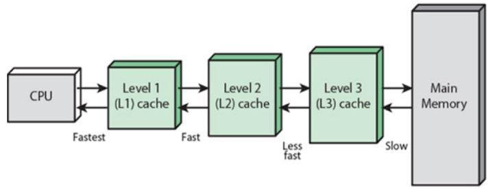

<em>Niveles de caché: de la CPU (más rápida) a la memoria principal (más lenta)</em>

- **Caché L1**: integrada en cada núcleo de forma independiente; es la más rápida, pero de menor capacidad. Normalmente se divide en dos bloques: uno para almacenar datos a tratar y otro para instrucciones.
- **Caché L2**: más lenta pero de mayor capacidad que la L1. Almacena datos de los niveles anteriores. En algunas arquitecturas se comunica con varios núcleos, por lo que es compartida y da coherencia a los núcleos. Algunas CPU pueden tener más niveles: por ejemplo, agrupar los núcleos en clústeres con una L2 en común y luego una L3 general; no es algo fijo.
- **Caché L3 o LLC** (*Last Level Cache*): mucho más lenta que las anteriores, pero de mayor capacidad. Es un espacio unificado y accesible para todos los núcleos de manera indistinta; almacena tanto datos como instrucciones. Es la caché de mayor capacidad y, al mismo tiempo, la más lenta. Existen procesadores con caché L4, pero es poco habitual.

#### 3.1.2 Funcionamiento

La caché no funciona igual que la RAM: no podemos hacer que la CPU se dirija a una dirección concreta dentro de la caché, porque lo que hace es **copiar los datos de la RAM cercanos a la dirección que la CPU está ejecutando en ese momento**.

Secuencia de uso: la utilidad de la caché es almacenar el segmento de RAM más cercano a donde está «mirando» el procesador. De manera preventiva copia un bloque de datos entero en el nivel de caché más alto y, mediante mecanismos relativamente complejos, mantiene la información que aún pueda ser útil.

La búsqueda no empieza en la RAM, sino en la caché más pequeña y cercana al procesador: se busca primero en la L1, luego en la L2 y así progresivamente hasta encontrar el dato. Si se encuentra en la caché, habrá tardado menos ciclos de reloj. Por ello, un procesador con una caché recortada siempre tendrá peor rendimiento. Este era precisamente el problema que se encontró en los años 80 y el motivo por el que se creó la caché: si cada vez que el procesador ejecuta una instrucción tuviera que esperar un nanosegundo de tiempo de acceso, la suma sería una enorme pérdida de rendimiento.

### 3.2 Memoria RAM

La **RAM** (*Random Access Memory*, memoria de acceso aleatorio) sirve para dotar al sistema de un espacio virtual necesario para manejar información y resolver problemas en cada momento. Es la memoria principal de un dispositivo, y en ella se almacenan de forma temporal los datos de los programas que estás utilizando en este momento. Se puede encontrar en cualquier dispositivo, desde ordenadores de sobremesa hasta teléfonos móviles.

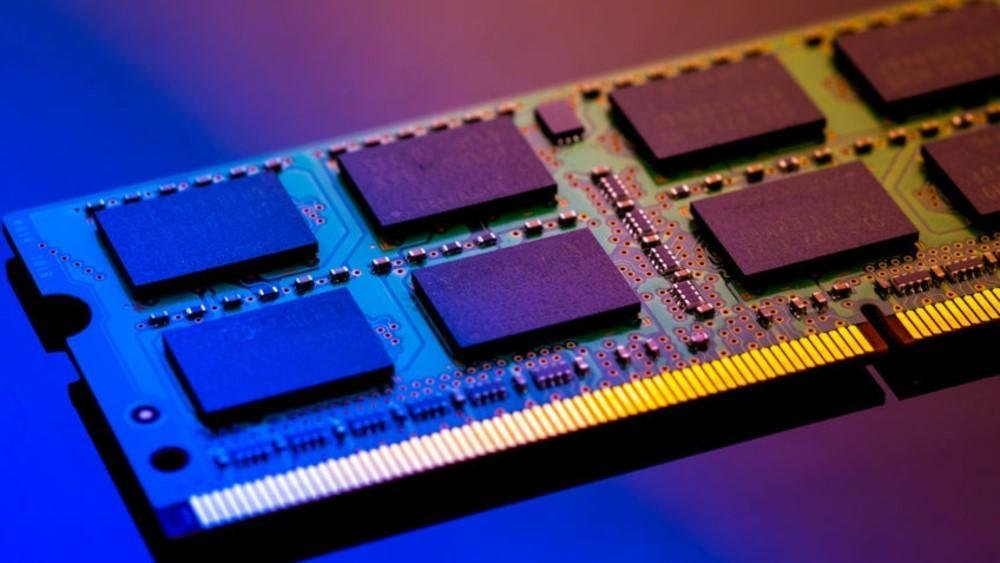

<em>Módulo de memoria RAM</em>

Hay que destacar que no es un sistema de almacenamiento como tal, ya que es **volátil**, pero guarda temporalmente información clave a la que el procesador debe acceder en un momento determinado. Lo que se intenta es reducir el impacto de rendimiento del procesador hacia distintos componentes, guardando información de alto valor en un sistema de alto ancho de banda y baja latencia, conectado de forma lógica al controlador de memoria integrado (IMC) de la CPU, con lo que el traspaso de información es constante y se carga y descarga cualquier dato en nanosegundos.

#### 3.2.1 Tipos de memoria

**RAM** (*Random Access Memory*): memorias formadas por semiconductores. Se distinguen varios tipos:

**DRAM (Dynamic RAM)**: memoria de lectura/escritura formada por **condensadores** (uno por bit) que se descargan cada cierto tiempo, por lo que es necesario leer el bit antes de que se pierda y regrabarlo o refrescarlo. Este ciclo se llama **ciclo de refresco**.

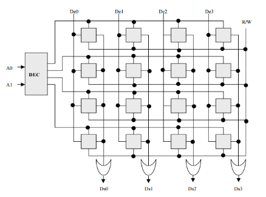

<em>Matriz de celdas de una memoria DRAM: filas (RAS) y columnas (CAS)</em>

- No se puede acceder a la información mientras se está refrescando.
- Es necesaria una operación de refresco para no perder la información.
- Tiene dos estados: estable e inestable.
- Almacena la información con un condensador y un transistor MOS (que forman la celda de memoria).
- Está formada por una rejilla bidimensional (matriz) de bits: cada columna se llama **CAS** y cada fila, **RAS**. La intersección de CAS y RAS son las celdas de memoria.
- Funcionamiento: se manda la carga al selector CAS y así se activa el transistor de cada bit de la columna. Para escribir, las filas tendrán el nuevo estado en función de la carga. En la lectura se tiene en cuenta el valor de la carga del condensador: menos del 50 % → 0; más del 50 % → 1.

**SRAM (Static RAM)**: también de lectura y escritura, pero **no necesita ser refrescada**, ya que se basa en semiconductores biestables que se autoalimentan y mantienen su estado mientras no se interrumpa la alimentación. Es un tipo de memoria más fiable.

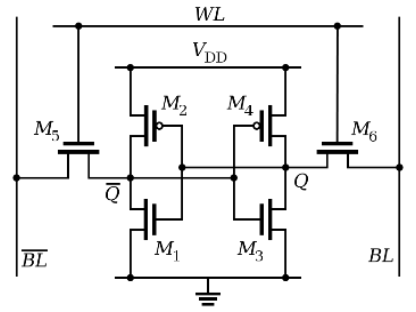

<em>Celda de memoria SRAM de seis transistores (biestable)</em>

- Tiempo de acceso entre 10 y 30 ns.
- Está formada por un circuito *flip-flop*: fluye la corriente de un lado a otro en función de cuál esté activado.
- Requiere un gran número de transistores, lo que la hace más voluminosa y disminuye la capacidad por chip.
- Ventajas: sin refresco y más rápida. Desventaja: más cara.

### 3.3 Tipos de memorias en el mercado

Las generaciones de memoria se distinguen por su velocidad, sus contactos y su voltaje. La DDR se utiliza para velocidades FSB de 266, 333 o 400 MHz y la DDR2 de 533 en adelante; según la velocidad FSB del procesador elegiremos una u otra, ya que los zócalos donde se insertan son distintos.

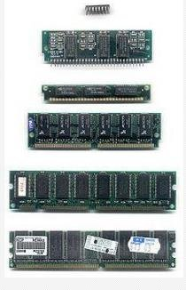

<em>Módulos de memoria de distintas épocas</em>

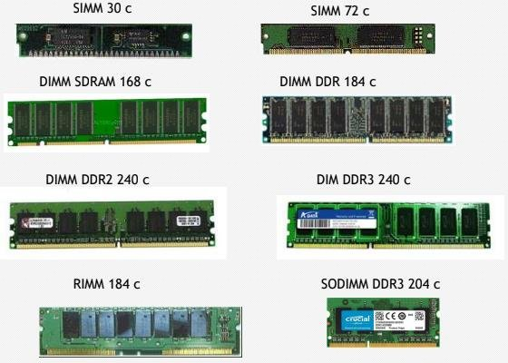

<em>Tipos de módulos: SIMM 30 y 72 contactos, DIMM SDRAM, DDR, DDR2, DDR3, RIMM y SODIMM</em>

| Generación | Descripción |
| ---------- | ----------- |
| DIMM SDRAM | Dos muescas, 168 contactos, 3,3 V |
| DDR | 2 palabras por ciclo; 266/333/400 MHz (PC2100/2700/3200); 184 contactos |
| DDR2 | 4 palabras por ciclo; 400/533/667/800 MHz (PC2-3200/6400); 1,8 V; 240 contactos |
| DDR3 | 8 palabras por ciclo; 800/1066/1333/1600 MHz (PC3-6400/8500/10600/12800); 1,5 V; 240 contactos |
| DDR4 | Intercala lecturas; 1,2 V; 1600-3200 MHz; 288 contactos |
| DDR5 | 1,1 V; 288 contactos (con muesca distinta a DDR4) |

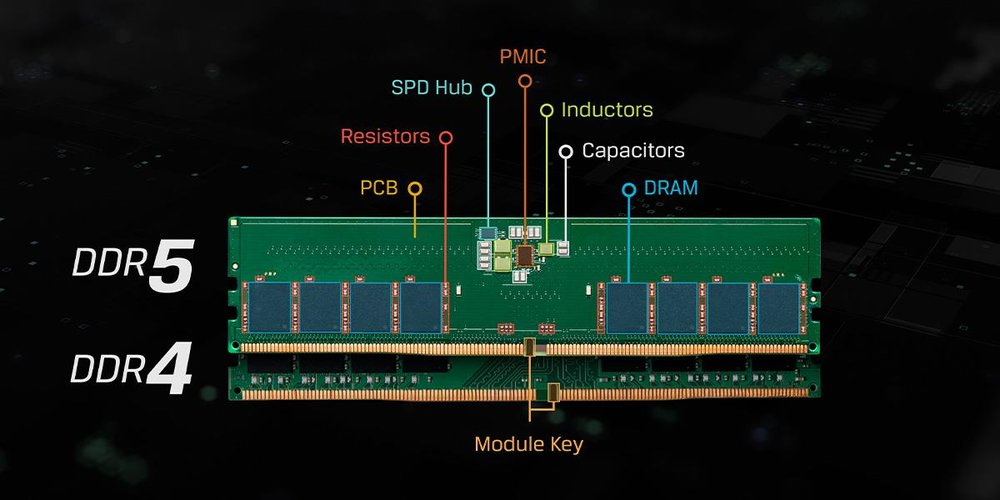

<em>Comparación de un módulo DDR5 y un módulo DDR4</em>

#### 3.3.1 HBM2

Es el tipo de memoria adoptado por AMD e Hynix, originalmente diseñada para tarjetas gráficas y dispositivos de red. AMD la usa como VRAM en sus tarjetas gráficas. **HBM** logra un mayor ancho de banda consumiendo sustancialmente menos que DDR4 y GDDR5. Esto se logra **apilando** hasta 8 *dies* de DRAM.

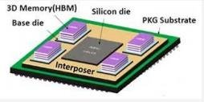

<em>Memoria HBM apilada sobre un interposer de silicio</em>

- HBM2 es la segunda generación; HBM2E, su evolución.
- Con una frecuencia de 1,2 GHz y un voltaje reducido de 1,2 V.
- Con 8 canales y un bus de 1024 bits, logra velocidades de 3,2 gigatransferencias por segundo.

#### 3.3.2 Optane

**Intel Optane** es un tipo de memoria intermedia para PC que, a efectos prácticos, actúa como una **caché entre la CPU y el disco duro**, acelerando los accesos al disco. Está pensada principalmente para acelerar los discos duros magnéticos rotatorios: combinando un HDD con una memoria Optane se tiene un rendimiento similar al de un SSD. Actualmente se ha quedado obsoleta y ha dejado de desarrollarse debido a los SSD.

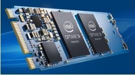

<em>Módulo Intel Optane</em>

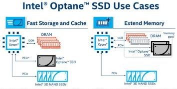

<em>Casos de uso de Intel Optane: almacenamiento/caché rápidos y ampliación de memoria</em>

### 3.4 Parámetros fundamentales

- **Velocidad de acceso**: expresada en nanosegundos; tiempo que tarda el sistema en acceder a la memoria.
- **Velocidad de reloj (frecuencia efectiva)**: frecuencia de trabajo del reloj interno de la memoria.
- **Latencia**: tiempo que tarda la RAM en atender una petición de la CPU. Al ser una matriz, se siguen estos pasos: selección de la fila (RAS, *Row Access Strobe*), selección de la columna (CAS), carga de la siguiente fila y envío de datos para escribir o leer en RAM.
  - El fabricante ofrece el dato de **CAS o CL** (*CAS Latency*): con CL 9 hay que esperar 9 ciclos de reloj para acceder a la columna.
- **Capacidad**: cantidad de información que puede contener.
- **Tiempo de acceso**: tiempo máximo que se tarda en leer o escribir el contenido de una posición de memoria.
- **Ancho de banda**: cantidad de información que puede transferirse simultáneamente y con continuidad por los distintos canales (MB o GB). En las DDR actuales se calcula como 8 bytes × velocidad de reloj.
- **Voltaje**: tensión necesaria para alimentar la memoria: DDR2 – 1,8 V; DDR3 – 1,5 V; DDR4 – 1,2 V; DDR5 – 1,1 V.
- **ECC** (*Error Checking and Correction*): memorias capaces de detectar errores al realizar el cambio de bits. Suelen usarse en servidores.

#### 3.4.1 Cálculos con la RAM

**Fórmulas:**

- Tasa de transferencia = ancho del bus (8 bytes) × frecuencia efectiva (MHz)
- Frecuencia real (velocidad del reloj de E/S) = frecuencia efectiva (velocidad del bus) ÷ accesos por ciclo
- Frecuencia efectiva (MHz) = frecuencia real × accesos por ciclo

Sustituyendo: tasa de transferencia = ancho del bus (8 bytes) × frecuencia real × accesos por ciclo.

| Tipo de memoria | Nombre estándar | Nombre del módulo | Accesos/ciclo |
| --------------- | --------------- | ----------------- | ------------- |
| DDR2 | PC2 | DDR2 | 4 |
| DDR3 | PC3 | DDR3 | 8 |
| DDR4 | PC4 | DDR4 | 8 |
| DDR5 | PC5 | DDR5 | 8 |

!!! example "Ejemplo 1: módulo DDR3-1600"
    ¿Nombre estándar, tasa de transferencia y velocidad de reloj real?

    - Tipo de RAM: DDR3 → PC3; accesos por ciclo: 8; frecuencia efectiva: 1600 MHz; ancho de bus: 8 bytes.
    - Tasa de transferencia = frecuencia efectiva × ancho de bus = 1600 MHz × 8 bytes = **12 800 MB/s** → nombre estándar **PC3-12800**.
    - Velocidad de reloj del bus = frecuencia efectiva ÷ accesos por ciclo = 1600 ÷ 8 = **200 MHz**.

!!! example "Ejemplo 2: módulo PC3-19200"
    ¿Frecuencia de reloj real?

    - Tipo de RAM: DDR3 → 8 accesos por ciclo; tasa de transferencia: 19 200 MB/s; ancho de bus: 8 bytes.
    - Frecuencia efectiva = tasa de transferencia ÷ ancho de bus = 19 200 ÷ 8 = **2400 MHz**.
    - Frecuencia real = frecuencia efectiva ÷ accesos por ciclo = 2400 ÷ 8 = **300 MHz**.

!!! task "Actividad"
    Calcula la tasa de transferencia y el nombre estándar de un módulo DDR4-3200, y la frecuencia efectiva y la frecuencia real de un módulo PC4-25600.

### 3.5 Componentes de un módulo de RAM

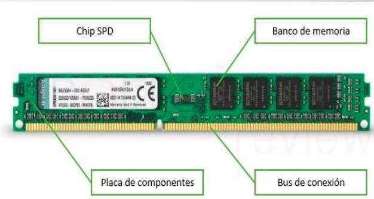

<em>Componentes de un módulo de RAM: chip SPD, banco de memoria, placa de componentes y bus de conexión</em>

- **Placa de componentes**: la estructura que soporta los demás componentes y las pistas eléctricas que comunican cada una de las partes.
- **Bancos de memoria**: los componentes físicos encargados de almacenar los registros. Están formados por chips de circuitos integrados compuestos en su interior por transistores y capacitores que forman celdas de almacenamiento.
- **Reloj**: las memorias RAM síncronas cuentan con un reloj que sincroniza las operaciones de lectura y escritura. Las asíncronas no llevan este elemento.
- **Chip SPD** (*Serial Presence Detect*): almacena los datos relativos al módulo: tamaño, tiempo de acceso, velocidad y tipo de memoria.
- **Bus de conexión**: contactos eléctricos que permiten la comunicación entre el módulo y la placa base.

### 3.6 Funcionamiento en Dual Channel

La tecnología de **doble canal** permite un incremento de rendimiento gracias a que es posible el acceso simultáneo a dos módulos distintos de memoria. Con *dual channel* activo se accede a bloques de **128 bits** en lugar de los 64 típicos. Para conseguirlo es necesario:

1. Un controlador de memoria adicional (situado en el puente norte de la placa base o, hoy, integrado en la CPU).
2. Módulos de memoria del mismo tipo, con la misma capacidad y velocidad.
3. Instalarlos en los slots indicados por la placa base (normalmente los pares 1-3 y 2-4).

Actualmente también se puede encontrar esta tecnología en triple canal o hasta cuádruple canal con las nuevas memorias DDR4.

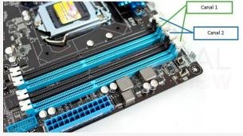

<em>Ranuras de memoria en dual channel: Canal 1 y Canal 2</em>

## Ejercicios prácticos

!!! task "Tarea"
    **Ejercicio 1**. Explica qué es un transistor y cómo, a partir de transistores, se construyen puertas lógicas y circuitos integrados. ¿Qué significa que un procesador se fabrique en 7 nm?

    **Ejercicio 2**. Compara CISC, RISC y el enfoque híbrido. ¿Por qué ARM destaca en eficiencia energética y x86 en rendimiento?

    **Ejercicio 3**. Enumera las partes del microprocesador (encapsulado, caché, FPU, unidad de control, ALU, registros, iGP) y explica brevemente la función de cada una.

    **Ejercicio 4**. Explica la diferencia entre núcleos físicos e hilos. ¿Qué significa que un procesador sea «8C/16T» y qué tecnologías lo permiten en Intel y en AMD?

    **Ejercicio 5**. Un procesador funciona a 1,3 V y consume 104 W. ¿Qué intensidad circula por él? Y otro con 1,2 V y 75 A, ¿qué potencia consume?

    **Ejercicio 6**. Explica qué es el *thermal throttling* y cuál es la diferencia entre TjMax, Tdie y TCase.

    **Ejercicio 7**. Explica en qué consiste el *overclocking*, qué requisitos hacen falta, qué riesgos tiene y qué es el *undervolting*.

    **Ejercicio 8**. Explica qué es un acierto y un fallo de caché, y por qué la búsqueda de un dato empieza siempre en la L1. Compara los tres niveles L1, L2 y L3.

    **Ejercicio 9**. Compara la DRAM y la SRAM en cuanto a funcionamiento, velocidad, coste y uso típico.

    **Ejercicio 10**. Calcula la tasa de transferencia y el nombre estándar de un módulo DDR4-3200, y la frecuencia efectiva y real de un módulo PC4-25600.

    **Ejercicio 11**. ¿Qué información almacena el chip SPD de un módulo de RAM y para qué se utiliza?

    **Ejercicio 12**. Explica qué es el *dual channel*, qué requisitos exige y en qué ranuras deben ponerse los módulos.

    **Ejercicio 13**. ¿En qué se diferencia la memoria HBM de la DDR? ¿Para qué se diseñó y por qué era interesante Optane?

    **Ejercicio 14 (práctica en el aula)**. Con una herramienta de información del sistema (por ejemplo, CPU-Z), identifica en un equipo del aula el modelo de procesador, número de núcleos e hilos, tamaño de las cachés L1/L2/L3, y tipo, capacidad, frecuencia y latencia de la RAM instalada.
