
<strong>CFGS Administración de Sistemas Informáticos y en Red (1º curso)</strong>

Material elaborado para el módulo **Fundamentos de Hardware**

# UT2.3. Almacenamiento y tarjetas de expansión

## Programación de Aula

### Resultados de Aprendizaje

Esta unidad forma parte de la UT2 "Elementos internos de un sistema informático" y trabaja el **Resultado de Aprendizaje 1 (RA1)** del módulo, según el **Real Decreto 1629/2009** (Anexo I, módulo *Fundamentos de Hardware*):

1. **RA1.** Configura equipos microinformáticos, componentes y periféricos, analizando sus características y relación con el conjunto.

Criterios de evaluación que trabaja esta unidad (junto con UT2.1 y UT2.2):

- **CE11** (RA1.a): Se han identificado y caracterizado los dispositivos que constituyen los bloques funcionales de un equipo microinformático.
- **CE13** (RA1.c): Se ha analizado la arquitectura general de un equipo y los mecanismos de conexión entre dispositivos.
- **CE14** (RA1.d): Se han establecido los parámetros de configuración (hardware y software) de un equipo microinformático con las utilidades específicas.
- **CE18** (RA1.h): Se han clasificado los dispositivos periféricos y sus mecanismos de comunicación.

### Planificación Temporal (2 sesiones / 4 horas)

| Sesión | Contenido |
| ------ | --------- |
| 1 | Puertos. Almacenamiento: discos duros (HDD) y discos de estado sólido (SSD) |
| 2 | Tarjetas de expansión: PCIe, tarjetas gráficas, de sonido, de red y RAID |

!!! info "Fuentes y licencia"
    Este tema adapta el documento *UT2.3 Almacenamiento. Expansión* de **Daniel López Escuder** (Fundamentos de Hardware – ASIX), publicado bajo licencia **Creative Commons Reconocimiento-NoComercial-CompartirIgual 4.0 (CC BY-NC-SA 4.0)**. Por respeto a dicha licencia, este material se comparte con las mismas condiciones. Las imágenes proceden del documento original. Bibliografía del original: Profesional Review, HardZone y Palentino.es.

## 1. Puertos

En informática, un **puerto** es una forma genérica de denominar una interfaz a través de la cual se pueden enviar o recibir los diferentes tipos de datos.

Los conectores, normalmente denominados «conectores de entrada y salida», son interfaces para conectar dispositivos mediante cables. Generalmente tienen un extremo **macho**, con clavijas que sobresalen, que debe insertarse en una parte **hembra** (también denominada *socket*), que incluye agujeros para acomodar las clavijas. Existen también enchufes «hermafroditas» que pueden actuar como macho o hembra y se pueden insertar en cualquiera de los dos.

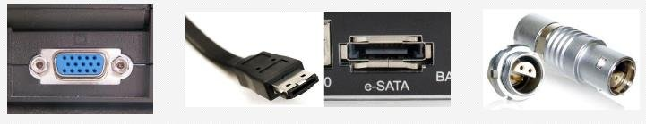

<em>Distintos tipos de conectores: VGA, HDMI, eSATA, entre otros</em>

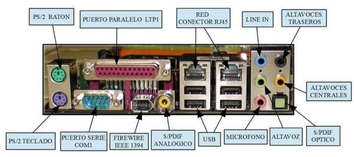

<em>Panel trasero de una placa base con sus conectores etiquetados</em>

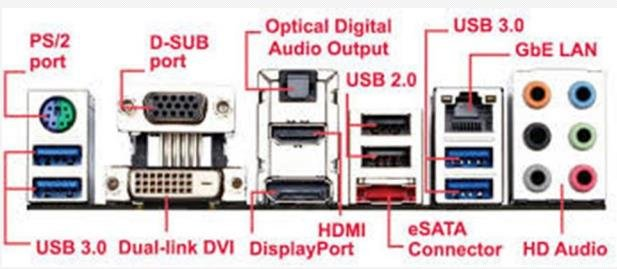

<em>Conectores del panel trasero: PS/2, D-SUB, audio digital óptico, USB, HDMI, DisplayPort, eSATA, Gb LAN...</em>

## 2. Almacenamiento

Un dispositivo de almacenamiento tiene la función de **retener datos informáticos durante un intervalo de tiempo**. Estos han ido evolucionando a lo largo de la historia con el objetivo de crear dispositivos lo más pequeños posible (físicamente) y con más capacidad para almacenar y tratar datos.

Podemos encontrarnos con tres tipos de almacenamiento:

- **Primario o principal (almacenamiento interno)**: la memoria interna del ordenador, que suele estar incluida en la placa base o en módulos que se integran en ella. Lo forman la memoria RAM y ROM, ya vistas en el tema anterior.
- **Secundario (almacenamiento externo o masivo)**: todos los dispositivos de almacenamiento masivo que se conectan al ordenador; pueden considerarse periféricos de almacenamiento masivo. Son bastante más lentos que los primarios, pero permiten almacenar mucha más información de forma permanente.
- **Terciario (almacenamiento distribuido)**: almacenamiento en Internet (la nube).

### 2.1 Almacenamiento secundario

El almacenamiento secundario es un medio de almacenamiento definitivo (no volátil como el de la memoria RAM). Aquí encontramos:

- **Magnéticos**: discos duros, cintas...
- **Ópticos**: DVD, CD-ROM...
- **Electrónicos / sólidos**: memoria flash, SSD.

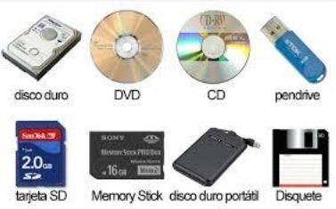

<em>Dispositivos de almacenamiento: disco duro, DVD, CD, pendrive, tarjeta SD, Memory Stick, disco duro portátil y disquete</em>

### 2.2 Discos HDD

Los **discos duros** constituyen la principal unidad de almacenamiento del ordenador. Son dispositivos **magnéticos**. La información que almacenan no puede ser procesada directamente por el procesador, sino que debe transferirse antes a la memoria principal. Las unidades contienen uno o más discos apilados sobre un eje central y aislados del exterior.

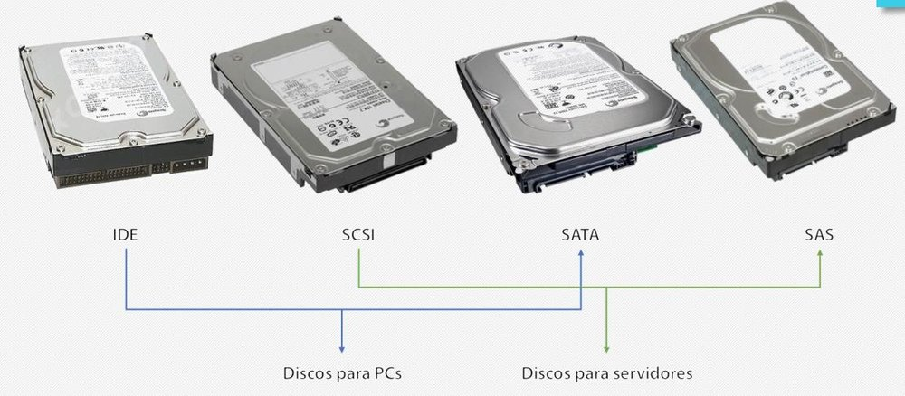

<em>Discos duros según su interfaz: IDE, SCSI, SATA y SAS</em>

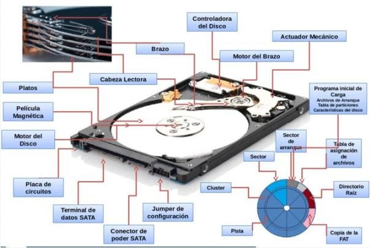

<em>Partes físicas de un disco duro</em>

**Partes físicas:**

- **Discos (platos)**: la parte principal del disco duro. Se encuentran apilados unos sobre otros y protegidos por una carcasa que evita la entrada de aire y polvo. Son de aluminio y están recubiertos de plástico sobre el que se ha diseminado óxido de hierro. La superficie se divide en pistas concéntricas, numeradas desde la parte interior empezando en 0.
- **Cabezas**: la parte capaz de leer y escribir usando tecnología magnética. Cada disco tiene dos caras y cada una tiene una cabeza de lectura/escritura sujeta por un brazo. Los brazos están entre los platillos. Se usan para expresar el número de caras: 4 cabezas = 4 caras = 2 platillos.

**Partes lógicas:** son las divisiones imaginarias que hacen los sistemas operativos en la superficie del disco.

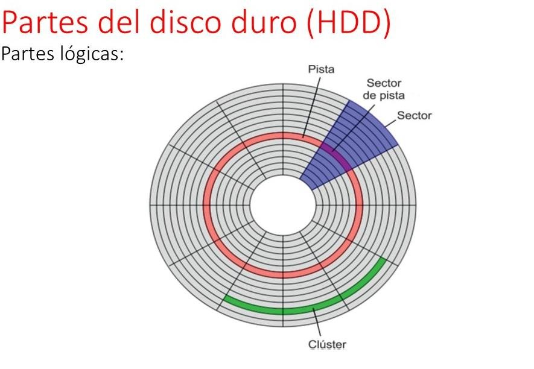

<em>Partes lógicas de un disco: pista, sector, cilindro y clúster</em>

- **Pistas**: anillos concéntricos indivisibles a lo largo de los cuales se graban los pulsos magnéticos.
- **Sectores**: subdivisiones de cada pista. Actualmente hay entre 15 y 65 sectores por pista.
- **Cilindros**: el conjunto de pistas a las que el sistema operativo puede acceder simultáneamente en cada posición de las cabezas. Con dos platos, un cilindro son 4 pistas. Manejando cilindros se accede más rápido a los datos que con pistas.
- **Clúster**: la longitud de pista tomada como unidad de proceso en cada operación de lectura/escritura, equivalente a un conjunto de 4 u 8 sectores contiguos.

#### 2.2.1 Características

- **Tiempo de acceso**: tiempo medio necesario para que la cabeza acceda a los datos. Es la media de: el tiempo que tarda en cambiar de una cabeza a otra, el tiempo en localizar la pista saltando de una a otra y el tiempo en localizar el sector dentro de la pista.
- **Velocidad de rotación**: velocidad a la que giran los platos del disco, medida en **RPM** (revoluciones por minuto). No se recomienda usar discos de menos de 5400 RPM en IDE/SATA.
- **Velocidad de transferencia**: cantidad de datos que se pueden leer o escribir en una sola operación (MB/s). IDE: 133 MB/s; SCSI: 260 MB/s; SATA: 150, 300 o 600 MB/s.
- **Tamaño**: diámetro de los platos, expresado en pulgadas.
- **Capacidad**: cantidad de información que se puede guardar.
- **Interfaz**: IDE, SCSI, SATA, SAS.
- **Buffer (caché)**: memoria incluida en la controladora interna del disco. Los datos se almacenan o leen primero de aquí; como los datos suelen estar contiguos, la caché guarda los datos cercanos a los que se han accedido anteriormente.

#### 2.2.2 Sistemas de direccionamiento

El **direccionamiento de bloque lógico** (*Logical Block Addressing*, LBA) es un método muy común para especificar la localización de los bloques de datos en los sistemas de almacenamiento, principalmente el almacenamiento secundario. Los bloques lógicos en las computadoras modernas son normalmente de 512 o 1024 bytes cada uno.

- **CHS** (*Cylinder-Head-Sector*): con estos tres valores se puede situar un dato en cualquier parte del disco.
- **LBA** (*Logical Block Addressing*): consiste en dividir el disco entero en sectores y asignar a cada uno un único número. Es el que se usa actualmente.

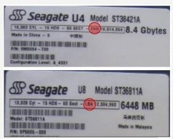

<em>Etiquetas de discos Seagate con sus datos de geometría (cilindros, cabezas, sectores)</em>

!!! info "Definición"
    El número total de sectores de un disco duro se calcula así: **nº de sectores = nº de caras × nº de pistas por cara × nº de sectores por pista**. Cada sector queda determinado si conocemos cabeza, cilindro y sector.

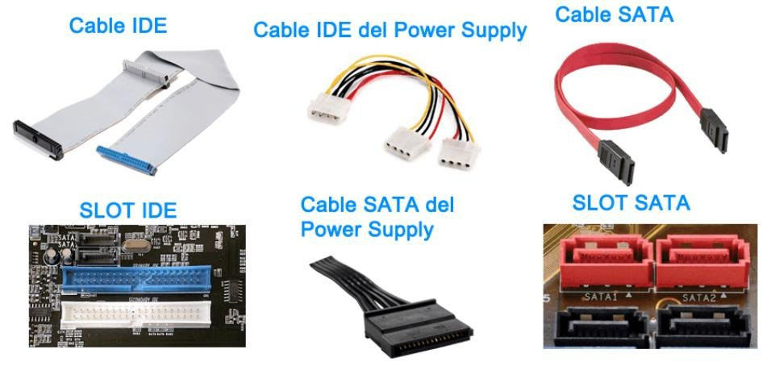

<em>Cables y slots de conexión de los discos: IDE y SATA (datos y alimentación)</em>

### 2.3 Discos SSD

Este tipo de disco está basado en **memoria flash** para el almacenamiento de datos. Las principales ventajas frente a los discos duros tradicionales son:

- La resistencia del disco (no tiene mecánica).
- La rapidez de acceso a los datos.
- La casi ausencia de calor.
- La ausencia total de ruido.

El tiempo medio de acceso de los discos duros es, por regla general, de entre 10 y 15 ms para el usuario medio. En los discos SSD este tiempo disminuye drásticamente hasta los 0,1 ms. Los SSD se conectan a la placa base mediante conexiones SATA o directamente a través de un conector PCI Express. Este último permite velocidades del orden de GB/s en lectura y escritura (unos 4 GB/s en teoría) y superar los límites físicos de la norma SATA.

#### 2.3.1 Diseño

La memoria SSD está basada en memoria de tipo **NAND**. Esta memoria basa su estructura en **transistores de puerta flotante** (*floating-gate*). La diferencia respecto a los transistores de la memoria DRAM es que estos últimos deben tener una carga eléctrica con una frecuencia de refresco constante para mantener los datos almacenados. La memoria NAND, en cambio, está diseñada para **mantener su estado de carga aun cuando no recibe corriente eléctrica**, por lo que es una memoria no volátil, al igual que su precursora, la EEPROM.

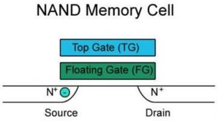

<em>Celda de memoria NAND: puerta de control (TG), puerta flotante (FG), fuente y drenador</em>

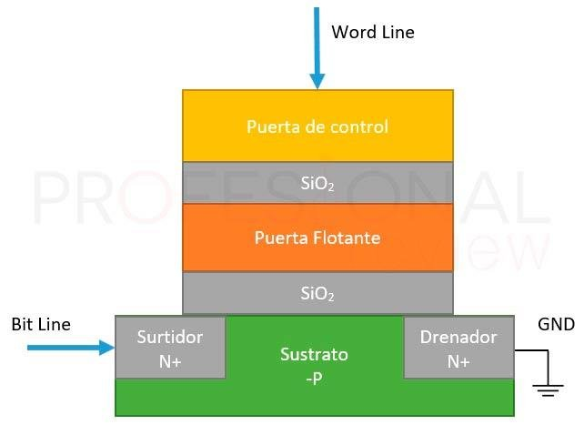

<em>Estructura de una celda de puerta flotante</em>

Los electrones se almacenan en la puerta flotante, de forma que se toma una lectura de 0 cuando está cargada y de 1 si está vacía (valores opuestos a lo habitual). La memoria NAND está organizada como una matriz: la matriz completa se entiende como un **bloque** y sus filas se denominan **páginas**. Lo normal es que las páginas tengan tamaños entre 2 KB y 16 KB, con unas 256 páginas por bloque, de forma que el tamaño de los bloques varía entre 256 KB y 4 MB.

En resumen:

- SSD basados en **memoria volátil (SDRAM)**: menor tiempo de acceso (0,01 ms); incorporan batería interna y sistemas de respaldo.
- SSD basados en **memoria flash no volátil**: no tienen baterías; almacenan datos incluso tras una pérdida repentina de alimentación; son más lentos que los de SDRAM. Pueden encontrarse en IDE, SATA, mSATA, M.2, U.2, PCI-E, USB o Thunderbolt.

#### 2.3.2 Formato

- El formato clásico de disco de 2,5″ con conexión **SATA**.
- El formato clásico de 2,5″ con conexión **U.2** (PCI Express).
- En forma de tarjeta **mSATA**, conectada en el bus PCI Express, para equipar algunos ordenadores ultraportátiles.
- En formato **M.2**, del tamaño de una tarjeta de memoria, conectado directamente en la placa base (SATA o PCI Express).

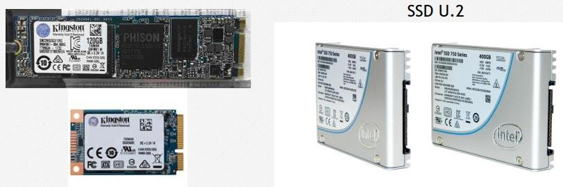

<em>Formatos de SSD: M.2, mSATA y U.2</em>

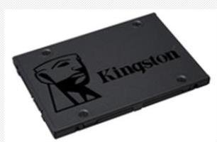

<em>SSD de 2,5″ con interfaz SATA</em>

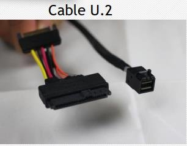

<em>Cable U.2</em>

#### 2.3.3 Interfaces de discos

**PCI-E NVMe (tarjeta)**: la versión del PCIe indica la velocidad máxima de cada pista o carril. Dependiendo del número de pistas (PCIe con 1, 2, 4, 8 o 16) habrá ese número de pistas de comunicación entre el zócalo de la placa base y la tarjeta PCI. Por tanto, la velocidad será la de la versión multiplicada por el número de pistas.

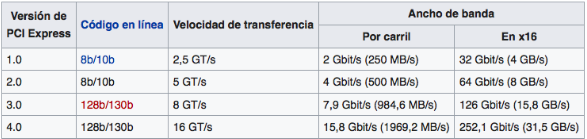

<em>Ancho de banda por carril y en x16 según la versión de PCI Express</em>

**SSD NVMe** (*Non-Volatile Memory Express*): pueden considerarse un estado intermedio entre los chips NAND y los DRAM de las memorias RAM. Los SSD NVMe superan a los SSD SATA aproximadamente en 4,5 veces en lectura y 2,5 veces en escritura secuencial, llegando a unos 2500 MB/s y 1500 MB/s respectivamente (en torno a 3000 MB/s en modelos más rápidos).

**M.2 con interfaz SATA**: utilizan el conector SATA, por lo que tienen la barrera de los 600 MB/s.

**M.2 con interfaz PCIe**: de pequeño tamaño; su problema radica en la temperatura.

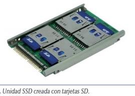

<em>Unidad SSD creada con tarjetas SD</em>

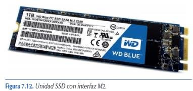

<em>Unidad SSD con interfaz M.2</em>

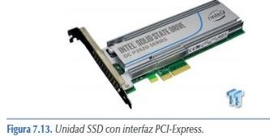

<em>Unidad SSD con interfaz PCI Express</em>

#### 2.3.4 Conector U.2

El conector **U.2** (de Intel) es una combinación intencional de los conectores SATA y SAS, que ofrece hasta un total de **4 líneas PCIe 3.0** a un dispositivo conectado, con la gran ventaja de no utilizar un slot PCIe. Mecánicamente, el conector U.2 es idéntico al conector SATA Express, por donde se conecta a la unidad. Comparado con SATA Express, el U.2 puede ofrecer hasta el doble de rendimiento y aprovechar por completo las ventajas de los nuevos SSD NVMe.

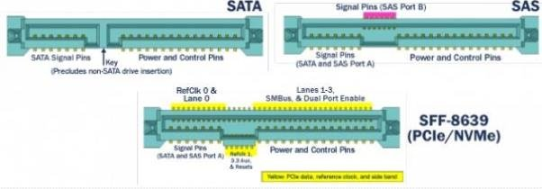

<em>Conector U.2 (SFF-8639): combinación de SATA y SAS</em>

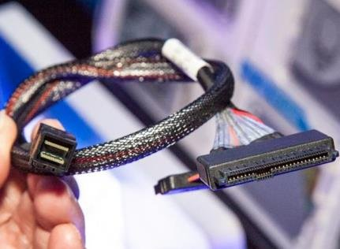

<em>Cable con conector U.2</em>

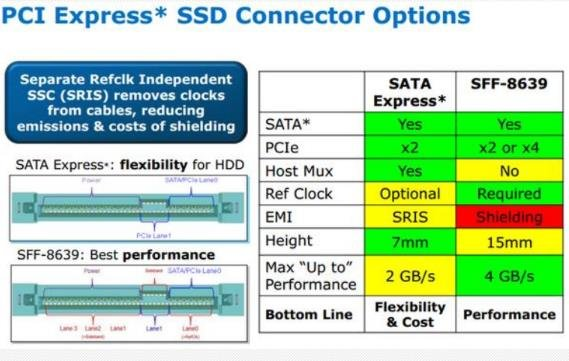

<em>Opciones de conector PCI Express para SSD: SATA Express y SFF-8639</em>

#### 2.3.5 Tipos de SSD

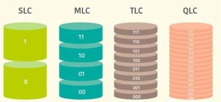

<em>Niveles de celda: SLC, MLC, TLC y QLC</em>

- **SLC** (*Single Level Cell*): almacena **1 bit** por celda de la memoria NAND. Implica una menor densidad de memoria, algo a tener en cuenta con las altas capacidades que se demandan hoy, donde conseguir un gigabyte equivale a unos diez mil millones de celdas.
- **MLC** (*Multi Level Cell*): almacena **2 bits** por celda; duplica la densidad respecto a SLC, lo que supone una gran ventaja en capacidad máxima y precio. La contrapartida es la pérdida de rendimiento y una mayor degradación: 2 bits implican 4 estados por celda, por lo que la lectura de cada celda es más lenta y estas empiezan a fallar antes.
- **TLC** (*Triple Level Cell*): almacena **3 bits** por celda, con un empaquetamiento aún más eficaz, más memoria por chip y el precio de fabricación y venta más económico. Los estados pasan a ser 8, por lo que la pérdida de rendimiento es aún mayor que en MLC.
- **QLC** (*Quad Level Cell*): almacena hasta **4 bits** por celda, lo que permite reducir aún más el precio. Es la que menos ciclos de escritura/borrado soporta, por lo que su vida útil es la más corta.

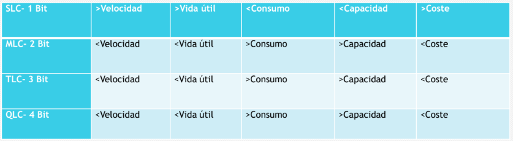

<em>Tabla comparativa de los tipos de SSD (velocidad, consumo, capacidad y coste)</em>

#### 2.3.6 TRIM

En los discos SSD, escribir y borrar datos en los mismos sectores o celdas hace que se pierda integridad. Para evitar estar continuamente escribiendo datos en las celdas y, por tanto, aumentar la vida útil del disco, se ideó el **TRIM**.

Es un comando específico de las unidades SSD en sus diferentes versiones. Aunque se introdujo con la interfaz SATA, también está disponible en las unidades M.2 NVMe PCIe. Cuando se quiere borrar información del SSD, TRIM no la borra, sino que la marca para borrar, de forma que indica al SSD qué cantidad de datos pueden borrarse sin problemas, limpiando de basura la unidad. El proceso realiza un escaneo previo buscando los bloques marcados para su borrado, los selecciona y los borra. De esta forma nos ahorramos una escritura en los bloques:

| Sin TRIM | Con TRIM |
| -------- | -------- |
| 1. Escritura de contenido | 1. Escritura de contenido |
| 2. Escritura para vaciar contenido | 2. Escritura del nuevo contenido |
| 3. Escritura del nuevo contenido | |

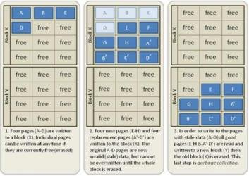

<em>Funcionamiento de TRIM: bloques libres, con datos válidos y con datos obsoletos</em>

Las instrucciones TRIM funcionan en multitud de sistemas operativos: múltiples distribuciones de Linux desde hace más de 15 años, macOS a partir de la versión 10.6.8 y Microsoft Windows desde la versión 7 hasta las actuales. Pero hay sistemas operativos que no admiten TRIM, por lo que puede darse el caso de que en algunas unidades no se active nativamente.

**¿Para qué sirve el TRIM?** Gestiona las áreas del SSD que contienen datos que ya no se usan o no se volverán a usar. El usuario no se da cuenta de este proceso, ya que se realiza en segundo plano cuando el equipo está en reposo. TRIM **no borra información del usuario** bajo ningún concepto; elimina datos que el sistema operativo le ha dicho que ya no son necesarios. Sin este comando, el SSD no sabría qué sectores contienen información no válida y debería esperar a que el sistema operativo le indicara que escribiera en ese sector: primero se debería borrar la información almacenada y luego escribir los datos. Es un pequeño lapso de tiempo, pero supone una pérdida de prestaciones.

#### 2.3.7 Desfragmentación en SSD

!!! warning "JAMÁS desfragmentes un SSD"
    Los discos duros mecánicos requerían desfragmentación periódica: se recolocaban los archivos dispersos por la unidad, emparejándolos y ordenándolos para que fuera más fácil el acceso. Este proceso **no se debe realizar bajo ningún concepto en un SSD**: primero, porque son unidades rápidas que acceden a la información de manera ágil y no es necesario; y segundo, porque supone degradar el SSD con una enorme cantidad de escrituras innecesarias.

Internamente, los SSD integran una controladora que gestiona la información almacenada de manera eficiente, guarda una «tabla» con la disposición de los datos para acceder a ellos rápidamente y cuenta con memoria caché para almacenar los datos temporalmente y «ganar» rendimiento. Hacer una desfragmentación a un SSD supone desgastarlo y acortar su vida útil, gastando los ciclos de escritura que garantiza el fabricante en procesos que no sirven para nada. Es uno de los puntos clave de la tecnología de almacenamiento de estado sólido.

## 3. Tarjetas de expansión

Hoy en día las placas base incorporan los controladores para manejar los periféricos básicos, como el teclado, el ratón o el disco duro. Los que no estén y necesitemos deberemos agregarlos mediante tarjetas en las **ranuras de expansión**. Aún se siguen incorporando por motivos de compatibilidad algunas ranuras PCI, pero ahora la mayoría son **PCI Express**.

**Ranura PCI Express** (PCI-E): la última evolución del bus PCI clásico, que permite añadir tarjetas de expansión al ordenador. Es un puerto **serie** local, a diferencia del PCI, que es paralelo. Conecta dispositivos punto a punto mediante **carriles** (*lanes*) y la velocidad de transferencia depende de los carriles: x1, x2, x4, x8, x12, x16 y x32 (los más grandes son extremadamente raros y por lo general no se ven en hardware de consumo). Una tarjeta x1 podrá utilizarse en un conector x16, aunque utilizando únicamente los carriles que le corresponden; sin embargo, no se puede hacer a la inversa.

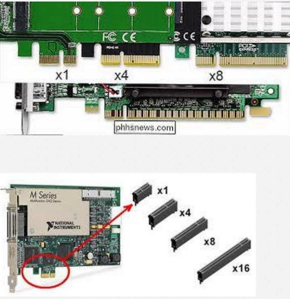

<em>Ranuras PCI Express x1, x4, x8 y x16</em>

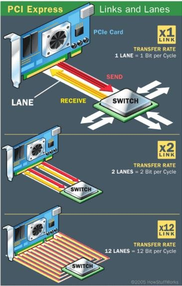

<em>Carriles (lanes) de PCI Express: x1, x2, x4</em>

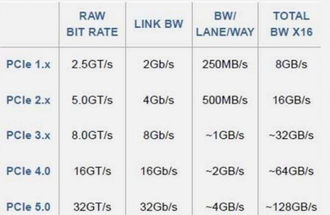

<em>Velocidad de transferencia de PCIe según su versión</em>

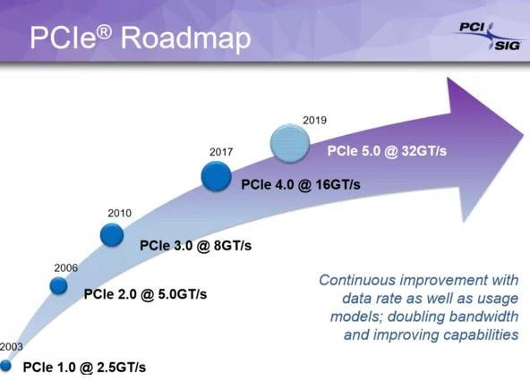

<em>Hoja de ruta del estándar PCI Express</em>

### 3.1 Diferencias entre AGP y PCI

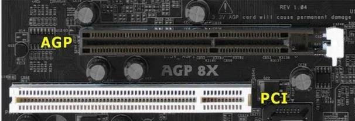

<em>Ranuras AGP y PCI en una placa base</em>

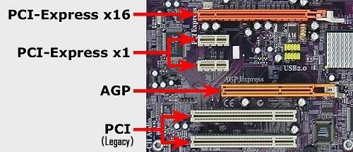

<em>Ranuras PCI Express x16, PCI Express x1, AGP y PCI (legacy) en una placa</em>

### 3.2 Tarjetas gráficas

Los usuarios nos comunicamos con el ordenador usando el teclado y el monitor; para ello el ordenador debe disponer de un elemento que transforme los datos internos en gráficos que podamos entender. La elección de una tarjeta dependerá de las necesidades. Las tarjetas actuales se clasifican por su potencia de trabajo, incluyendo su procesador gráfico, velocidad, memoria, tipo de slot y conectores disponibles.

La **tarjeta gráfica**, también conocida como tarjeta de vídeo, tarjeta aceleradora de gráficos o adaptador de pantalla, es la responsable de mostrar texto, imágenes y gráficos en el monitor. Se encarga de controlar la apariencia, el movimiento, el color, el brillo y la claridad de las imágenes mostradas en el monitor o la TV, procesando cada bit de datos enviado.

La mayoría de las tarjetas gráficas actuales están diseñadas para la ranura **PCI Express x16**; las AGP y PCI están prácticamente extinguidas. Los principales fabricantes son **ATI (AMD)** y **NVIDIA**; también Via/S3, SiS e Intel fabrican chipsets para gráficas, pero la mayoría integradas (*on board*) en la placa base. La evolución de la tarjeta gráfica ha ido paralela al desarrollo de los videojuegos, con un gran avance con la aparición de los primeros juegos en 3D.

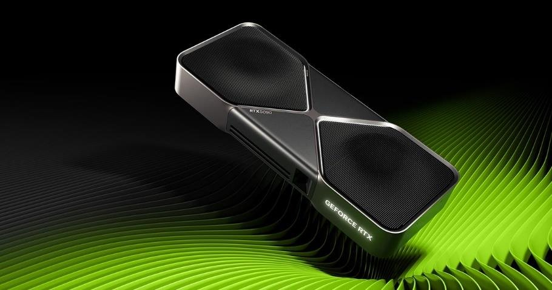

<em>Tarjeta gráfica moderna</em>

#### 3.2.1 Memoria compartida frente a memoria dedicada

La tarjeta gráfica puede utilizar dos tipos de memoria de vídeo:

- **Memoria compartida**: suele darse cuando la tarjeta está integrada en la placa base y, en algunos casos, utiliza la propia RAM de la placa para sus operaciones.
- **Memoria dedicada**: la tarjeta tiene su propia memoria RAM dedicada a las operaciones gráficas, independiente de la RAM de la placa. Se caracteriza por su **capacidad** (MB o GB), su **tipo** (GDDR, basada en la misma tecnología que la memoria DDR; hoy hasta GDDR6) y su **velocidad** (MHz).

**Ventajas** de una gráfica dedicada:

- Son mucho más potentes que una GPU integrada.
- Se pueden comprar y cambiar cuando queramos por una mejor.
- Tienen su propia GPU y su propia memoria.
- Tienen su propio sistema de refrigeración integrado.
- Si es buena, permite jugar a los últimos títulos aunque el equipo sea antiguo, activando filtros avanzados y de mayor calidad sin que el equipo se ralentice.
- Existen muchos modelos, desde las más potentes a las más modestas, y casi todas rinden mejor que una tarjeta integrada.

**Desventajas:**

- La inversión de dinero en una buena es bastante grande, casi siempre más de 300 euros.
- Consumen bastante potencia y necesitamos fuentes de alimentación de más de 500 W.
- Meten más calor en la caja.

#### 3.2.2 Componentes y características

**GPU** (*Graphics Processing Unit*): un procesador, como la CPU, dedicado específicamente al procesamiento de gráficos. Su tarea principal es disminuir la carga de trabajo del procesador central. Está optimizada para el cálculo en coma flotante, sobre todo en las funciones 3D. Para obtener el mejor rendimiento se han de tener en cuenta tres características importantes:

- La **frecuencia de reloj del núcleo**, que oscila entre 825 MHz y 1600 MHz.
- El número de **sombreadores o *shaders***, llamados también **núcleos CUDA** (*Compute Unified Device Architecture*) en NVIDIA y ***Stream Processors*** en AMD. Se encargan de la rasterización de texturas y de la geometría de objetos, y del número de tuberías (de vértices o fragmentos) que traducen una imagen 3D compuesta por vértices y líneas en una imagen 2D compuesta por píxeles.
  - **CUDA** es una plataforma desarrollada por NVIDIA para realizar la programación de las tareas. Su gran ventaja sobre arquitecturas anteriores es la posibilidad de paralelizar las instrucciones de los shaders, consiguiendo imágenes mucho más realistas con bastante menos trabajo.
  - Los **Stream Processors** tienen la misión de procesar las instrucciones destinadas a la GPU, relacionadas con los gráficos y su renderizado (dibujado de modelos 3D, iluminación ambiental...). Trabajan en paralelo para completar la tarea en el menor tiempo posible.

**Chips**: todas disponen de un circuito llamado **RAMDAC**, cuya función es convertir las señales digitales que llegan del procesador en señales analógicas. Pueden incluir otros chips, como el 3D, que libera al procesador realizando tareas de generación de vectores y triángulos.

**API gráficas**: las APIs de gráficos y procesamiento actúan como puentes entre el software y el hardware, permitiendo a los desarrolladores aprovechar al máximo las capacidades de los dispositivos, ya sea para crear entornos visualmente espectaculares o para llevar a cabo cálculos complejos y tareas paralelizadas de alta intensidad.

- **DirectX 12 Ultimate**: la apuesta de Microsoft para Windows y Xbox; incluye características como el *ray tracing* y una gran optimización para el hardware moderno.
- **OpenGL 4.6**: el estándar versátil; su amplia compatibilidad lo mantiene relevante, especialmente cuando la portabilidad es clave.
- **Vulkan**: ofrece control detallado del hardware y eficiencia superior; es una API de bajo nivel disponible en plataformas múltiples, incluidos dispositivos móviles.
- **Metal**: diseñada para dispositivos de Apple (iOS y macOS).
- **WebGL**: gráficos 3D y 2D directamente en el navegador.

**Tipos de buses**: es el canal por donde circula la información. El número de bits que pueden circular a la vez es el ancho de bus; la velocidad a la que circula se mide en MHz; y el ancho de banda es el número de bits transmitidos por unidad de tiempo.

**Memoria**: la memoria gráfica de acceso aleatorio (GRAM) son chips de memoria que almacenan y transportan información entre sí; no son determinantes del rendimiento máximo de la tarjeta, pero unas especificaciones reducidas pueden limitar la potencia de la GPU. La memoria **GDDR-SDRAM** está basada en la DDR-SDRAM y se caracteriza por la optimización de los tiempos de acceso y las altas frecuencias (GDDR2, GDDR3, GDDR4, GDDR5 y GDDR6, la tecnología actual).

**Frecuencia**: en casi todas las tarjetas gráficas hay tres frecuencias distintas:

- **Base**: el reloj al que funciona la GPU en reposo.
- **Game**: el reloj cuando jugamos o seleccionamos un preset de overclock determinado.
- **Boost**: la frecuencia máxima teórica que podemos disfrutar en la GPU.

La frecuencia de la GPU se mide en MHz e indica lo rápido que pueden ser sus núcleos. A mayor refrigeración, mayor capacidad de mantener una frecuencia más alta (más calor requiere mejor refrigeración), por lo que las gráficas con tres ventiladores o con bloques de agua manejan frecuencias más altas. Hay que diferenciar el *core clock* del *memory clock*, siendo este último la velocidad de la memoria **VRAM** (la cantidad de memoria GDDR de la GPU, muy habitual en 4, 6, 8, 10-12, 16 y 24 GB o más).

**Salidas de vídeo**: hay muchos tipos, pero en la actualidad se utilizan las siguientes:

- **VGA** (totalmente en desuso): *Video Graphics Array*, estándar de vídeo analógico de la década de los 90.
- **DVI** (en desuso): *Digital Visual Interface*, sustituye a la anterior. Es totalmente digital, por lo que no hay que hacer conversión, eliminando gran parte del ruido eléctrico y la distorsión. Ofrece mayor calidad y mayores resoluciones.
- **HDMI**: *High Definition Multimedia Interface*; actualmente el más utilizado. Cuenta con cifrado sin compresión y es capaz de transmitir audio a la vez que vídeo, con resoluciones todavía más altas.
- **DisplayPort**: actualmente el «rival» del HDMI. Es un estándar de VESA que también transmite audio y vídeo, pero a mayor resolución y frecuencia que HDMI. Tiene como ventaja que está libre de patentes, por lo que es más fácil que su uso se extienda (prácticamente todas las gráficas llevan DisplayPort).

#### 3.2.3 Funcionamiento

<em>Un videojuego como ejemplo de aplicación que utiliza la GPU</em>

1. **Videojuego**: queremos mostrar un escenario.
2. **API** (OpenGL, Vulkan, WebGL o DirectX 3D): el videojuego usa las funciones de la API para generar el escenario.
3. **Controlador (driver) de la gráfica**: sin el driver no podemos traducir esas funciones a la GPU.

#### 3.2.4 Arquitectura

Los procesadores gráficos tienen una infinidad de parámetros de rendimiento y además están construidos bajo distintas arquitecturas y fabricantes. Aquí se citan las últimas tecnologías de cada fabricante (según el documento original).

**Arquitectura Turing (NVIDIA)**: toda tarjeta gráfica que lleve en su nombre **RTX** es de tecnología Turing, la más novedosa de la marca en el momento del documento. La arquitectura Turing fabrica procesadores con transistores de 12 nm optimizados para el ***ray tracing*** (trazado de rayos en tiempo real), la realidad virtual (VR) y la inteligencia artificial. En las características de los procesadores de las NVIDIA RTX podemos identificar los **núcleos CUDA**, los **núcleos Tensor** y los **núcleos RT** (procesador de rayos dedicado), además de la frecuencia de reloj: cuanto mayores son estas cifras, mayor rendimiento ofrece la tarjeta. Los desarrolladores pueden aprovechar hasta 4608 núcleos CUDA, cada uno un «mini procesador» que se encarga de cierto tipo de instrucciones que suelen poder ejecutarse en paralelo.

**Arquitectura RDNA 3 (AMD)**: RDNA proviene de *Radeon DNA*, marca registrada de AMD que se usa para referirse a su microarquitectura y conjunto de instrucciones gráficas que siguieron a GCN (*Graphics Core Next*).

!!! task "Actividad 2"
    Haced 2 grupos en clase. **Grupo 1**: explicará en qué consiste la arquitectura Turing y variantes. **Grupo 2**: explicará en qué consiste la arquitectura RDNA y variantes. Después, entre todos: ¿qué es el *ray tracing*? ¿Cómo se conectan las dos tarjetas en paralelo y qué implicaciones tiene (puntos positivos y negativos)? ¿Cómo funciona el minado de criptomonedas? ¿Por qué ha crecido tanto NVIDIA en inteligencia artificial?

#### 3.2.5 Diferencias entre CPU y GPU

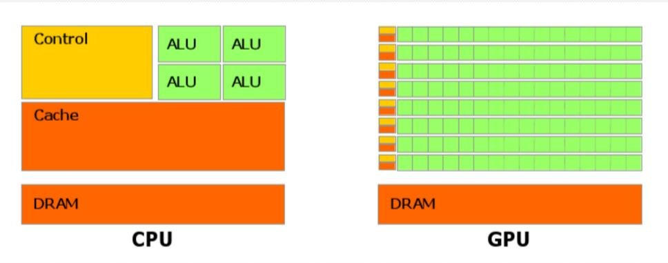

<em>Esquema comparativo de una CPU (control, pocas ALU, mucha caché) y una GPU (miles de ALU pequeñas)</em>

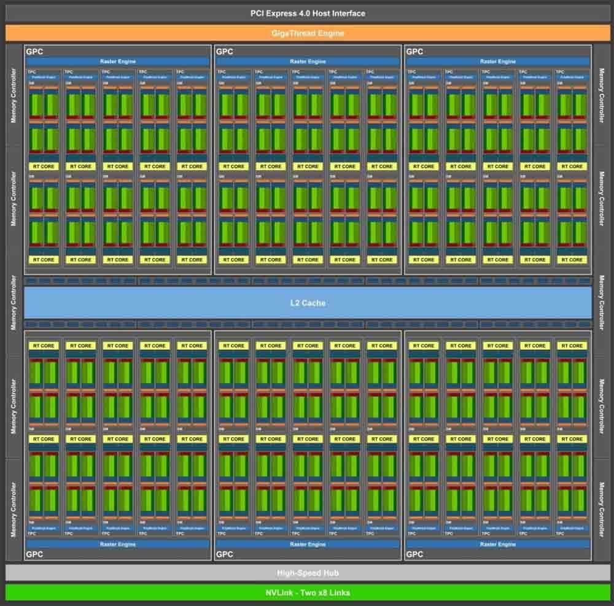

<em>Distribución interna de un procesador gráfico con miles de núcleos</em>

- La **GPU** no sigue la arquitectura Von Neumann clásica, sino un modelo basado en la segmentación y el procesamiento paralelo. Está especializada en cómputo intensivo y altamente paralelo, y sus transistores se dedican al procesamiento de datos en lugar de al almacenamiento en caché y al control de flujo. Tiene **miles de núcleos sencillos**, orientados al cálculo (unidades de cálculo FPU independientes).
- La **CPU** sigue la arquitectura Von Neumann y carga programas (*fetch, decode, execute, write back*). Tiene **pocos núcleos, pero complejos**.

#### 3.2.6 Modelos de NVIDIA

Junto al nombre GeForce GTX o RTX hay una serie de números que representan la generación y también la gama en la que se ubica cada modelo. Hasta la serie GTX 900, el primer número, el «9», se refiere a la generación. Con las GTX 1000 y RTX 2000 esto se ha extendido a los dos primeros números, es decir, el «10» y el «20».

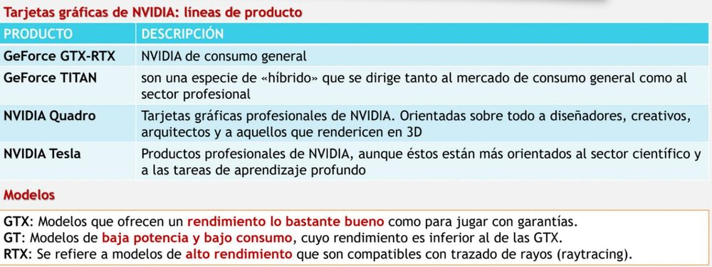

<em>Líneas de producto de NVIDIA: GeForce GTX/RTX, Titan, Quadro y Tesla</em>

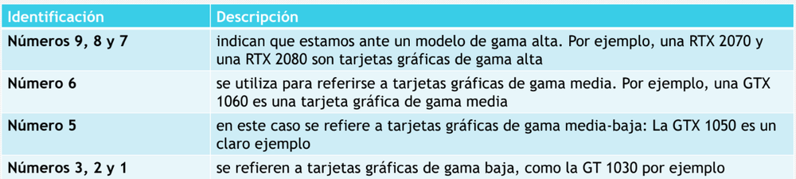

<em>Significado de las cifras en el nombre de una tarjeta NVIDIA</em>

#### 3.2.7 Modelos de AMD

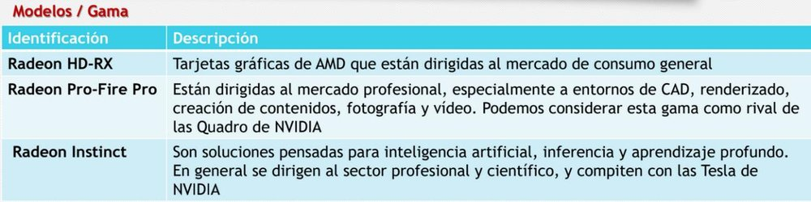

<em>Líneas de producto de AMD: Radeon RX, Radeon Pro/FirePro y Radeon Instinct</em>

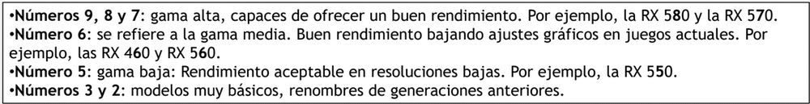

<em>Significado de las cifras en el nombre de una tarjeta AMD</em>

### 3.3 Tarjetas de sonido

La **tarjeta de sonido** es una tarjeta de expansión para computadoras que permite la salida de audio controlada por un programa informático llamado **controlador** (*driver*). El uso típico de las tarjetas de sonido consiste en hacer, mediante un programa que actúa de mezclador, que las aplicaciones multimedia del componente de audio suenen y puedan ser gestionadas.

### 3.4 Tarjetas de red

Son dispositivos que permiten conectar el ordenador a una red de ordenadores para realizar la transmisión y recepción a través de ellas. Existen diferentes tarjetas de red:

- **Ethernet**: se utilizan en entornos de red pequeños y grandes; es el estándar, por lo que no pertenece a ninguna industria y no hay problemas de compatibilidad. Este tipo de tarjetas no garantizan la distribución de acceso al medio de forma igualitaria: se podrá transmitir siempre que la red esté libre. Velocidades de transmisión: 10 y 100 Mbps, 1 y 10 Gbps.
- **Wi-Fi**: basadas en la tecnología de transmisión inalámbrica.

Es aconsejable que todos los elementos que forman una red de área local soporten la misma velocidad, para evitar cuellos de botella.

### 3.5 Tarjetas RAID

Las tarjetas **RAID** surgieron para solucionar los problemas de almacenamiento con los tiempos de acceso. El concepto fundamental es dividir en bloques o segmentos, cada uno almacenado en discos diferentes y con determinadas medidas de redundancia de datos. Consecuencias:

- Así se minimiza la pérdida de datos.
- Menor tiempo de acceso a la información.

Esto se debe a que suministran información en paralelo, comportándose como unidades diferentes.

## Ejercicios prácticos

!!! task "Tarea"
    **Ejercicio 1**. Explica la diferencia entre almacenamiento primario, secundario y terciario, y pon un ejemplo de cada uno.

    **Ejercicio 2**. Describe las partes físicas y lógicas de un disco duro (platos, cabezas, pistas, sectores, cilindros, clúster).

    **Ejercicio 3**. Un disco duro tiene 6 caras, 2000 pistas por cara y 63 sectores por pista. Calcula el número total de sectores y su capacidad si cada sector ocupa 512 bytes.

    **Ejercicio 4**. Explica la diferencia entre los sistemas de direccionamiento CHS y LBA. ¿Cuál se usa actualmente?

    **Ejercicio 5**. Compara un HDD y un SSD (tiempo de acceso, ruido, calor, resistencia). ¿Qué es una celda de puerta flotante?

    **Ejercicio 6**. Explica la diferencia entre un SSD M.2 SATA y un M.2 NVMe. ¿Qué velocidad máxima aproximada tiene cada uno?

    **Ejercicio 7**. Ordena de mayor a menor durabilidad los tipos de celda SLC, MLC, TLC y QLC, y explica la relación entre bits por celda, precio y vida útil.

    **Ejercicio 8**. Explica qué hace el comando TRIM, por qué alarga la vida del SSD y por qué **nunca** hay que desfragmentar un SSD.

    **Ejercicio 9**. ¿Qué diferencia hay entre PCI y PCI Express? ¿Se puede instalar una tarjeta x1 en una ranura x16? ¿Y una x16 en una x1? Explica por qué.

    **Ejercicio 10**. Compara memoria de vídeo compartida y dedicada, con ventajas e inconvenientes.

    **Ejercicio 11**. Explica las tres frecuencias de una GPU (base, game y boost) y la diferencia entre *core clock* y *memory clock*.

    **Ejercicio 12**. Explica qué papel juegan la API gráfica y el driver cuando un videojuego muestra una escena en pantalla. Cita dos API gráficas y su plataforma principal.

    **Ejercicio 13**. Compara las salidas de vídeo VGA, DVI, HDMI y DisplayPort.

    **Ejercicio 14**. Explica las diferencias entre una CPU y una GPU (número y tipo de núcleos, uso de los transistores, tipo de tareas).

    **Ejercicio 15**. ¿Para qué sirve una tarjeta RAID? ¿Qué ventajas ofrece?

    **Ejercicio 16 (práctica en el aula)**. En un equipo del aula, identifica el tipo de disco (HDD/SSD), su interfaz (SATA/M.2/NVMe), las ranuras de expansión libres y usadas, y la tarjeta gráfica (integrada o dedicada, y su VRAM). Documéntalo en una tabla.
