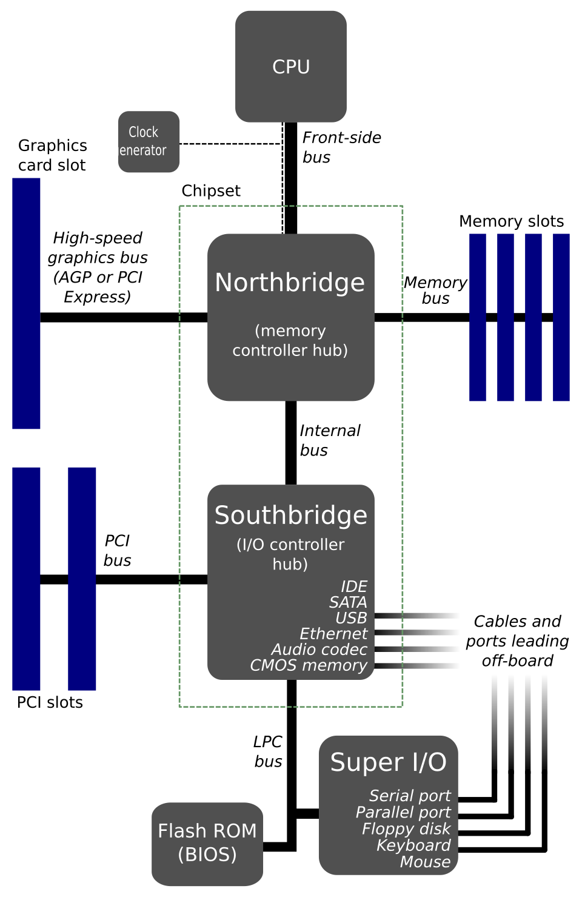
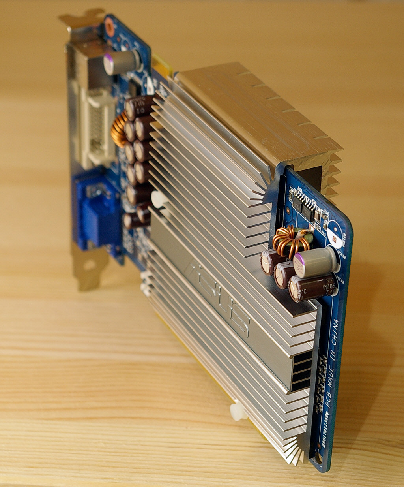
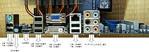
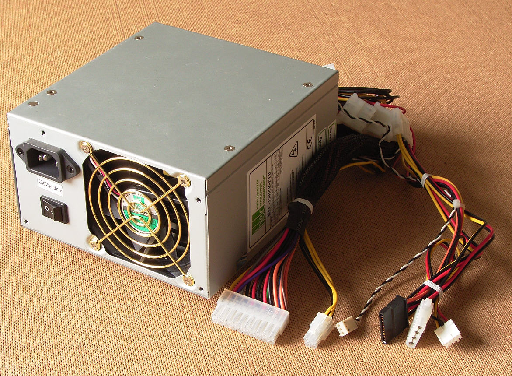

<strong>CFGS Administración de Sistemas Informáticos y en Red (1º curso)</strong>

Material elaborado para el módulo **Fundamentos de Hardware**

# Elementos internos de un Sistema Informático

## Programación de Aula

### Resultados de Aprendizaje

⚠️ **Corrección**: esta unidad pertenece en realidad al **Resultado de Aprendizaje 1 (RA1)** (no al RA2), según confirma la tabla de criterios de tu programación y el **Real Decreto 1629/2009** (Anexo I, módulo *Fundamentos de Hardware*):

1. **RA1.** Configura equipos microinformáticos, componentes y periféricos, analizando sus características y relación con el conjunto.

Según la programación de aula, esta unidad (UT2) se evalúa sobre los criterios **CE11, CE13, CE14, CE18, CE47 y CE49**, cuya redacción literal es:

- **CE11** (RA1.a): Se han identificado y caracterizado los dispositivos que constituyen los bloques funcionales de un equipo microinformático.
- **CE13** (RA1.c): Se ha analizado la arquitectura general de un equipo y los mecanismos de conexión entre dispositivos.
- **CE14** (RA1.d): Se han establecido los parámetros de configuración (hardware y software) de un equipo microinformático con las utilidades específicas.
- **CE18** (RA1.h): Se han clasificado los dispositivos periféricos y sus mecanismos de comunicación.
- **CE47** (RA5.d): Se han descrito los elementos de seguridad de las máquinas y los equipos de protección individual que se deben emplear.
- **CE49** (RA5.f): Se han identificado las posibles fuentes de contaminación del entorno ambiental.

### Planificación Temporal (6 sesiones / 12 horas)

| Sesión | Duración | Contenido |
| ------ | -------- | --------- |
| 1 | 2 h | La placa base: chipset, socket, formatos. Slots de memoria y de expansión |
| 2 | 2 h | Tarjetas de expansión. Conectores internos y externos |
| 3 | 2 h | La fuente de alimentación: conectores, potencia y eficiencia |
| 4 | 2 h | Almacenamiento interno (HDD/SSD/RAID) y sistemas de refrigeración |
| 5 | 2 h | BIOS/UEFI: configuración básica. Normas de seguridad y herramientas |
| 6 | 2 h | **Práctica**: montaje y desmontaje guiado de un equipo. Repaso y ejercicios |

## 1. La placa base

<em>La placa base es el elemento central: todos los demás componentes se conectan a ella.</em>

La **placa base** (o placa madre) es una tarjeta de circuito impreso a la que se conectan todos los componentes del ordenador: CPU, memoria, tarjetas de expansión, almacenamiento y fuente de alimentación. Es el elemento que da soporte físico y eléctrico a la comunicación entre unidades funcionales, y determina en gran medida qué componentes son compatibles entre sí.

### 1.1 El chipset

El **chipset** es el conjunto de circuitos integrados que gestionan la comunicación entre la CPU, la memoria y el resto de dispositivos. Tradicionalmente se dividía en dos chips:

| Chip | Función |
| ----- | ------- |
| Puente norte (Northbridge) | Gestiona la comunicación de alta velocidad: CPU, memoria RAM y tarjeta gráfica |
| Puente sur (Southbridge) | Gestiona los dispositivos más lentos: discos, USB, red, audio |

!!! note "Evolución del chipset"
    En los procesadores modernos, buena parte de las funciones del puente norte (controlador de memoria, líneas PCIe) se han integrado dentro del propio microprocesador, quedando en la placa base principalmente las funciones del antiguo puente sur. Por eso hoy se habla simplemente de "el chipset" (un único chip), identificado con un nombre comercial (por ejemplo, Intel Z790 o AMD B650).

El chipset también determina funciones importantes que hay que tener en cuenta al elegir una placa base:

- Si permite hacer **overclocking** (aumentar la frecuencia de la CPU/memoria por encima de su valor de fábrica).
- Cuántos puertos USB, SATA y líneas PCIe admite.
- Si soporta configuraciones de varias tarjetas gráficas (SLI/CrossFire).

### 1.2 El zócalo o socket

El **socket** es el conector donde se inserta la CPU. Cada familia de procesadores requiere un socket compatible; si no coinciden, el procesador no se puede instalar físicamente. Existen dos tipos principales:

- **PGA (Pin Grid Array)**: los pines están en el procesador y encajan en los agujeros del socket. Se usaba tradicionalmente en procesadores AMD.
- **LGA (Land Grid Array)**: los pines están en el propio socket de la placa base, y el procesador solo tiene contactos planos. Es el sistema habitual en procesadores Intel y en los AMD más recientes.

!!! example "Ejemplo de sockets actuales"
    Intel LGA 1700 (para procesadores Core de 12ª a 14ª generación), AMD AM5 (para procesadores Ryzen 7000 en adelante). Antes de comprar un procesador y una placa base por separado, siempre hay que comprobar que ambos usan el mismo socket.

### 1.3 Slots de memoria

Ranuras donde se insertan los módulos de memoria RAM. Su número (normalmente entre 2 y 4 en placas de sobremesa) y tipo (DDR4, DDR5...) determinan la cantidad máxima de memoria instalable y su velocidad. Las placas actuales suelen funcionar en **modo dual channel**: si se instalan los módulos en pares (en las ranuras del mismo color), la velocidad de acceso a memoria mejora sensiblemente.

### 1.4 Formatos de placa base y de caja

El **formato** (o factor de forma) determina el tamaño físico de la placa y, por tanto, con qué cajas es compatible:

| Formato | Tamaño aproximado | Uso habitual |
| -------- | ------------------ | ------------- |
| E-ATX | 305 x 330 mm | Equipos de alta gama, muchos slots y conectores |
| ATX | 305 x 244 mm | Equipos de sobremesa estándar, buena expansión |
| Micro-ATX | 244 x 244 mm | Equipos compactos, menos slots de expansión |
| Mini-ITX | 170 x 170 mm | Equipos muy pequeños, un único slot de expansión |

La caja (o torre) del ordenador debe elegirse de forma compatible con el formato de la placa base (una caja ATX admite placas ATX, Micro-ATX y Mini-ITX, pero una caja Mini-ITX solo admite placas Mini-ITX).

## 2. Slots y tarjetas de expansión

Los **slots de expansión** son ranuras de la placa base donde se insertan tarjetas que añaden funcionalidades al equipo. El estándar actual es **PCI Express (PCIe)**, que sustituyó a los antiguos PCI y AGP. Existen distintos tamaños de ranura PCIe (x1, x4, x8, x16) según el ancho de banda necesario; a mayor número, más líneas de datos y mayor velocidad. Además, cada nueva versión del estándar (PCIe 3.0, 4.0, 5.0...) duplica aproximadamente el ancho de banda de la anterior manteniendo el mismo tamaño físico de ranura.

<em>Una tarjeta gráfica es la tarjeta de expansión PCIe más habitual en un PC de sobremesa.</em>

Las tarjetas de expansión más comunes son:

| Tarjeta | Función |
| -------- | ------- |
| Tarjeta gráfica | Procesa y genera la imagen que se envía al monitor; imprescindible en diseño, juegos o edición de vídeo |
| Tarjeta de sonido | Gestiona la entrada y salida de audio (aunque hoy suele venir integrada en la placa base) |
| Tarjeta de red | Permite la conexión a una red cableada o inalámbrica (Wi-Fi/Bluetooth) |
| Controladora RAID | Gestiona varios discos duros trabajando de forma conjunta |
| Tarjeta capturadora | Captura vídeo de una fuente externa (consola, cámara...) |

!!! info "Recuerda"
    Muchas de estas funciones (sonido, red, incluso gráficos básicos) vienen ya **integradas** en la propia placa base. Solo se añade una tarjeta de expansión dedicada cuando se necesita más rendimiento del que ofrece la versión integrada.

## 3. Conectores internos y externos

Los **conectores** son los elementos de interconexión entre los distintos componentes del equipo, tanto internos como externos.

### 3.1 Conectores internos

| Conector | Función |
| -------- | ------- |
| SATA (datos) | Conecta discos duros, SSD y unidades ópticas a la placa base |
| M.2 | Ranura de alta velocidad para SSD compactos, conectados directamente sobre la placa |
| Molex / SATA power | Alimentación desde la fuente hacia discos y algunos ventiladores |
| Conectores de panel frontal (F_PANEL) | Botón de encendido, botón de reinicio, LED de encendido, LED de actividad de disco |
| USB interno (header) | Permite conectar los puertos USB frontales de la caja |
| CPU_FAN / CHA_FAN | Conectores de alimentación y control de velocidad de los ventiladores |

### 3.2 Conectores externos

<em>Panel de E/S de una placa base, con los conectores accesibles desde el exterior de la caja.</em>

| Conector | Función |
| -------- | ------- |
| USB (2.0, 3.0, USB-C) | Conexión de periféricos: teclado, ratón, impresoras, almacenamiento externo... |
| HDMI / DisplayPort | Salida de vídeo (y audio) hacia el monitor |
| RJ-45 (Ethernet) | Conexión de red cableada |
| Jack de audio | Entrada/salida de sonido analógico |
| PS/2 (en desuso) | Conector antiguo para teclado y ratón, previo al USB |

!!! example "Características del USB"
    El USB (Universal Serial Bus) es uno de los conectores más utilizados por su simplicidad, resistencia y fiabilidad. Es **Plug and Play**: el sistema operativo detecta e instala el dispositivo automáticamente al conectarlo, sin necesidad de reiniciar el equipo. Cada nueva versión (USB 2.0 → 3.0 → 3.2 → 4) ha ido aumentando la velocidad de transferencia de datos.

## 4. La fuente de alimentación

<em>La fuente de alimentación convierte la corriente alterna de la red eléctrica en corriente continua para los componentes.</em>

La **fuente de alimentación** (PSU) transforma la corriente alterna (220V) de la red eléctrica en las distintas corrientes continuas de bajo voltaje (+3.3V, +5V, +12V) que necesitan los componentes del ordenador.

Sus conectores principales son:

| Conector | Destino |
| -------- | ------- |
| ATX de 24 pines | Alimentación principal de la placa base |
| EPS de 4/8 pines | Alimentación adicional para la CPU |
| PCIe de 6/8 pines | Alimentación de tarjetas gráficas de alto consumo |
| SATA power | Alimentación de discos y unidades ópticas |

### 4.1 Cálculo de la potencia necesaria

Antes de elegir una fuente de alimentación, hay que estimar la potencia (en vatios, W) que va a consumir el equipo, sumando el consumo aproximado de cada componente (CPU, tarjeta gráfica, discos, ventiladores...) y dejando un margen de seguridad de entre el 20% y el 30% para picos de consumo y para no forzar la fuente al 100% de su capacidad de forma continua.

### 4.2 Certificación 80 PLUS

!!! note "Certificación 80 PLUS"
    Indica la eficiencia energética de la fuente: cuánta electricidad se aprovecha realmente frente a la que se pierde en forma de calor. Los niveles van de menor a mayor eficiencia: White, Bronze, Silver, Gold, Platinum y Titanium. Una fuente más eficiente consume menos electricidad de la red para entregar la misma potencia útil a los componentes.

## 5. Almacenamiento interno

| Tipo | Tecnología | Formato habitual | Velocidad |
| ----- | ---------- | ------------------ | --------- |
| HDD (disco duro) | Magnética, con partes mecánicas móviles | 3.5" (sobremesa) / 2.5" (portátil) | Más lenta |
| SSD SATA | Memoria flash, sin partes móviles | 2.5" | Rápida |
| SSD M.2 NVMe | Memoria flash conectada directamente al bus PCIe | Tarjeta compacta enchufada a la placa | Muy rápida |

!!! info "Recuerda"
    Al no tener partes mecánicas, los SSD son más rápidos, silenciosos y resistentes a golpes que los HDD, aunque tradicionalmente su coste por GB es mayor.

### 5.1 Configuraciones RAID

El **RAID** (Redundant Array of Independent Disks) combina varios discos físicos para mejorar el rendimiento, la seguridad de los datos, o ambas cosas:

| Nivel RAID | Qué hace | Ventaja principal |
| ----------- | -------- | ------------------- |
| RAID 0 | Reparte los datos entre varios discos (*striping*) | Mayor velocidad, pero sin redundancia: si falla un disco, se pierden todos los datos |
| RAID 1 | Duplica los mismos datos en dos discos (*mirroring*) | Si falla un disco, los datos siguen disponibles en el otro |
| RAID 5 | Reparte datos y calcula información de paridad entre varios discos | Buen equilibrio entre rendimiento y seguridad, tolera el fallo de un disco |

## 6. Sistemas de refrigeración

Los componentes del ordenador (sobre todo la CPU y la tarjeta gráfica) generan calor durante su funcionamiento, que debe disiparse para evitar averías, bajadas de rendimiento (*thermal throttling*) o apagados de seguridad:

- **Disipador pasivo**: bloque metálico (normalmente de aluminio o cobre) que aumenta la superficie de contacto con el aire para evacuar calor sin partes móviles.
- **Disipador activo**: un disipador combinado con uno o varios ventiladores que fuerzan la circulación de aire.
- **Refrigeración líquida (AIO o personalizada)**: un líquido refrigerante circula por un circuito cerrado, absorbiendo el calor de la CPU y liberándolo en un radiador; permite disipar más calor que el aire en el mismo espacio y con menos ruido.

!!! note "Pasta térmica"
    Entre el disipador y la CPU siempre se aplica una fina capa de **pasta térmica**, que mejora el contacto físico entre ambas superficies y facilita la transmisión del calor. Sin ella, el aire (mal conductor del calor) quedaría atrapado entre las dos superficies.

## 7. BIOS / UEFI

La **BIOS** (Basic Input/Output System) es un pequeño programa grabado en un chip de la placa base que se ejecuta nada más encender el ordenador, antes de cargar el sistema operativo. Su función es comprobar el hardware disponible (memoria, discos, teclado...) y arrancar el proceso de carga del sistema operativo.

La **UEFI** (Unified Extensible Firmware Interface) es la evolución moderna de la BIOS: ofrece una interfaz gráfica, soporte para discos de mayor capacidad, arranque más rápido y funciones de seguridad como el **Secure Boot**.

### 7.1 Parámetros configurables habituales

- **Orden de arranque (Boot order)**: en qué unidad busca primero el sistema operativo (disco interno, USB, red...).
- **Fecha y hora del sistema**.
- **Perfiles de memoria (XMP/EXPO)**: aplican automáticamente la velocidad avanzada de la RAM.
- **Velocidad de los ventiladores**: perfiles silenciosos o de rendimiento.
- **Contraseña de BIOS**: restringe el acceso a la configuración o al arranque del equipo.
- **Virtualización (VT-x/AMD-V)**: necesario activarlo para poder usar máquinas virtuales.

## 8. Montaje y desmontaje de componentes (práctica)

### 8.1 Normas de seguridad

!!! warning "Atención"
    Antes de manipular cualquier componente interno: desconecta el equipo de la corriente, pulsa el botón de encendido unos segundos para descargar la electricidad residual, y usa una **pulsera antiestática** (o toca una parte metálica sin pintar de la caja) para evitar descargas de electricidad estática que puedan dañar los componentes.

### 8.2 Orden recomendado de montaje

1. Instalar la **CPU** en el socket de la placa base (fuera de la caja, es más cómodo).
2. Aplicar **pasta térmica** e instalar el disipador/ventilador de la CPU.
3. Instalar los módulos de **memoria RAM** en sus slots.
4. Fijar la placa base dentro de la caja, sobre los separadores metálicos (*standoffs*).
5. Instalar la **fuente de alimentación** en la caja.
6. Conectar los cables de alimentación a la placa base (ATX 24 pines y EPS de CPU).
7. Instalar el **almacenamiento** (SSD/HDD) y conectar sus cables de datos y alimentación.
8. Instalar las **tarjetas de expansión** necesarias (gráfica, red...) en sus slots PCIe.
9. Conectar los cables del **panel frontal** (encendido, LEDs, USB, audio).
10. Comprobar que todo está bien conectado, cerrar la caja y realizar el primer encendido.

## Ejercicios prácticos

!!! task "Tarea"
    **Ejercicio 1**. Explica la diferencia entre el puente norte y el puente sur del chipset tradicional, y qué ha cambiado en los procesadores actuales.

    **Ejercicio 2**. Busca las especificaciones de una placa base real (puedes usar la web de un fabricante) e indica: su formato, su socket, cuántos slots de memoria tiene y cuántos slots PCIe.

    **Ejercicio 3**. Clasifica estos conectores según sean internos o externos: SATA, HDMI, M.2, USB, Molex, RJ-45.

    **Ejercicio 4**. ¿Por qué una tarjeta gráfica dedicada necesita normalmente un conector de alimentación adicional de la fuente, además de la ranura PCIe?

    **Ejercicio 5**. Compara un HDD, un SSD SATA y un SSD M.2 NVMe en cuanto a velocidad, precio y resistencia a golpes.

    **Ejercicio 6**. Explica la diferencia entre RAID 0, RAID 1 y RAID 5. ¿Cuál usarías para un servidor de datos importantes y por qué?

    **Ejercicio 7**. Investiga el consumo aproximado (en vatios) de una CPU y una tarjeta gráfica actuales, y calcula qué potencia de fuente de alimentación recomendarías para ese equipo, aplicando un margen de seguridad del 25%.

    **Ejercicio 8**. Explica con tus palabras qué hace la BIOS/UEFI justo al encender el ordenador, antes de que aparezca el sistema operativo, y cita tres parámetros que se pueden configurar en ella.

    **Ejercicio 9 (práctica en el aula)**. Bajo supervisión del profesor, desmonta y vuelve a montar un equipo del aula siguiendo el orden de montaje explicado en el punto 8.2, identificando en voz alta cada componente y conector.

---
**Créditos de imágenes:** imágenes de componentes internos de ordenador, vía Wikimedia Commons (licencias CC / dominio público — ver enlaces de descarga proporcionados).
