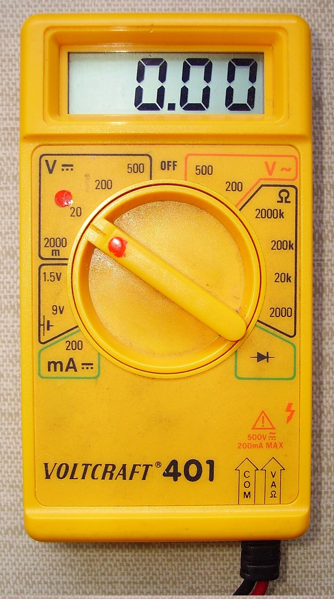

<strong>CFGS Administración de Sistemas Informáticos y en Red (1º curso)</strong>

Material elaborado para el módulo **0371. Fonaments de Maquinari / Fundamentos de Hardware**

# Montaje, diagnóstico y configuración de ordenadores

## Programación de Aula

### Resultados de Aprendizaje

Esta unidad, junto con las UT1 y UT2, trabaja el **Resultado de Aprendizaje 1 (RA1)** del módulo, según la programación didáctica del centro:

1. **RA1.** Configura equips microinformàtics, components i perifèrics, analitzant les seues característiques i relació amb el conjunt.

Según la tabla de relación entre criterios de evaluación e instrumentos de la programación del módulo, esta unidad (UT3) se evalúa sobre los criterios **CE15, CE16, CE17, CE18, CE19, CE47 y CE49**.

Su redacción literal, según el **Real Decreto 1629/2009** (Anexo I, módulo *Fundamentos de Hardware*), es:

- **CE15** (RA1.e): Se ha evaluado las prestaciones del equipo.
- **CE16** (RA1.f): Se han ejecutado utilidades de chequeo y diagnóstico.
- **CE17** (RA1.g): Se han identificado averías y sus causas.
- **CE18** (RA1.h): Se han clasificado los dispositivos periféricos y sus mecanismos de comunicación.
- **CE19** (RA1.i): Se han utilizado protocolos estándar de comunicación inalámbrica entre dispositivos.
- **CE47** (RA5.d): Se han descrito los elementos de seguridad (protecciones, alarmas y pasos de emergencia, entre otros) de las máquinas y los equipos de protección individual que se deben emplear en las distintas operaciones de montaje y mantenimiento.
- **CE49** (RA5.f): Se han identificado las posibles fuentes de contaminación del entorno ambiental.

### Ponderación de esta unidad

Según el cuadro de ponderaciones de la programación del módulo, **UT3 (Assemblatge i reparació d'equips informàtics)** aporta un **10%** de la nota final del módulo, dentro del RA1 (que junto con UT1 y UT2 suma el 30% total del RA1).

### Planificación Temporal (6 sesiones / 12 horas)

| Sesión | Contenido |
| ------ | --------- |
| 1 | Recordatorio del montaje completo. Checklist previo al primer encendido. Bench test |
| 2 | El arranque del equipo: POST, códigos de error y diagnóstico por LED |
| 3 | Diagnóstico de averías comunes en hardware. Herramientas físicas de medición |
| 4 | Herramientas de diagnóstico software, benchmarking y actualización de BIOS/UEFI y drivers |
| 5 | Instalación y configuración de periféricos. Mantenimiento preventivo y documentación técnica |
| 6 | **Práctica evaluable**: montaje, diagnóstico guiado (caso de avería) y elaboración de un informe técnico |

## 1. Del montaje al primer encendido

En la UT2 vimos el orden de montaje de los componentes internos. Antes de darle al botón de encendido por primera vez, conviene seguir una **checklist de comprobación**, ya que muchos fallos "graves" en realidad son solo un cable mal conectado.

!!! task "Checklist antes del primer encendido"
    - ¿Está conectado el conector ATX de 24 pines a la placa base?
    - ¿Está conectado el conector EPS (4/8 pines) de alimentación de la CPU?
    - ¿Está el disipador de la CPU bien asentado y con pasta térmica aplicada?
    - ¿Están los módulos de RAM encajados hasta el final (con el clic de las pestañas)?
    - ¿Está el cable de datos (SATA o M.2) y de alimentación del disco conectados?
    - ¿Están conectados los cables del panel frontal (power switch, reset, LEDs)?
    - ¿Hay algún tornillo o herramienta olvidada dentro de la caja?

### 1.1 Montaje fuera de la caja (bench test)

Una buena práctica cuando se monta un equipo nuevo (o se diagnostica uno que no arranca) es hacer un **montaje de prueba fuera de la caja** (*bench test*): placa base, CPU, RAM y fuente de alimentación conectados sobre una superficie no conductora (por ejemplo, la propia caja de cartón de la placa base), sin meterlo todo en la torre. Así se descarta que el problema sea un cortocircuito con la caja (por ejemplo, un tornillo mal puesto o un separador *standoff* de más haciendo contacto con la parte trasera de la placa) antes de invertir tiempo en el montaje completo.

### 1.2 Puenteo manual del botón de encendido

Si todavía no se han conectado los cables del panel frontal, se puede arrancar el equipo tocando brevemente con un destornillador de punta plana los dos pines correspondientes al *power switch* en la placa base (consultando el manual para localizarlos), cerrando el circuito igual que haría el botón físico. Es una técnica habitual en un banco de pruebas.

## 2. El arranque del equipo: POST

Al pulsar el botón de encendido, la placa base ejecuta la **POST** (Power-On Self-Test): una serie de comprobaciones automáticas del hardware básico (CPU, memoria, tarjeta gráfica...) antes de ceder el control al sistema operativo. Si todas las comprobaciones son correctas, el proceso continúa con la carga del gestor de arranque y, después, del sistema operativo.

Si la POST detecta un fallo, muchas placas base emiten una serie de **pitidos (beep codes)** a través de un altavoz interno (*speaker*), ya que en ese punto todavía no hay imagen en pantalla para mostrar un mensaje de error.

!!! example "Códigos de pitido habituales (chipset AMI/Award, orientativo)"
    | Patrón de pitidos | Posible causa |
    | ------------------- | --------------- |
    | 1 pitido corto | Arranque correcto, sin errores |
    | Sin pitido y sin imagen | Fallo de alimentación o de placa base |
    | Pitidos continuos | Problema de memoria RAM mal insertada |
    | 1 largo + 2 cortos | Fallo en la tarjeta gráfica |
    | 1 largo + 3 cortos | Fallo en el teclado o su controlador |

    ⚠️ Los patrones exactos varían según el fabricante del chipset de la placa base (AMI, Award, Phoenix); conviene consultar siempre el manual de la placa base concreta.

### 2.1 Diagnóstico por LED / display de la placa base

Muchas placas base actuales incluyen, además o en lugar de los pitidos, un pequeño **display de dos dígitos** (código hexadecimal de POST) o unos **LEDs de diagnóstico** (CPU, DRAM, VGA, BOOT) que se iluminan según en qué fase del arranque se ha quedado bloqueado el equipo, facilitando mucho el diagnóstico sin necesidad de memorizar códigos de pitidos.

### 2.2 Secuencia completa de arranque

Para entender mejor dónde puede fallar el proceso, conviene tener claras sus fases:

1. Se pulsa el botón de encendido → la fuente de alimentación entrega tensión a la placa base.
2. La UEFI/BIOS ejecuta la **POST**, comprobando CPU, memoria y dispositivos básicos.
3. Se inicializan los dispositivos de vídeo y aparece la primera imagen en pantalla (logo del fabricante).
4. La UEFI/BIOS busca un dispositivo de arranque según el **orden configurado** (disco interno, USB, red...).
5. Se carga el **gestor de arranque** (bootloader) del sistema operativo.
6. El sistema operativo termina de cargarse y aparece la pantalla de inicio de sesión.

## 3. Diagnóstico de averías comunes

<em>Un multímetro permite comprobar si la fuente de alimentación entrega los voltajes correctos.</em>

| Síntoma | Posibles causas | Cómo comprobarlo |
| -------- | ---------------- | ------------------ |
| El equipo no enciende (ni ventiladores, ni luces) | Fuente de alimentación averiada, cable de corriente, interruptor de la PSU apagado | Probar con otra fuente conocida, comprobar el interruptor trasero de la PSU |
| Enciende pero no da imagen | RAM mal asentada, tarjeta gráfica mal conectada, cable de vídeo | Reasentar la RAM módulo a módulo, probar con un solo módulo, revisar el cable HDMI/DP |
| Se enciende y apaga solo (reinicios) | Sobrecalentamiento de la CPU, fuente insuficiente, cortocircuito | Revisar temperaturas, comprobar que el disipador está bien montado |
| Pantallazos azules o cuelgues aleatorios | Memoria RAM defectuosa, drivers, disco con errores | Ejecutar un test de memoria (Memtest86), revisar el estado del disco (SMART) |
| Ruido extraño (clics, chirridos) | Disco duro mecánico (HDD) fallando, ventilador rozando | Hacer copia de seguridad urgente, revisar el ventilador afectado |
| El equipo va muy lento tras un tiempo de uso | Disco casi lleno, exceso de programas en el arranque, acumulación de polvo (sobrecalentamiento) | Revisar espacio libre, gestor de tareas, limpiar el interior |
| Un puerto USB deja de reconocer dispositivos | Puerto dañado, driver del controlador USB corrupto | Probar el dispositivo en otro puerto, reinstalar el controlador |

!!! warning "Atención"
    Antes de tocar cualquier componente para diagnosticar una avería, desconecta siempre el equipo de la corriente y aplica las normas de seguridad antiestática vistas en la UT2.

### 3.1 Metodología del diagnóstico: el método de descarte

Para diagnosticar una avería de forma ordenada (y no "a lo loco" cambiando piezas), conviene seguir un método sistemático:

1. **Reproducir el problema**: confirmar en qué condiciones exactas ocurre el fallo.
2. **Formular una hipótesis**: ¿qué componente es más probable que esté fallando, según los síntomas?
3. **Aislar la variable**: cambiar (o quitar) un único componente cada vez, para saber con certeza cuál era el responsable.
4. **Verificar la solución**: comprobar que, tras el cambio, el problema desaparece de forma consistente (no solo una vez).
5. **Documentar**: anotar qué se ha hecho, para futuras averías similares.

### 3.2 Herramientas físicas de diagnóstico

- **Multímetro**: para comprobar si la fuente de alimentación entrega los voltajes correctos (+3.3V, +5V, +12V) en sus distintos conectores.
- **Fuente de alimentación de pruebas / PSU tester**: pequeño dispositivo que se conecta al conector ATX de 24 pines para comprobar rápidamente si la fuente "arranca" y da tensión, sin necesidad de montarla en un equipo.
- **Módulo de RAM y disco "de repuesto conocido"**: sustituir un componente sospechoso por otro que sabemos que funciona es una de las formas más rápidas de aislar el problema.
- **Kit de destornilladores de precisión y pulsera antiestática**: herramientas básicas de cualquier técnico de hardware.

## 4. Herramientas de diagnóstico software

Además de la comprobación física, existen programas específicos para verificar el estado de cada componente:

| Herramienta | Qué comprueba |
| ------------ | --------------- |
| Memtest86 / Memtest86+ | Detecta errores en los módulos de memoria RAM, ejecutándose antes de arrancar el sistema operativo |
| CrystalDiskInfo | Muestra el estado S.M.A.R.T. de discos duros y SSD, alertando de fallos inminentes |
| HWMonitor / HWiNFO | Muestra temperaturas, voltajes y velocidades de ventiladores en tiempo real |
| Benchmarks (Cinebench, 3DMark...) | Miden el rendimiento de CPU/GPU y permiten comparar con los valores esperados del modelo |
| Administrador de tareas / Monitor de recursos | Muestra en tiempo real el uso de CPU, memoria, disco y red del sistema operativo |

!!! note "S.M.A.R.T."
    S.M.A.R.T. (Self-Monitoring, Analysis and Reporting Technology) es un sistema integrado en los discos duros y SSD que registra indicadores de su estado de salud (horas de uso, sectores dañados, temperatura...) y permite anticiparse a un fallo antes de que se produzca una pérdida de datos.

### 4.1 El benchmarking como herramienta de diagnóstico

Un **benchmark** es una prueba estandarizada que mide el rendimiento de un componente y lo compara con valores de referencia conocidos. No sirve solo para "presumir" de un equipo: también es útil para el diagnóstico, ya que si el resultado obtenido está muy por debajo de lo esperado para ese modelo de CPU o GPU, puede indicar un problema (throttling térmico, configuración incorrecta, un driver defectuoso...).

### 4.2 Actualización de BIOS/UEFI y drivers

- **Actualizar la BIOS/UEFI** puede solucionar problemas de compatibilidad (por ejemplo, que la placa base no reconozca un procesador nuevo) o de estabilidad, pero es un proceso delicado: si se interrumpe a mitad (por ejemplo, un corte de luz), la placa base puede quedar inutilizada (*brickeada*). Por eso se recomienda hacerlo solo cuando sea necesario y siguiendo exactamente el procedimiento del fabricante (a menudo mediante un USB preparado con el archivo de la nueva versión).
- **Actualizar los drivers** (controladores) de los distintos componentes (gráfica, red, chipset...) asegura que el sistema operativo aproveche todas sus funciones y corrige errores conocidos. Es recomendable descargarlos siempre de la web oficial del fabricante, no de sitios de terceros.

!!! info "Recuerda"
    Antes de actualizar la BIOS de un equipo en producción (que un usuario está utilizando activamente), asegúrate de tener una fuente de alimentación estable (idealmente con un SAI) y no interrumpas nunca el proceso una vez iniciado.

## 5. Instalación y configuración de periféricos

Una vez el equipo funciona correctamente por dentro, hay que conectar y configurar los periféricos externos:

- **Plug and Play**: la mayoría de periféricos actuales (USB) se detectan e instalan automáticamente al conectarlos, ya que el sistema operativo reconoce el dispositivo y busca (o ya incluye) el driver adecuado.
- **Instalación manual de drivers**: algunos periféricos (impresoras, escáneres, tabletas gráficas) requieren instalar un software específico del fabricante para funcionar con todas sus funciones.
- **Calibración**: monitores e impresoras a veces requieren un proceso de calibración de color para que lo que se ve en pantalla coincida con lo impreso.
- **Gestión de cables**: un buen enrutado y sujeción de los cables internos mejora la circulación de aire (y por tanto la refrigeración) y facilita futuras tareas de mantenimiento.

## 6. Mantenimiento preventivo básico

Aunque el mantenimiento preventivo en profundidad se trabajará en unidades posteriores, conviene introducir ya algunas pautas básicas asociadas al montaje y diagnóstico:

- Limpieza periódica del polvo acumulado en disipadores y ventiladores (con aire comprimido, con el equipo apagado y desconectado).
- Comprobación periódica de temperaturas en carga, para detectar una degradación progresiva de la pasta térmica.
- Revisión del estado S.M.A.R.T. de los discos de forma regular, especialmente en equipos que llevan varios años en uso.
- Comprobación visual de condensadores hinchados o abombados en la placa base o la fuente de alimentación, señal de que están próximos a fallar.

## 7. Documentación técnica de una intervención

En un entorno profesional, toda intervención de montaje o reparación debe quedar **documentada**, tanto para el propio historial del equipo como para justificar el trabajo realizado ante el cliente. Un buen informe técnico incluye:

- **Identificación del equipo** (modelo, número de serie o etiqueta de inventario).
- **Síntoma reportado** por el usuario, con sus propias palabras.
- **Diagnóstico realizado**: pruebas efectuadas y componente(s) identificado(s) como causantes del problema.
- **Solución aplicada**: qué se ha hecho (sustitución de una pieza, actualización de driver, limpieza...).
- **Verificación final**: comprobación de que el problema queda resuelto.
- **Fecha y técnico responsable**.

## Ejercicios prácticos

!!! task "Tarea"
    **Ejercicio 1**. Explica qué es la POST y en qué momento exacto del arranque del ordenador se ejecuta. Enumera las seis fases de la secuencia de arranque vistas en el punto 2.2.

    **Ejercicio 2**. Un equipo enciende (los ventiladores giran y las luces se encienden) pero no da imagen en el monitor. Describe, en orden, los pasos que seguirías para diagnosticar la causa, aplicando el método de descarte del punto 3.1.

    **Ejercicio 3**. ¿Para qué sirve un PSU tester, y en qué se diferencia de comprobar la fuente con un multímetro?

    **Ejercicio 4**. Explica qué es el estado S.M.A.R.T. de un disco y por qué es útil revisarlo periódicamente.

    **Ejercicio 5**. ¿Por qué es arriesgado actualizar la BIOS de una placa base, y qué precauciones tomarías antes de hacerlo?

    **Ejercicio 6**. Explica con tus palabras qué es un benchmark y pon un ejemplo de cómo podría ayudarte a detectar que la CPU de un equipo se está sobrecalentando.

    **Ejercicio 7 (práctica en el aula)**. Bajo supervisión del profesor, realiza el montaje completo de un equipo del aula, complétalo con la checklist de la sección 1, enciéndelo, y si detectas algún problema, documenta el proceso de diagnóstico seguido hasta resolverlo.

    **Ejercicio 8**. Elabora un informe técnico completo (siguiendo el esquema del punto 7) simulando la avería de un equipo que se apaga solo a los pocos minutos de uso: identificación del equipo, síntoma, diagnóstico, solución aplicada y verificación final.

    **Ejercicio 9**. Compara los pasos que darías para diagnosticar dos averías distintas: (a) un equipo que no enciende en absoluto, y (b) un equipo que enciende pero se reinicia solo bajo carga. ¿En qué se parecen y en qué se diferencian los procesos de diagnóstico?
